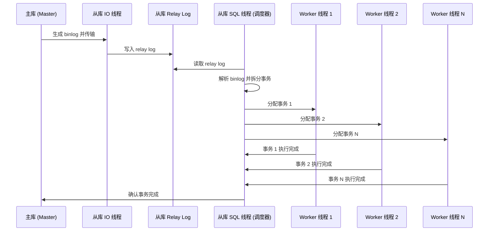
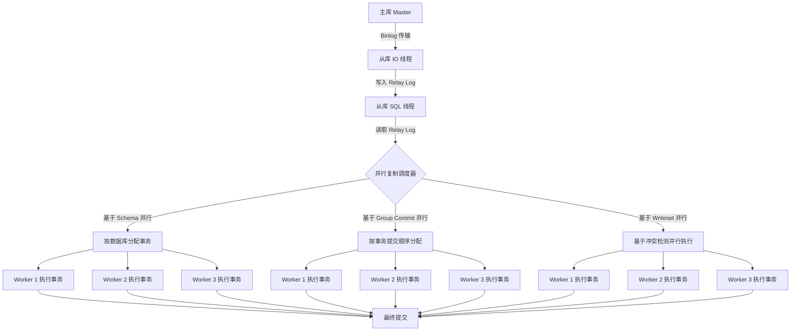

# MySQL 并行复制

## 1. MySQL 并行复制逻辑流程




## 2. MySQL 并行复制核心流程




## 3. 详细流程解析

### (1) 主库生成 Binlog

* MySQL 主库将事务记录到 Binlog 中，并按照提交顺序存储。

### (2) 从库 IO 线程获取 Binlog

* IO 线程 连接 主库，拉取 Binlog 并存储在 Relay Log 中。

### (3) 从库 SQL 线程解析 Relay Log

* SQL 线程读取 Relay Log，解析 Binlog 并进行 事务调度。

### (4) 并行复制调度

MySQL 通过 不同的策略 进行 事务调度：

* Schema 并行复制（不同数据库事务可并行）。
* Group Commit 并行复制（按主库事务提交顺序分配）。
* Writeset 并行复制（基于冲突检测并行执行，MySQL 8.0+）。

### (5) Worker 线程并行执行

* SQL 线程将事务分配给 多个 Worker 线程。
* Worker 线程独立执行事务，提高复制吞吐量。

### (6) 事务执行完成并提交

* Worker 线程执行完毕后，通知 SQL 线程。
* SQL 线程确保事务一致性，并最终提交。

## 4. 并行复制优化建议

```sql
-- 开启多 Worker 线程
SET GLOBAL slave_parallel_workers = 8;

-- 选择并行复制模式 (基于 Group Commit)
SET GLOBAL slave_parallel_type = 'LOGICAL_CLOCK';

-- 选择 Writeset 并行复制 (MySQL 8.0)
SET GLOBAL binlog_transaction_dependency_tracking = 'WRITESET';
```

总结：

• MySQL 并行复制 通过多个 Worker 线程并行执行事务，提高吞吐量。

• 三种并行模式（Schema、Group Commit、Writeset），MySQL 8.0 推荐使用 Writeset 并行复制。

• 优化参数 可显著提升从库同步性能，减少复制延迟！
