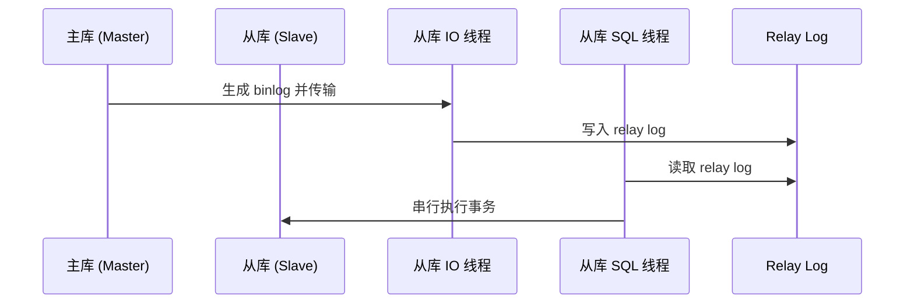
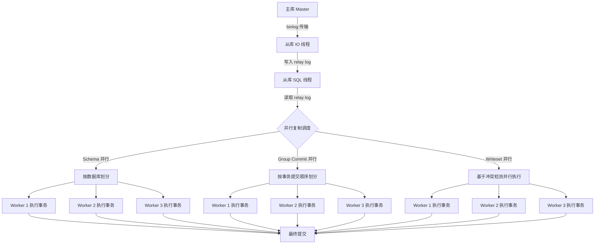

# MySQL 并行复制

## 1. MySQL 复制基本原理

### 1.1 复制架构

MySQL 复制采用 异步复制 机制，涉及以下核心组件：

1\. 主库（Master）：写入事务，并记录 Binlog（二进制日志）。

2\. 从库（Slave）：

* I/O 线程：从主库拉取 Binlog 并写入 Relay Log（中继日志）。
* SQL 线程：读取 Relay Log 并执行 SQL 语句。
* Worker 线程（并行复制）：支持多个事务并发执行，提高吞吐量。

### 1.2 传统复制 vs 并行复制

#### 传统复制（单线程 SQL 执行）




问题：

* SQL 线程单线程执行，无法利用多核 CPU 资源。
* 复制延迟高，主库并发写入，但从库串行执行。

#### 并行复制（多线程 SQL 执行）



优点：

* 多线程并发执行，充分利用多核 CPU。
* 降低复制延迟，提升吞吐量。

## 2. MySQL 并行复制模式

### 2.1 Schema 并行复制

* 原理：根据 数据库（Schema） 分配 Worker 线程，不同数据库事务可并行执行。
* 适用场景：多租户架构（每个用户一个数据库），适用于 多库操作。

```sql
SET GLOBAL slave_parallel_workers = 4;
SET GLOBAL slave_parallel_type = 'DATABASE';
```

缺点：

* 单数据库仍然串行，对于 单数据库大并发写入 场景无效。

### 2.2 Group Commit 并行复制

原理：

* MySQL 主库 事务提交时，多个事务如果是并行提交的，在从库上也可以 并行执行。
* 适用场景：单库高并发事务。

```sql
SET GLOBAL slave_parallel_workers = 8;
SET GLOBAL slave_parallel_type = 'LOGICAL_CLOCK';
```

缺点：

* 依赖 主库事务并行提交，如果主库是单线程提交事务，从库仍然是串行的。

### 2.3 Writeset 并行复制（MySQL 8.0 推荐）

原理：

* 基于事务的 Writeset（写集合）检测事务冲突，无冲突的事务可 并行执行。

适用场景：

* 任何高并发场景，适用于 单库和多库操作。

```sql
SET GLOBAL slave_parallel_workers = 16;
SET GLOBAL binlog_transaction_dependency_tracking = 'WRITESET';
```

优点：

* 适用性最强，MySQL 8.0 及以上推荐使用。

## 3. MySQL 并行复制可能遇到的问题

### 3.1 复制延迟未降低

可能原因：

* SQL 线程仍然单线程：检查 slave\_parallel\_workers 是否 >1。
* 主库提交事务是串行的：SHOW PROCESSLIST 检查主库事务提交情况。

解决方案：

* Group Commit 模式：主库使用 binlog-group-commit 。
* Writeset 模式（MySQL 8.0+）：减少事务冲突。

### 3.2 事务顺序问题

可能原因：

* 并行执行导致事务依赖错误（如 UPDATE 依赖 INSERT）。

解决方案：

* 确保 事务隔离性，业务端避免跨事务依赖。
* 使用 Writeset 模式 避免事务顺序错误。

### 3.3 主从数据不一致

可能原因：

* 非事务性语句（如 UPDATE ... LIMIT 1）。
* 非确定性函数（如 NOW()、RAND()）。
* 从库崩溃导致事务未完整回放。

解决方案：

* 确保使用 ROW 格式 Binlog：

```sql
SET GLOBAL binlog_format = 'ROW';
```

避免 非确定性 SQL 语句。

### 3.4 并行度低

可能原因：

* Worker 线程未充分利用，事务分配不均。
* 事务冲突过多，导致 Worker 等待。

解决方案：

* 调整 slave\_parallel\_workers：

```sql
SET GLOBAL slave_parallel_workers = 16;
```

* 使用 Writeset 并行复制：

```sql
SET GLOBAL binlog_transaction_dependency_tracking = 'WRITESET';
```

## 4. MySQL 并行复制优化建议

### 4.1 配置 Worker 线程

```sql
SET GLOBAL slave_parallel_workers = 16;
```

### 4.2 使用 ROW 格式 Binlog

```sql
SET GLOBAL binlog_format = 'ROW';
```

### 4.3 启用 GTID

```sql
SET GLOBAL enforce_gtid_consistency = ON;
SET GLOBAL gtid_mode = ON;
```

### 4.4 开启 Writeset 并行

```sql
SET GLOBAL binlog_transaction_dependency_tracking = 'WRITESET';
```

## 5. 结论

| 并行复制模式          | 适用场景  | 优势   | 局限性          |
| --------------- | ----- | ---- | ------------ |
| Schema 级别       | 多个数据库 | 简单   | 单数据库事务串行     |
| Group Commit 级别 | 单库高并发 | 提高吞吐 | 依赖主库事务提交     |
| Writeset 级别     | 任何场景  | 最优   | 需要 MySQL 8.0 |

总结：

• 优先选择 Writeset 并行复制（MySQL 8.0+）。

• 开启多 Worker 线程，减少事务冲突。

• 避免非事务性 SQL，确保主从数据一致。

\


如果你有特定的业务场景，欢迎讨论更详细的优化方案！🔥🚀
