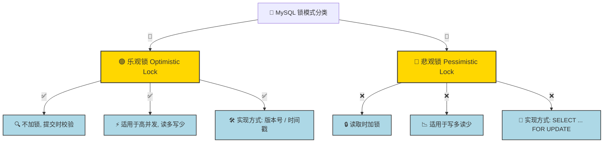

# 乐观锁 vs悲观锁




## 🔹 1. 乐观锁（Optimistic Lock）

### 💡 概念

* **不加锁**，假设数据不会发生冲突，在更新数据时检查是否发生变更。
* **适用于读多写少的场景**，减少锁开销，提高吞吐量。

### 📌 主要实现方式

1. **版本号机制（Version Number）**
   * 在表中增加 `version` 字段，每次修改数据时 `version +1`，更新时检查 `version` 是否匹配。
2. **时间戳机制（Timestamp）**
   * 记录数据的 `last_update_time`，更新时检查数据的 `更新时间` 是否发生变化。

### 📌 SQL 示例

```sql
-- 1. 查询数据并记录 version
SELECT id, name, version FROM users WHERE id = 1;

-- 2. 更新数据时检查 version 是否匹配
UPDATE users 
SET name = 'Tom', version = version + 1 
WHERE id = 1 AND version = 5;

-- 如果 version 发生变化，则更新失败，需要重新读取数据
```

### 📌 适用场景

适用于 读多写少 的业务场景：

* 订单状态更新，防止超卖问题。
* 配置表并发修改，避免写冲突。
* API 并发请求控制，降低锁等待。

### 📌 优缺点

| **优势**             | **劣势**              |
| ------------------ | ------------------- |
| ✅ **高吞吐量**，不影响其他事务 | ❌ **写冲突较多时会增加重试成本** |
| ✅ **避免锁等待**，无死锁风险  | ❌ **适用于读多写少的业务**    |
| ✅ **性能高**，减少数据库锁竞争 | ❌ **存在事务提交失败重试的开销** |

## 🔹 2. 悲观锁（Pessimistic Lock）

### 💡 概念

* 加锁策略，假设数据存在并发冲突，操作数据前主动加锁，防止其他事务修改数据。
* 适用于写多读少的场景，可以保证数据一致性，但会降低并发能力。

### 📌 主要实现方式

1.共享锁（Shared Lock, S 锁）

* 允许多个事务同时读取数据，但不允许修改。

2.排他锁（Exclusive Lock, X 锁）

* 只有一个事务可以访问该数据，其他事务必须等待。

### 📌 SQL 示例

```sql
-- 事务 A：加悲观锁，锁定数据，防止其他事务修改
SELECT * FROM users WHERE id = 1 FOR UPDATE;

-- 事务 B：等待事务 A 释放锁，才能执行
UPDATE users SET name = 'Tom' WHERE id = 1;
```

### 📌 适用场景

适用于 写多读少 的业务场景：

* 订单支付：防止多次扣款。
* 库存管理：防止超卖问题。
* 事务隔离要求高的场景，如金融交易、银行业务。


