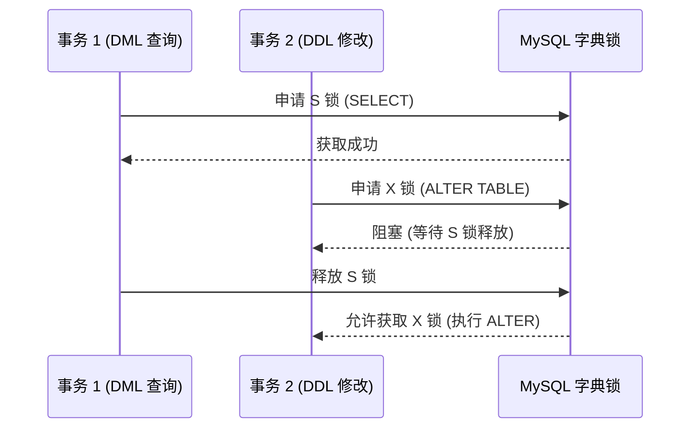

# MySQL 的字典锁（Dictionary Lock, DL）

## 1. 什么是字典锁（Dictionary Lock，DL）

字典锁（Dictionary Lock, DL） 是 MySQL 元数据锁（Metadata Lock, MDL）的一部分，用于保护数据字典（即表结构、索引等元数据），防止并发 DDL 操作导致数据不一致。

作用：

* 保护 表结构、索引等元数据 在并发操作时的一致性。
* 防止 DDL（ALTER TABLE、DROP TABLE）与 DML（SELECT、INSERT、UPDATE）冲突。
* 控制多个事务对 表结构 的并发访问，确保表的定义不会被并发修改。

## 2. 字典锁的工作原理

#### (1) 什么时候会触发字典锁？

* DDL 语句（表结构变更）

```sql
ALTER TABLE users ADD COLUMN age INT;
DROP TABLE orders;
```

* 表的创建、删除、修改

```sql
CREATE TABLE test (id INT);
RENAME TABLE test TO test_new;
```

* 获取表的元数据

```sql
SHOW CREATE TABLE users;
```

* 查询表信息

```sql
SELECT * FROM information_schema.tables;
```

### (2) 字典锁的分类

| 锁类型    | 作用                    | 适用场景                     |
| ------ | --------------------- | ------------------------ |
| S（共享锁） | 允许多个事务同时读取表的结构，但不允许修改 | SELECT、SHOW CREATE TABLE |
| X（排他锁） | 只允许一个事务修改表结构，阻塞所有访问   | ALTER TABLE、DROP TABLE   |



## 3. MySQL 字典锁的影响

### (1) 可能引发的性能问题

* DDL 操作被 DML 阻塞
* 如果有长时间运行的查询（SELECT），那么 ALTER TABLE 可能会 被阻塞。
* DML 操作被 DDL 阻塞
* 如果有 ALTER TABLE 执行中，其他事务的 SELECT 或 INSERT 可能会被阻塞。

### (2) 如何检查字典锁

```sql
SELECT * FROM performance_schema.metadata_locks;
```

查看当前持有的元数据锁，找出阻塞的 SQL。

## 4. 如何避免字典锁问题

### (1) 避免长时间查询

* 查询时加 LIMIT，减少锁持有时间：

```sql
SELECT * FROM users LIMIT 1000;

```

• 使用索引优化查询，避免全表扫描：

```sql
CREATE INDEX idx_users_email ON users(email);
```

### (2) 使用 Online DDL

MySQL InnoDB 提供 Online DDL 方式，可以避免字典锁：

```sql
ALTER TABLE users ADD COLUMN age INT, ALGORITHM=INPLACE, LOCK=NONE;
```

* ALGORITHM=INPLACE：在线变更表结构，不复制数据。
* LOCK=NONE：不阻塞 DML 操作。

### (3) 事务中避免 DDL

不要在事务中执行 DDL 操作！

```sql
BEGIN;
ALTER TABLE users ADD COLUMN age INT; -- ❌ 可能导致事务阻塞
COMMIT;
```

* DDL 会隐式提交事务，可能引发死锁。

### (4) 并发执行 DDL 时要小心

多个 ALTER TABLE 同时执行，可能导致锁冲突：

```sql
ALTER TABLE users ADD COLUMN age INT;
ALTER TABLE users DROP COLUMN address; -- ❌ 可能会被阻塞
```

* 解决方案：避免同时执行多个 DDL 语句。

## 5. 总结

| 问题         | 原因                  | 解决方案                |
| ---------- | ------------------- | ------------------- |
| DML 阻塞 DDL | 长时间查询持有 S 锁         | 限制查询时间 (LIMIT)、优化索引 |
| DDL 阻塞 DML | ALTER TABLE 申请 X 锁  | 使用 LOCK=NONE，避免影响业务 |
| 事务阻塞       | 事务内执行 DDL           | 避免在事务内执行 DDL        |
| 并发 DDL 冲突  | 多个 ALTER TABLE 同时执行 | 避免同时执行多个 DDL        |

🚀 最佳实践

• 避免长时间查询，优化索引，减少 S 锁持有时间。

• 使用 Online DDL (LOCK=NONE)，减少 DML 影响。

• 不要在事务中执行 DDL，避免锁冲突。

