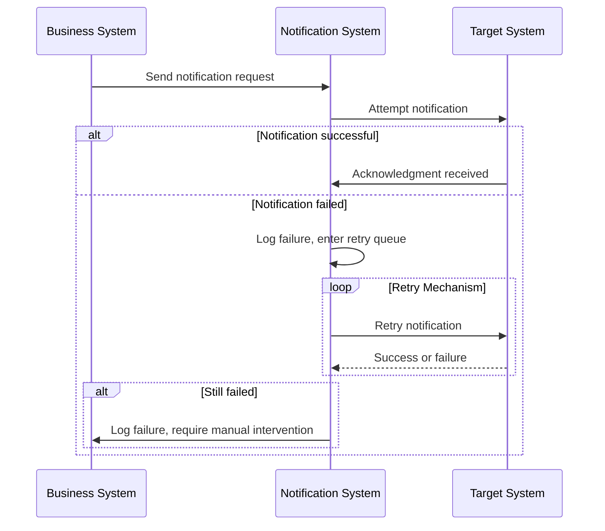

# 最大努力通知（Best Effort Notification）分布式解决方案

## 概念

最大努力通知是一种 最终一致性事务解决方案，适用于 对一致性要求不严格，但需要 保证消息尽最大可能传递 的场景。

该方案 不保证 100% 送达，但 会进行多次重试，确保消息 大概率被消费。

## 工作流程

### 1. 业务系统发起操作

* 业务执行完成后，向通知系统 异步发送通知。

### 2. 通知系统记录通知请求

* 记录该通知请求（如存入数据库）。
* 采用 消息队列（MQ） 或 定时任务 进行 异步通知。

### 3. 多次重试

* 若通知失败，通知系统会按照 设定的策略 进行 多次重试（如指数退避）。
* 重试次数有限，不会无限重试，防止资源浪费。

4\. 成功 & 失败处理

* 成功：目标系统确认收到通知，停止重试。
* 失败：超过重试次数仍未成功，记录日志，并由 人工介入 处理。

## &#x20;特性

| 特性    | 说明                       |
| ----- | ------------------------ |
| 最终一致性 | 通过多次尝试，尽可能让数据保持一致        |
| 异步通知  | 业务执行完成后，通知逻辑与主业务解耦，提高吞吐量 |
| 有损通知  | 不保证 100% 送达，但会尽力重试       |
| 重试策略  | 指数退避、固定间隔、最大重试次数         |
| 人工介入  | 失败后，可手动修正或重新发送通知         |

## 适用场景

✅ 支付系统：支付完成后，通知订单系统状态变更

✅ 订单超时取消：通知库存系统释放库存

✅ 积分 & 会员系统：用户完成任务后，通知积分系统加分

✅ 消息推送：用户行为触发推送，但不影响主业务

优缺点

| 优点                 | 缺点               |
| ------------------ | ---------------- |
| ✅ 低耦合，异步通知，主业务不受影响 | ❌ 不能 100% 确保消息送达 |
| ✅ 提高系统吞吐量，适用于高并发   | ❌ 需要额外 日志 & 监控   |
| ✅ 适用于 微服务、分布式系统    | ❌ 失败需要 人工介入 处理   |

## 选型建议

📌 如果业务对一致性要求高（如金融支付） → 建议使用 2PC / TCC

📌 如果业务对一致性要求不高（如订单通知） → 适用最大努力通知

📌 如果可接受短暂不一致，但希望最终一致 → 可结合 MQ + 事务日志

📌 示例流程图

## 总结

🚀 最大努力通知 适用于 高吞吐 & 允许一定失败 的分布式事务场景，如 订单、库存、营销 等领域。

📌 但 不能 100% 确保消息送达，需要 日志 + 监控 + 人工干预，适合 最终一致性事务。
