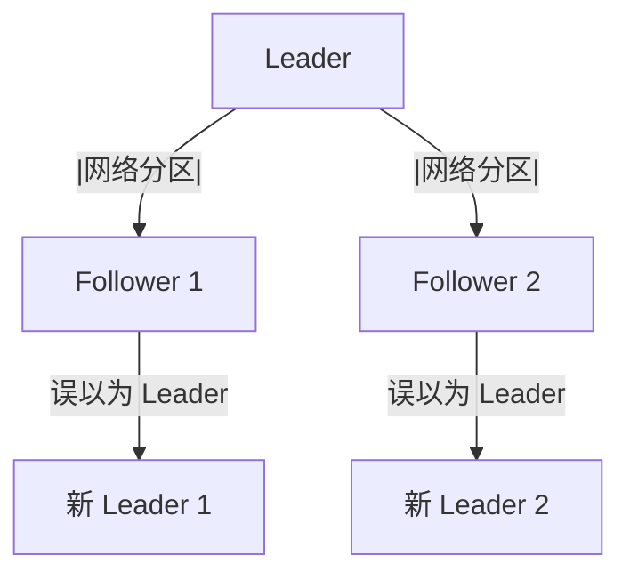
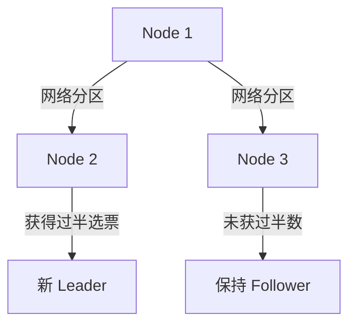
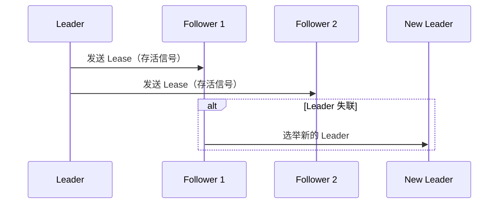
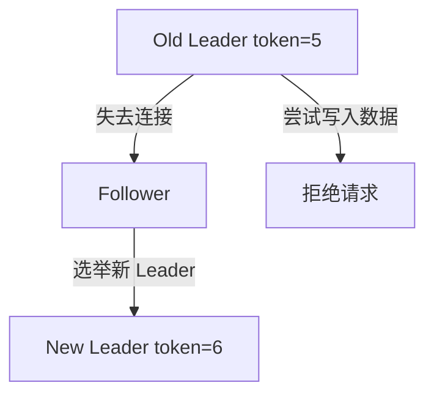
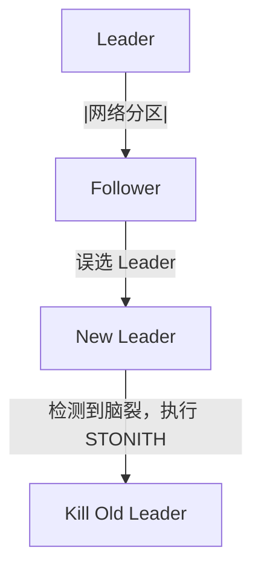

# 脑裂（Split-Brain）问题及解决方案

## 1. 什么是脑裂（Split-Brain）

### 概念

脑裂（Split-Brain） 是指 分布式系统 在\*\*网络分区（Network Partition）\*\*的情况下，多个节点误以为自己是 Leader，从而导致数据不一致或服务故障。

### 发生场景

* 主从集群（Leader-Follower）：主节点（Leader）和部分从节点（Follower）断开连接，导致两个 Leader 竞争。
* 对等集群（Peer-to-Peer）：多个节点在网络分区后，各自独立执行写操作，导致数据冲突。
* 高可用系统（HA）：如 Redis Sentinel、Zookeeper、Raft，如果脑裂未正确处理，可能导致数据不一致。

### 典型案例

* Redis Sentinel：多个 Sentinel 分区，可能选出两个 Master，导致数据冲突。
* Kafka：多个 Broker 误认为自己是 Leader，消息丢失或重复。
* Raft：多个节点选出不同 Leader，日志不一致。

## 2. 为什么会发生脑裂？

### 主要原因

| 原因     | 描述                                   |
| ------ | ------------------------------------ |
| 网络分区   | 部分节点因网络故障断开，但仍继续工作                   |
| 选举机制缺陷 | 节点可能在未获得集群多数票时自认为是 Leader            |
| 节点超时误判 | 由于心跳超时，Follower 误以为 Leader 挂掉，主动发起选举 |
| 同步超时   | Leader 更新数据后，部分 Follower 因网络原因未同步    |



### 影响

| 影响    | 后果                                  |
| ----- | ----------------------------------- |
| 数据不一致 | 不同 Leader 处理不同请求，数据冲突               |
| 数据丢失  | 脑裂恢复后，旧 Leader 覆盖新 Leader 数据，导致数据丢失 |
| 客户端异常 | 不同 Leader 返回不同结果，业务逻辑混乱             |

## 3. 脑裂的解决方案

针对不同系统和架构，脑裂的解决方案主要包括：

* 仲裁机制（Quorum）
* 租约（Lease-Based Heartbeat）
* Fencing Token（事务令牌）
* 强制下线（STONITH）
* 基于时钟的冲突解决

### 方案 1：仲裁机制（Quorum Majority Rule）

适用系统

* Raft（ETCD、TiDB）
* Kafka
* Zookeeper

方案原理

* 集群只有获得 “多数派”（Quorum Majority）的节点才能成为 Leader。
* 少数节点即使误认为自己是 Leader，也无法写入数据。




代码示例（Raft）

```java
// 选举时，必须获得过半数节点投票
if (votes > totalNodes / 2) {
    becomeLeader();
} else {
    remainFollower();
}
```

关键点

* 防止小部分节点形成“孤立群体”。
* 少数派即使误认为 Leader，也无法操作数据。

### 方案 2：租约机制（Lease-Based Heartbeat）

适用系统

* ETCD、Zookeeper
* Kubernetes Leader 选举
* Redis Sentinel

方案原理

* Leader 定期向 Follower 发送 “租约”，保持 Leader 身份。
* 租约超时后，Follower 才能发起选举，防止误选 Leader。




代码示例

```java
// 只有租约仍然有效，Leader 才能执行写操作
if (leaseValid()) {
    processWrite();
} else {
    rejectRequest();
}
```

关键点

* 防止短暂网络波动导致错误选举。
* 使用 NTP 保持时间同步，确保租约准确。

### 方案 3：Fencing Token（事务令牌）

适用系统

* Zookeeper
* 分布式数据库

方案原理

* Leader 选举后，分配一个递增的 token（如 term ID）。
* Follower 只能接受比当前 token 更新的 Leader，防止旧 Leader 继续写入。




代码示例

```java
if (currentTerm < latestTerm) {
    rejectWrite();  // 旧 Leader 无权写入
}
```

关键点

* 旧 Leader 即使恢复，也无法覆盖新数据。
* 适用于分布式数据库，如 MySQL Group Replication。

## 方案 4：STONITH（Shoot The Other Node In The Head）

适用系统

* Kubernetes + Etcd
* Ceph
* Redis Sentinel

方案原理

* 主动杀死旧 Leader，防止其继续工作。




代码示例（Kubernetes）

```sh
kubectl delete pod etcd-1  # 强制清理旧 Leader
```

关键点

* 适用于分布式存储，避免数据冲突。

## 4. 各分布式系统如何解决脑裂

| 系统                | 方案                    | 机制              |
| ----------------- | --------------------- | --------------- |
| Raft（ETCD, TiDB）  | 仲裁机制                  | 半数派选举           |
| Zookeeper         | Fencing Token         | 事务令牌            |
| Redis Sentinel    | Lease-Based Heartbeat | 租约              |
| Kafka             | ISR（同步副本集）            | Quorum Majority |
| Kubernetes + Etcd | STONITH               | 杀死旧 Leader      |

## 5. 总结

🔹 脑裂主要由网络分区导致，多个 Leader 可能并存，造成数据冲突。

🔹 Raft 采用 Quorum 选举机制，确保只有一个 Leader。

🔹 Zookeeper 采用 Fencing Token，防止旧 Leader 继续写入。

🔹 Redis Sentinel 采用租约机制，确保 Leader 选举稳定。

🔹 Kubernetes + Etcd 采用 STONITH，直接强制杀死旧 Leader。

\


✅ 不同系统采用不同策略，防止脑裂导致数据不一致 🚀。
