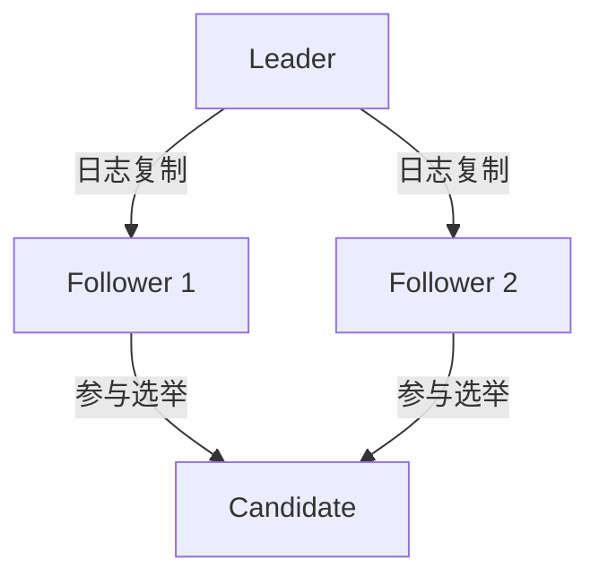
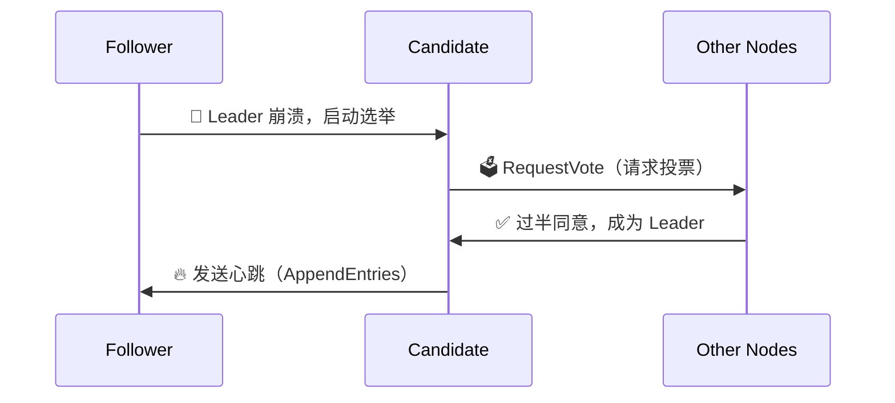
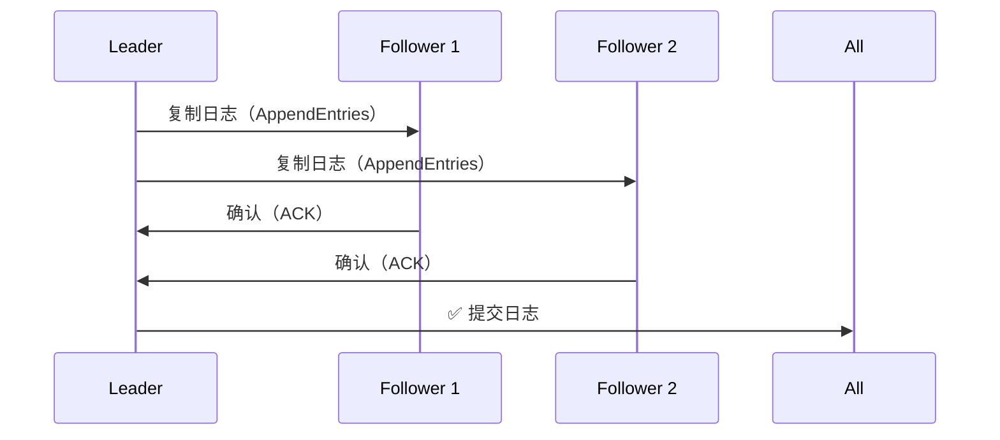
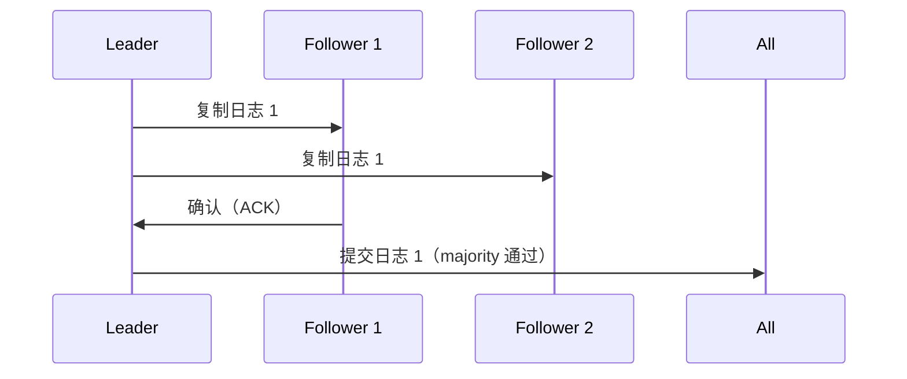

# Raft 算法详解

## 1. Raft 算法的核心概念

Raft 主要用于 多副本数据同步，保证数据一致性，常用于 分布式数据库、分布式存储、消息队列等系统。

Raft 的目标

* Leader 选举：集群需要一个 Leader 负责日志同步。
* 日志复制：Leader 负责向 Follower 复制数据，保证一致性。
* 故障恢复：当 Leader 故障时，Follower 重新选举新的 Leader。
* 日志提交 & 持久化：确保即使节点崩溃，日志仍然一致。

## 2. Raft 的角色

Raft 由 3 种角色组成：

| 角色             | 职责                          |
| -------------- | --------------------------- |
| Leader（领导者）    | 处理所有写请求，管理日志复制              |
| Follower（跟随者）  | 被动接受 Leader 的命令，复制日志        |
| Candidate（候选者） | 参与 Leader 选举，赢得选举后成为 Leader |

✅ 每个节点初始都是 Follower，Leader 崩溃后，Follower 可能变成 Candidate 竞选 Leader。

## 3. Raft 算法的工作流程

Raft 主要包括 三大流程：

1. Leader 选举
2. 日志复制
3. 日志提交 & 持久化

### 1. Leader 选举

当 Leader 失联（网络断开 / 崩溃），Follower 会发起 选举：

1\. Follower 进入 Candidate 状态，增加 term（任期），向其他节点请求投票（RequestVote）。

2\. 如果获得超过半数的选票，Candidate 成为 Leader。

3\. Leader 发送心跳（AppendEntries），防止 Follower 触发选举。

选举条件

* Candidate 获取大多数（>50%）投票，才能成为 Leader。
* 投票基于日志最新性：
* 如果两个节点日志一样新，则任期大的获胜。
* 如果任期相同，则日志索引高的获胜

### 2. 日志复制

* Leader 处理写请求，把日志 复制到 Follower。
* Follower 确认日志后，Leader 进行提交（commit）。

Follower 宕机后恢复，会重新向 Leader 申请同步日志，保证数据一致性。

### 3. 日志提交 & 持久化

Raft 采用 半数机制 确保数据一致：

1\. Leader 等待大多数（>50%）Follower 确认，才提交日志。

2\. 提交后通知 Follower 更新 commitIndex，确保日志持久化。

保证即使 Leader 崩溃，新 Leader 也能恢复一致性日志。

## 4. Raft vs. Paxos

| 对比项       | Raft             | Paxos                   |
| --------- | ---------------- | ----------------------- |
| 易实现性      | ✅ 更简单            | ❌ 复杂                    |
| Leader 选举 | ✅ 基于心跳           | ❌ 基于提案                  |
| 日志复制      | ✅ 单 Leader 复制    | ❌ 多提案者竞争                |
| 应用场景      | 分布式数据库、ETCD、TiDB | Google Chubby、Zookeeper |

Raft 更易实现，适用于分布式数据库 & KV 存储（如 ETCD、TiDB）。

## 5. Raft 的优势

✅ 简单易实现，比 Paxos 易理解。

✅ 日志同步保证数据一致性。

✅ Leader 选举快，故障恢复迅速。

✅ 支持分区恢复，保证可用性。

## 6. 结论

🔹 Raft 是一种高效的分布式一致性算法，被 ETCD、TiDB 广泛采用。

🔹 通过 Leader 选举 + 日志复制，确保数据一致性。

🔹 相比 Paxos，Raft 更易理解，适用于数据库、分布式存储等场景 🚀。
