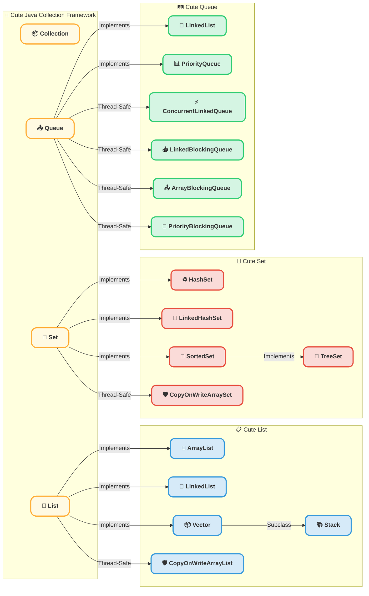
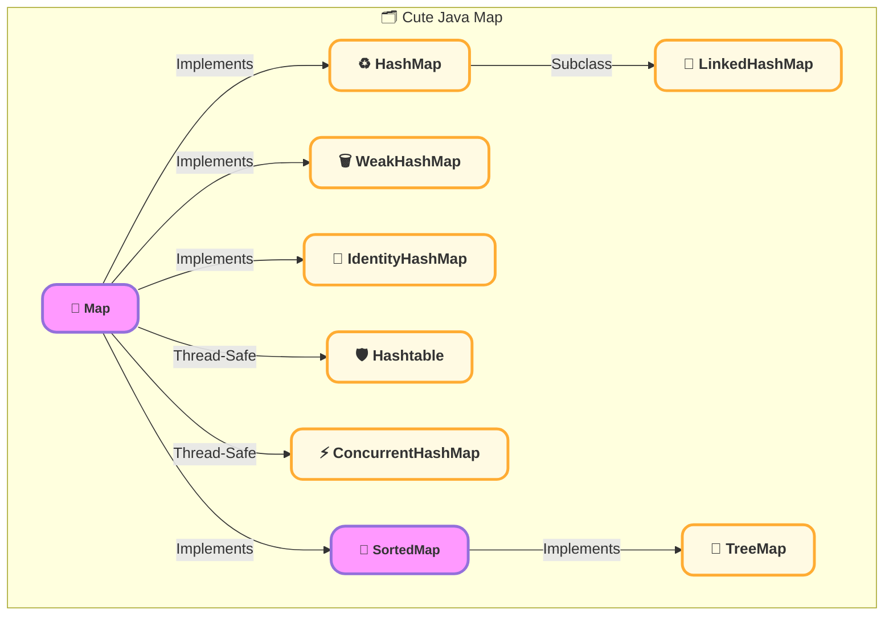

# Java集合分类

## Java 集合框架概述

Java 集合框架的核心是 Collection 接口（及其子接口）和 Map 接口，它们构成了 Java 最常用的数据存储结构。

• Collection：用于存储单个元素的容器，包括 List、Set 和 Queue。

• Map：用于存储键值对，比如 HashMap 和 TreeMap。

### Collection

### Map

## 接口特点

### List

List 允许元素 重复，且有序存储，适用于需要频繁 随机访问 数据的场景。

| 实现类                  | 底层数据结构 | 线程安全   | 特点        |
| -------------------- | ------ | ------ | --------- |
| ArrayList            | 动态数组   | ❌ 不安全  | 查询快、增删慢   |
| LinkedList           | 双向链表   | ❌ 不安全  | 查询慢、增删快   |
| Vector               | 动态数组   | ✅ 线程安全 | 老旧类，不推荐使用 |
| CopyOnWriteArrayList | 动态数组   | ✅ 线程安全 | 适用于 读多写少  |

#### List选型建议

• 查询多、修改少 ➝ ArrayList

• 插入/删除频繁 ➝ LinkedList

• 多线程环境 ➝ CopyOnWriteArrayList

### Set

Set 主要用于存储 唯一值，不允许元素重复，底层通常使用 哈希表或红黑树。

| 实现类                 | 底层结构           | 排序     | 线程安全   |
| ------------------- | -------------- | ------ | ------ |
| HashSet             | HashMap（Key）   | ❌ 无序   | ❌ 不安全  |
| LinkedHashSet       | HashMap + 双向链表 | ✅ 插入顺序 | ❌ 不安全  |
| TreeSet             | 红黑树（TreeMap）   | ✅ 排序   | ❌ 不安全  |
| CopyOnWriteArraySet | 动态数组           | ❌ 无序   | ✅ 线程安全 |

#### Set 选型建议

• 唯一性但无序 ➝ HashSet

• 唯一性且按插入顺序 ➝ LinkedHashSet

• 唯一性且需要排序 ➝ TreeSet

• 线程安全 ➝ CopyOnWriteArraySet

### Queue

Queue 主要用于 先进先出（FIFO） 结构，适合任务调度、消息队列等场景。

| 实现类                   | 底层结构 | 线程安全   | 特点           |
| --------------------- | ---- | ------ | ------------ |
| LinkedList（队列）        | 双向链表 | ❌ 不安全  | 支持 FIFO、LIFO |
| PriorityQueue         | 堆    | ❌ 不安全  | 元素优先级排序      |
| ConcurrentLinkedQueue | 链表   | ✅ 线程安全 | 无锁并发队列       |
| LinkedBlockingQueue   | 链表   | ✅ 线程安全 | 支持容量限制       |
| ArrayBlockingQueue    | 链表   | ✅ 线程安全 | 定长阻塞队列       |

#### Queue 选型建议

• 普通 FIFO 队列 ➝ LinkedList

• 优先级队列 ➝ PriorityQueue

• 高并发队列 ➝ ConcurrentLinkedQueue

• 阻塞队列 ➝ LinkedBlockingQueue

### Map（键值对存储）

Map 主要用于存储 Key-Value 对象，适用于 快速查找、缓存、索引。

| 实现类               | 底层结构           | 排序         | 线程安全   |
| ----------------- | -------------- | ---------- | ------ |
| HashMap           | 数组 + 链表 + 红黑树  | ❌ 无序       | ❌ 不安全  |
| LinkedHashMap     | HashMap + 双向链表 | ✅ 插入顺序     | ❌ 不安全  |
| TreeMap           | 红黑树            | ✅ 按 Key 排序 | ❌ 不安全  |
| ConcurrentHashMap | CAS + 分段锁      | ❌ 无序       | ✅ 线程安全 |

#### Map 选型建议

• 无序存储 ➝ HashMap

• 有序存储（按插入顺序） ➝ LinkedHashMap

• 排序存储（按 Key 排序） ➝ TreeMap

• 线程安全 ➝ ConcurrentHashMap

## 总结

Java 集合框架为不同的应用场景提供了 多种数据结构，根据 数据特点、访问方式、并发需求 选择合适的实现类，可以提高 程序性能。
