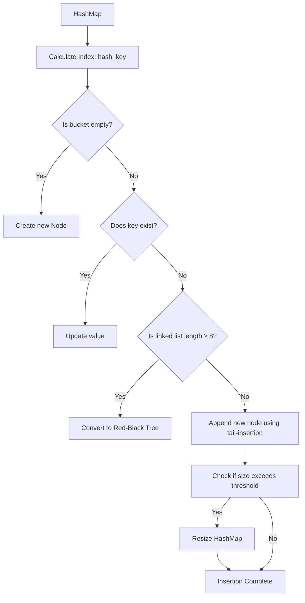

# HashMap putval() flow

## 1.putval() flow



## 2.putVal 方法源码解析（带注释）

```java
final V putVal(int hash, K key, V value, boolean onlyIfAbsent, boolean evict) {
    Node<K,V>[] tab; Node<K,V> p; int n, i;
    
    // ① 如果哈希表为空，则进行初始化（懒加载），并返回新的容量
    if ((tab = table) == null || (n = tab.length) == 0)
        n = (tab = resize()).length;

    // ② 计算数组索引位置 `(n - 1) & hash`，并检查是否为空桶
    if ((p = tab[i = (n - 1) & hash]) == null)
        // ③ 如果桶为空，则直接在该位置创建新的节点
        tab[i] = newNode(hash, key, value, null);
    else {
        Node<K,V> e; K k;
        
        // ④ 如果桶不为空，检查当前桶中的第一个节点是否匹配 key
        if (p.hash == hash && ((k = p.key) == key || (key != null && key.equals(k))))
            e = p;  // 直接获取该节点
        // ⑤ 如果该桶是一个树结构（红黑树），调用 `putTreeVal` 进行树的插入
        else if (p instanceof TreeNode)
            e = ((TreeNode<K,V>)p).putTreeVal(this, tab, hash, key, value);
        else { 
            // ⑥ 否则，遍历链表寻找匹配的 key，或者找到链表尾部插入新节点
            for (int binCount = 0; ; ++binCount) {
                if ((e = p.next) == null) { // 遍历到链表的最后一个节点
                    p.next = newNode(hash, key, value, null); // 在尾部插入新节点
                    // ⑦ 如果链表长度达到 `TREEIFY_THRESHOLD - 1` (默认 7)，转为红黑树
                    if (binCount >= TREEIFY_THRESHOLD - 1)
                        treeifyBin(tab, hash);
                    break;
                }
                // ⑧ 如果找到 key 相同的节点，跳出循环
                if (e.hash == hash &&
                    ((k = e.key) == key || (key != null && key.equals(k))))
                    break;
                p = e; // 继续遍历链表
            }
        }

        // ⑨ 如果找到了已经存在的 key，则更新 value
        if (e != null) {
            V oldValue = e.value;
            if (!onlyIfAbsent || oldValue == null) // `onlyIfAbsent` 为 `false` 时，更新值
                e.value = value;
            afterNodeAccess(e); // 触发访问后回调（LinkedHashMap 可用）
            return oldValue; // 返回旧值
        }
    }

    // ⑩ 结构修改次数 `modCount` 自增，`size` 超过 `threshold` 时触发扩容
    ++modCount;
    if (++size > threshold)
        resize(); // 触发扩容

    afterNodeInsertion(evict); // 插入后操作（LinkedHashMap 可用）
    return null; // 返回 `null` 表示新插入的 key
}
```

