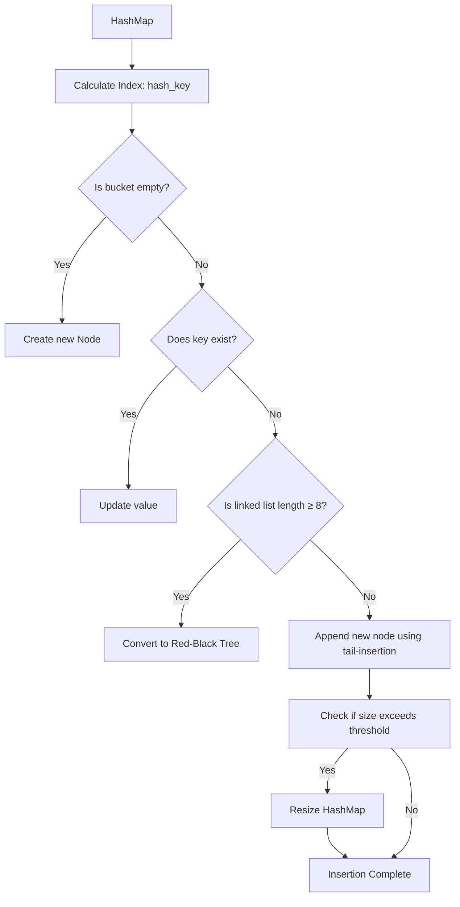
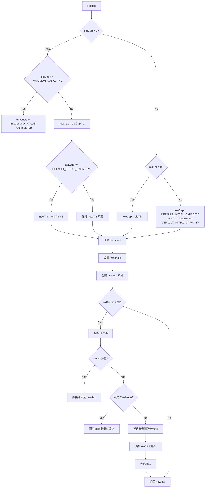

# HashMap putval() flow

## 1.putval() flow



## 2.putVal 方法源码解析

```java
final V putVal(int hash, K key, V value, boolean onlyIfAbsent, boolean evict) {
    Node<K,V>[] tab; Node<K,V> p; int n, i;
    
    // ① 如果哈希表为空，则进行初始化（懒加载），并返回新的容量
    if ((tab = table) == null || (n = tab.length) == 0)
        n = (tab = resize()).length;

    // ② 计算数组索引位置 `(n - 1) & hash`，并检查是否为空桶
    if ((p = tab[i = (n - 1) & hash]) == null)
        // ③ 如果桶为空，则直接在该位置创建新的节点
        tab[i] = newNode(hash, key, value, null);
    else {
        Node<K,V> e; K k;
        
        // ④ 如果桶不为空，检查当前桶中的第一个节点是否匹配 key
        if (p.hash == hash && ((k = p.key) == key || (key != null && key.equals(k))))
            e = p;  // 直接获取该节点
        // ⑤ 如果该桶是一个树结构（红黑树），调用 `putTreeVal` 进行树的插入
        else if (p instanceof TreeNode)
            e = ((TreeNode<K,V>)p).putTreeVal(this, tab, hash, key, value);
        else { 
            // ⑥ 否则，遍历链表寻找匹配的 key，或者找到链表尾部插入新节点
            for (int binCount = 0; ; ++binCount) {
                if ((e = p.next) == null) { // 遍历到链表的最后一个节点
                    p.next = newNode(hash, key, value, null); // 在尾部插入新节点
                    // ⑦ 如果链表长度达到 `TREEIFY_THRESHOLD - 1` (默认 7)，转为红黑树
                    if (binCount >= TREEIFY_THRESHOLD - 1)
                        treeifyBin(tab, hash);
                    break;
                }
                // ⑧ 如果找到 key 相同的节点，跳出循环
                if (e.hash == hash &&
                    ((k = e.key) == key || (key != null && key.equals(k))))
                    break;
                p = e; // 继续遍历链表
            }
        }

        // ⑨ 如果找到了已经存在的 key，则更新 value
        if (e != null) {
            V oldValue = e.value;
            if (!onlyIfAbsent || oldValue == null) // `onlyIfAbsent` 为 `false` 时，更新值
                e.value = value;
            afterNodeAccess(e); // 触发访问后回调（LinkedHashMap 可用）
            return oldValue; // 返回旧值
        }
    }

    // ⑩ 结构修改次数 `modCount` 自增，`size` 超过 `threshold` 时触发扩容
    ++modCount;
    if (++size > threshold)
        resize(); // 触发扩容

    afterNodeInsertion(evict); // 插入后操作（LinkedHashMap 可用）
    return null; // 返回 `null` 表示新插入的 key
}
```

## 3.resize()

### 扩容流程




resize() 方法是 HashMap 在 JDK 1.8 里的扩容逻辑，它的作用是 当容量超过阈值时，进行扩容（通常是原来的 2 倍），并重新分布数据。

```java
final Node<K,V>[] resize() {
    // 1️⃣ 旧表（oldTab）和旧容量（oldCap）
    Node<K,V>[] oldTab = table;
    int oldCap = (oldTab == null) ? 0 : oldTab.length;
    int oldThr = threshold;
    int newCap, newThr = 0;

    // 2️⃣ 旧容量大于 0，进行扩容
    if (oldCap > 0) {
        if (oldCap >= MAXIMUM_CAPACITY) { // 1<<30，即 2^30
            threshold = Integer.MAX_VALUE; // 不能再扩容了
            return oldTab;
        }
        else if ((newCap = oldCap << 1) < MAXIMUM_CAPACITY &&
                 oldCap >= DEFAULT_INITIAL_CAPACITY)
            newThr = oldThr << 1; // 阈值翻倍
    }
    // 3️⃣ 旧容量等于 0，旧阈值大于 0，则 newCap = oldThr
    else if (oldThr > 0) // 初始容量设置过
        newCap = oldThr;
    // 4️⃣ 初次创建表，使用默认值
    else {               
        newCap = DEFAULT_INITIAL_CAPACITY; // 16
        newThr = (int)(DEFAULT_LOAD_FACTOR * DEFAULT_INITIAL_CAPACITY); // 12
    }

    // 5️⃣ 计算新的阈值（如果 newThr 还没确定）
    if (newThr == 0) {
        float ft = (float)newCap * loadFactor;
        newThr = (newCap < MAXIMUM_CAPACITY && ft < (float)MAXIMUM_CAPACITY ?
                  (int)ft : Integer.MAX_VALUE);
    }

    // 6️⃣ 设定新的 threshold
    threshold = newThr;

    // 7️⃣ 创建新数组 newTab
    @SuppressWarnings({"rawtypes","unchecked"})
    Node<K,V>[] newTab = (Node<K,V>[])new Node[newCap];
    table = newTab;

    // 8️⃣ 重新映射旧数据
    if (oldTab != null) {
        for (int j = 0; j < oldCap; ++j) {
            Node<K,V> e;
            if ((e = oldTab[j]) != null) {
                oldTab[j] = null; // 释放旧的引用
                if (e.next == null) // 直接迁移
                    newTab[e.hash & (newCap - 1)] = e;
                else if (e instanceof TreeNode) // 处理红黑树
                    ((TreeNode<K,V>)e).split(this, newTab, j, oldCap);
                else { // 处理链表
                    Node<K,V> loHead = null, loTail = null;
                    Node<K,V> hiHead = null, hiTail = null;
                    Node<K,V> next;
                    do {
                        next = e.next;
                        if ((e.hash & oldCap) == 0) { // 低位
                            if (loTail == null)
                                loHead = e;
                            else
                                loTail.next = e;
                            loTail = e;
                        }
                        else { // 高位
                            if (hiTail == null)
                                hiHead = e;
                            else
                                hiTail.next = e;
                            hiTail = e;
                        }
                    } while ((e = next) != null);

                    if (loTail != null) {
                        loTail.next = null;
                        newTab[j] = loHead;
                    }
                    if (hiTail != null) {
                        hiTail.next = null;
                        newTab[j + oldCap] = hiHead;
                    }
                }
            }
        }
    }
    return newTab;
}
```

### 高低位拆分法

HashMap 1.8 在 resize() 过程中，重新分配桶（bucket）时，使用高低位拆分法（low/high splitting）进行数据迁移 的核心逻辑之一

当 HashMap 进行 扩容 时，容量 oldCap 会变成 newCap = oldCap \* 2。扩容后，原来的数据要么 留在原索引位置，要么 移动到新索引（旧索引 + oldCap）。

#### 代码逐行解析

```java
// 维护两个链表，分别存储低位和高位的节点
Node<K,V> loHead = null, loTail = null;  // 低位链表
Node<K,V> hiHead = null, hiTail = null;  // 高位链表
Node<K,V> next; // 临时变量，存储当前节点的下一个节点
```

* loHead/loTail：低位链表的头和尾。
* hiHead/hiTail：高位链表的头和尾。
* next：用于保存当前节点的 next，避免链表断裂。

```java
do {
    next = e.next; // 先保存当前节点的 next，避免链表断裂
    if ((e.hash & oldCap) == 0) { // 低位组
        if (loTail == null) // 如果低位链表为空，初始化头部
            loHead = e;
        else
            loTail.next = e; // 追加到低位链表
        loTail = e; // 更新低位链表的尾节点
    }
    else { // 高位组
        if (hiTail == null) // 如果高位链表为空，初始化头部
            hiHead = e;
        else
            hiTail.next = e; // 追加到高位链表
        hiTail = e; // 更新高位链表的尾节点
    }
} while ((e = next) != null); // 遍历链表中的所有节点
```

使用 (e.hash & oldCap) == 0 判断是否属于低位组

* e.hash & oldCap == 0 → 低位组，索引不变。
* e.hash & oldCap != 0 → 高位组，索引变为 j + oldCap。

遍历链表，分别构建 loHead → loTail 和 hiHead → hiTail

* 如果 loTail == null，说明低位组还没有元素，将当前节点 e 作为 loHead。
* 否则，把 e 追加到 loTail 之后，并更新 loTail。
* 同理，高位组也是类似的操作。

```java
if (loTail != null) { 
    loTail.next = null; 
    newTab[j] = loHead; 
}
if (hiTail != null) { 
    hiTail.next = null; 
    newTab[j + oldCap] = hiHead; 
}
```

* 将低位链表存入新数组的 j 索引位置。
* 将高位链表存入新数组的 j + oldCap 索引位置。
* 设置 loTail.next = null，避免形成环（死循环）。

#### 例子：oldCap = 16，newCap = 32

假设 HashMap 需要扩容，旧容量 oldCap=16，新容量 newCap=32，我们有以下哈希值的元素：

```java
元素A -> hash =  3   (二进制: 0000 0011)
元素B -> hash = 18   (二进制: 0001 0010)
元素C -> hash = 20   (二进制: 0001 0100)
```

计算 (hash & oldCap) == 0

| Key | Hash 值 (二进制) | (hash & oldCap) | 结果 |
| --- | ------------ | --------------- | -- |
| A   | 0000 0011    | 0000 0000       | 低位 |
| B   | 0001 0010    | 0001 0000       | 高位 |
| C   | 0001 0100    | 0001 0000       | 高位 |

* 低位组（索引不变）： A
* 高位组（索引变化 j + oldCap）： B, C

#### 低位高位拆分优化

1.避免全量重新计算索引，提高性能

* JDK 1.7：采用 重新计算 (hash % newCap)，需要 重新计算索引，性能较低。
* JDK 1.8：使用 (hash & oldCap) 判断，避免重新计算索引，提升效率。

2.保持原链表的相对顺序

* 在拆分过程中，loTail.next = null 和 hiTail.next = null 保证新链表不会形成环，且相对顺序保持不变。


