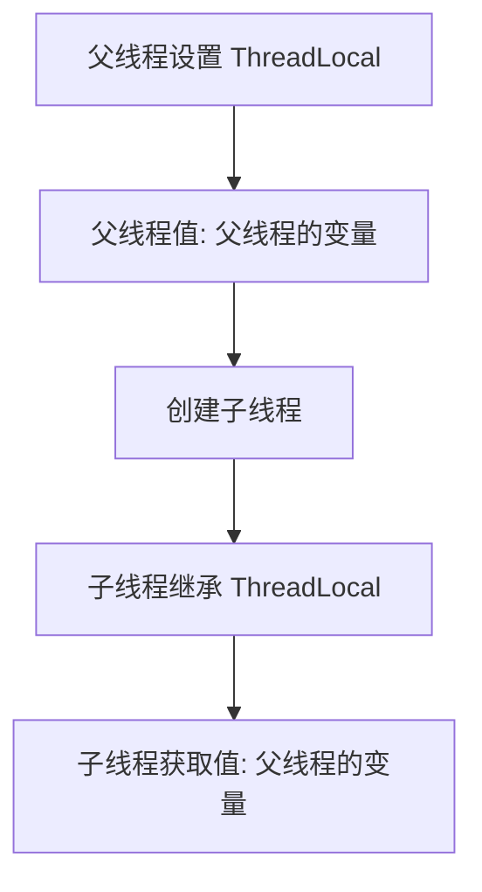

# Java 并发 - ThreadLocal 父子线程共享问题

## 1. ThreadLocal 变量在父子线程中的问题

### 1.1 ThreadLocal 默认行为

```java
public class ThreadLocalParentChild {
    private static ThreadLocal<String> threadLocal = new ThreadLocal<>();

    public static void main(String[] args) {
        threadLocal.set("父线程的变量");

        Thread childThread = new Thread(() -> {
            System.out.println("子线程获取的值: " + threadLocal.get());
        });

        childThread.start();
    }
}
```

执行结果

```sh
子线程获取的值: null
```

关键点

* threadLocal 变量 不会被子线程继承，因此 threadLocal.get() 返回 null。

## 2. 解决方案：使用 InheritableThreadLocal

如果希望 子线程继承父线程的 ThreadLocal 变量，可以使用 InheritableThreadLocal：

```java
public class InheritableThreadLocalExample {
    private static InheritableThreadLocal<String> threadLocal = new InheritableThreadLocal<>();

    public static void main(String[] args) {
        threadLocal.set("父线程的变量");

        Thread childThread = new Thread(() -> {
            System.out.println("子线程获取的值: " + threadLocal.get());
        });

        childThread.start();
    }
}
```

执行结果

```
子线程获取的值: 父线程的变量
```

关键点

* InheritableThreadLocal 允许 子线程自动继承 父线程的变量。



## 3. InheritableThreadLocal 的问题

### 3.1 父线程变量修改，子线程是否会变化？

```java
public class InheritableThreadLocalUpdate {
    private static InheritableThreadLocal<Integer> threadLocal = new InheritableThreadLocal<>();

    public static void main(String[] args) throws InterruptedException {
        threadLocal.set(100);
        
        Thread childThread = new Thread(() -> {
            System.out.println("子线程获取的值: " + threadLocal.get());
        });

        threadLocal.set(200); // 父线程修改变量
        childThread.start();
    }
}
```

执行结果

```
子线程获取的值: 100
```

关键点

* 子线程继承的是创建时的值，而不会随父线程修改而变化。

## 3.2 InheritableThreadLocal 变量在线程池中的问题

如果 使用线程池，InheritableThreadLocal 可能导致 变量污染：

```java
import java.util.concurrent.ExecutorService;
import java.util.concurrent.Executors;

public class InheritableThreadLocalThreadPool {
    private static InheritableThreadLocal<String> threadLocal = new InheritableThreadLocal<>();

    public static void main(String[] args) {
        ExecutorService executor = Executors.newFixedThreadPool(2);

        Runnable task1 = () -> {
            threadLocal.set(Thread.currentThread().getName() + " 的数据");
            System.out.println(Thread.currentThread().getName() + " 设置值: " + threadLocal.get());
        };

        Runnable task2 = () -> {
            System.out.println(Thread.currentThread().getName() + " 读取值: " + threadLocal.get());
        };

        executor.execute(task1);
        executor.execute(task2); // 可能读取到 task1 的值，导致污染

        executor.shutdown();
    }
}
```

可能的执行结果

```
pool-1-thread-1 设置值: pool-1-thread-1 的数据
pool-1-thread-2 读取值: null
pool-1-thread-1 读取值: pool-1-thread-1 的数据
```

问题

* 线程池会复用线程，导致子线程可能读取到 其他任务的 ThreadLocal 值，导致数据污染。

## 4. 解决方案：TransmittableThreadLocal

阿里巴巴 TTL（TransmittableThreadLocal）库 解决了线程池污染问题：

```java
<dependency>
    <groupId>com.alibaba</groupId>
    <artifactId>transmittable-thread-local</artifactId>
    <version>2.12.2</version>
</dependency>
```

```java
import com.alibaba.ttl.TransmittableThreadLocal;
import com.alibaba.ttl.TtlRunnable;
import java.util.concurrent.ExecutorService;
import java.util.concurrent.Executors;

public class TransmittableThreadLocalExample {
    private static TransmittableThreadLocal<String> threadLocal = new TransmittableThreadLocal<>();

    public static void main(String[] args) {
        ExecutorService executor = Executors.newFixedThreadPool(2);

        threadLocal.set("父线程数据");

        Runnable task = TtlRunnable.get(() -> {
            System.out.println(Thread.currentThread().getName() + " 读取值: " + threadLocal.get());
        });

        executor.execute(task);
        executor.shutdown();
    }
}
```

执行结果

```java
pool-1-thread-1 读取值: 父线程数据
```

关键点

* TtlRunnable.get() 包装任务，使 TransmittableThreadLocal 正确传递变量，防止线程池污染。

## 5. ThreadLocal vs. InheritableThreadLocal vs. TransmittableThreadLocal

| 特性             | ThreadLocal | InheritableThreadLocal | TransmittableThreadLocal |
| -------------- | ----------- | ---------------------- | ------------------------ |
| 子线程是否继承        | ❌ 不会继承      | ✅ 会继承                  | ✅ 会继承                    |
| 父线程变量修改是否影响子线程 | ❌ 不会影响      | ❌ 不会影响                 | ❌ 不会影响                   |
| 线程池是否安全        | ✅ 安全        | ❌ 不安全（变量污染）            | ✅ 安全                     |
| 适用场景           | 线程隔离        | 线程继承                   | 线程池变量传递                  |

## 6. 总结

* ThreadLocal 线程独立存储，不会被子线程继承。
* InheritableThreadLocal 支持子线程继承变量，但不能防止线程池变量污染。
* TransmittableThreadLocal 适用于线程池，确保变量正确传递。&#x20;

推荐

• 普通多线程：使用 ThreadLocal。

• 父子线程传递变量：使用 InheritableThreadLocal。

• 线程池环境：使用 TransmittableThreadLocal 。
