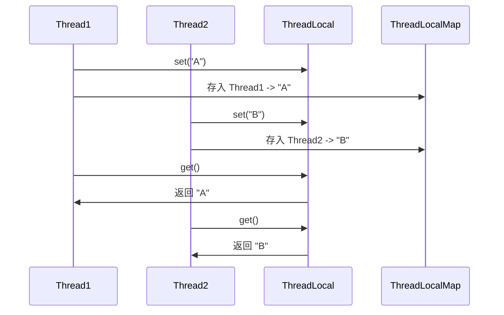
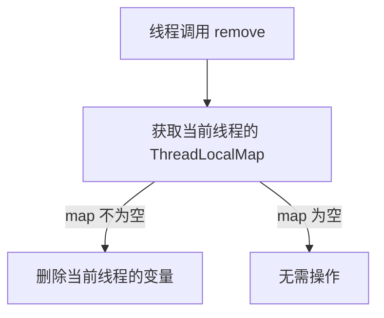

# Java 并发 - ThreadLocal 详解

## 1. ThreadLocal 作用

### 1.1 ThreadLocal 是什么？

ThreadLocal 是 Java 提供的 线程本地存储机制，允许每个线程 存储独立的数据副本，即 每个线程都有自己的变量副本，不共享。

### 1.2 适用场景

* 用户 Session 管理：每个线程维护独立的用户信息。
* 数据库连接管理：每个线程使用独立的 Connection，避免并发问题。
* 事务管理：每个线程管理自己的事务状态。
* 线程安全的变量共享：避免 synchronized，提高性能。

## 2. ThreadLocal 的核心逻辑

### 2.1 ThreadLocal 工作流程

1. 每个线程 持有一个 ThreadLocalMap（Thread 内部属性）。
2. 存值 (set)：线程将值存入 ThreadLocalMap，仅当前线程可见。
3. 取值 (get)：线程从 ThreadLocalMap 读取值，不影响其他线程。
4. 删除 (remove)：防止 内存泄漏，线程池环境下应主动删除。

&#x20;




## 3. ThreadLocal 核心源码解析

### 3.1 set() 方法

```java
/**
 * 将值存入当前线程的 ThreadLocalMap
 */
public void set(T value) {
    Thread t = Thread.currentThread();
    ThreadLocalMap map = getMap(t);
    if (map != null)
        map.set(this, value); // 存入 ThreadLocalMap
    else
        createMap(t, value); // 如果 map 为空，则创建
}
```

关键点

* 获取当前线程 (Thread.currentThread())。
* 检查当前线程是否已有 ThreadLocalMap：
* 如果有，直接存入 ThreadLocalMap。
* 如果没有，创建 ThreadLocalMap 并存入。


3.2 get() 方法

```java
/**
 * 获取当前线程的 ThreadLocal 变量
 */
public T get() {
    Thread t = Thread.currentThread();
    ThreadLocalMap map = getMap(t);
    if (map != null) {
        ThreadLocalMap.Entry e = map.getEntry(this);
        if (e != null)
            return (T) e.value;
    }
    return setInitialValue(); // 如果没有值，返回初始化值
}
```

关键点

* 获取当前线程的 ThreadLocalMap。
* 如果 ThreadLocalMap 存在，查找 Entry，返回对应值。
* 如果 ThreadLocalMap 为空，调用 setInitialValue() 进行初始化。

### 3.3 remove() 方法

```java
/**
 * 删除当前线程的变量，防止内存泄漏
 */
public void remove() {
    ThreadLocalMap m = getMap(Thread.currentThread());
    if (m != null)
        m.remove(this);
}
```

关键点

* 手动删除 ThreadLocalMap 中的变量，防止 内存泄漏。



## 4. ThreadLocalMap 内部实现

### 4.1 ThreadLocalMap 结构

* ThreadLocalMap 采用 开放地址法（数组） 作为存储结构。
* ThreadLocalMap.Entry 继承 WeakReference\<ThreadLocal\<?>>，避免 内存泄漏。

```java
/**
 * ThreadLocalMap 内部 Entry
 */
static class Entry extends WeakReference<ThreadLocal<?>> {
    Object value;
    
    Entry(ThreadLocal<?> k, Object v) {
        super(k);
        value = v;
    }
}
```

关键点

* Entry 使用 弱引用 关联 ThreadLocal，GC 时自动回收，避免内存泄漏。
* value 存储线程变量的值。

## 5. ThreadLocal 使用示例

5.1 场景 1：每个线程独立变量

```java
import java.util.concurrent.ExecutorService;
import java.util.concurrent.Executors;

public class ThreadLocalExample {
    private static ThreadLocal<Integer> threadLocal = ThreadLocal.withInitial(() -> 0);

    public static void main(String[] args) {
        ExecutorService executor = Executors.newFixedThreadPool(3);

        Runnable task = () -> {
            int value = threadLocal.get();
            threadLocal.set(value + 1);
            System.out.println(Thread.currentThread().getName() + " 的值: " + threadLocal.get());
        };

        for (int i = 0; i < 5; i++) {
            executor.execute(task);
        }

        executor.shutdown();
    }
}
```

执行结果（每个线程维护独立变量）

```
pool-1-thread-1 的值: 1
pool-1-thread-2 的值: 1
pool-1-thread-3 的值: 1
pool-1-thread-1 的值: 2
pool-1-thread-2 的值: 2
```

### 5.2 场景 2：数据库连接管理

```java
import java.sql.Connection;
import java.sql.DriverManager;
import java.sql.SQLException;

public class DBConnectionManager {
    private static ThreadLocal<Connection> connectionHolder = ThreadLocal.withInitial(() -> {
        try {
            return DriverManager.getConnection("jdbc:mysql://localhost:3306/test", "user", "password");
        } catch (SQLException e) {
            throw new RuntimeException("数据库连接失败");
        }
    });

    public static Connection getConnection() {
        return connectionHolder.get();
    }

    public static void closeConnection() throws SQLException {
        Connection conn = connectionHolder.get();
        if (conn != null) {
            conn.close();
            connectionHolder.remove();
        }
    }
}
```

关键点

* 每个线程使用自己的数据库连接，避免多线程访问冲突。
* 使用 remove() 手动清理，防止 连接泄漏。&#x20;

## 6. ThreadLocal vs. synchronized

| 对比项  | ThreadLocal | synchronized   |
| ---- | ----------- | -------------- |
| 线程安全 | ✅ 每个线程独立变量  | ✅ 线程互斥访问       |
| 性能   | 🚀 无锁，高性能   | 🐢 加锁，可能导致性能下降 |
| 适用场景 | 每个线程需要独立变量  | 多个线程共享变量       |
| 内存管理 | ⚠ 可能导致内存泄漏  | ✅ 不会导致泄漏       |

## 7. ThreadLocal 内存泄漏问题

### 7.1 为什么会有内存泄漏？

* ThreadLocalMap.Entry 采用 弱引用 关联 ThreadLocal，但 value 是 强引用。
* 如果 ThreadLocal 被 GC 回收，但 value 没有被清理，可能会造成 内存泄漏。

### 7.2 如何避免？

主动调用 remove() 释放资源

```java
try {
    threadLocal.set("value");
    // 执行业务逻辑
} finally {
    threadLocal.remove();
}
```

8\. 总结

* ThreadLocal 允许 每个线程存储独立变量，避免数据竞争。
* 适用于线程安全的变量共享，如 数据库连接、用户 Session、事务管理。
* 防止内存泄漏：使用 remove() 手动清理变量。
* 与 synchronized 相比，ThreadLocal 避免了锁竞争，提高并发性能 🚀。
