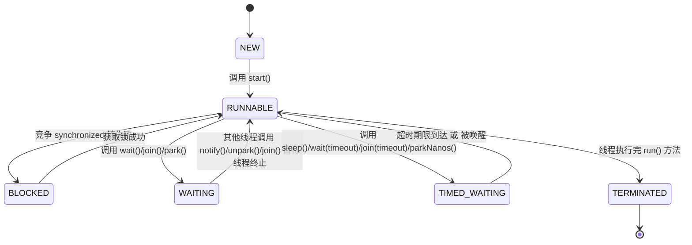

# Java 线程的 6 种状态及其状态流转

Java 线程的生命周期由 Thread.State 枚举定义，总共有 6 种状态。这些状态之间的转换是由 JVM 线程调度器管理的，受 synchronized、wait()、notify()、sleep() 等方法的影响。

## 1. 线程的 6 种状态

| 状态                   | 描述                 | 进入方式                                                           | 退出方式                                |
| -------------------- | ------------------ | -------------------------------------------------------------- | ----------------------------------- |
| NEW（新建）              | 线程创建后，还未启动         | new Thread()                                                   | start() 进入 RUNNABLE                 |
| RUNNABLE（可运行）        | 线程已启动，等待 CPU 调度    | start() / 线程从 WAITING/TIMED\_WAITING/BLOCKED 恢复                | CPU 时间片调度执行                         |
| BLOCKED（阻塞）          | 线程等待获取锁            | synchronized 竞争锁失败                                             | 获取锁后进入 RUNNABLE                     |
| WAITING（无限等待）        | 线程主动进入等待状态，需其他线程唤醒 | Object.wait() / Thread.join()（无超时）/ LockSupport.park()         | notify() / unpark() / join() 目标线程终止 |
| TIMED\_WAITING（计时等待） | 线程等待固定时间后自动恢复      | Thread.sleep(time) / wait(time) / join(time) / parkNanos(time) | 超时后自动恢复 或 被唤醒                       |
| TERMINATED（终止）       | 线程执行完毕或发生异常        | 线程 run() 方法执行完毕                                                | 无法恢复                                |

## 2. 线程状态转换示意图




## 3. 线程状态流转详细解析javaa

### 1.NEW（新建）

* 进入方式：new Thread() 创建线程后，线程处于 NEW 状态，还未启动。
* 退出方式：调用 start() 方法后进入 RUNNABLE。

```java
Thread t = new Thread(() -> System.out.println("Hello"));
System.out.println(t.getState()); // NEW
```

### 2.RUNNABLE（可运行）

* 进入方式：
* start() 启动线程
* 线程从 BLOCKED、WAITING 或 TIMED\_WAITING 恢复
* 退出方式：&#x20;

&#x20;          • CPU 调度线程执行时，进入 RUNNING 状态（JVM 内部状态）。

&#x20;          • 线程调用 wait()、join()、sleep() 或尝试进入 synchronized 块时，转换到 WAITING/TIMED\_WAITING/BLOCKED。

• 线程 run() 方法执行完毕，进入 TERMINATED。

```java
t.start();
System.out.println(t.getState()); // RUNNABLE
```

### 3.BLOCKED（阻塞）

* 进入方式：线程尝试获取 synchronized 代码块的锁，但锁被其他线程持有，进入 BLOCKED 状态。
* 退出方式：获取到锁后，进入 RUNNABLE。

```java
public class BlockedDemo {
    private static final Object lock = new Object();

    public static void main(String[] args) throws InterruptedException {
        Thread t1 = new Thread(() -> {
            synchronized(lock) {
                try { Thread.sleep(2000); } catch (InterruptedException e) { }
            }
        });

        Thread t2 = new Thread(() -> {
            synchronized(lock) {
                System.out.println("Thread2: 获得锁");
            }
        });

        t1.start();
        Thread.sleep(100);
        t2.start();

        Thread.sleep(100);
        System.out.println("Thread2 状态: " + t2.getState()); // BLOCKED
    }
}
```

### 4.WAITING（无限等待）

* 进入方式：

&#x20;        • wait()

&#x20;        • join()（无超时）

&#x20;        • park()

&#x20;• 退出方式：

&#x20;         • notify() / notifyAll()

&#x20;         • unpark()

&#x20;         • join() 等待的线程终止

```java
public class WaitingDemo {
    private static final Object monitor = new Object();

    public static void main(String[] args) throws InterruptedException {
        Thread t1 = new Thread(() -> {
            synchronized (monitor) {
                try {
                    monitor.wait();
                    System.out.println("Thread1: 被唤醒");
                } catch (InterruptedException e) { }
            }
        });

        t1.start();
        Thread.sleep(200);
        System.out.println("t1 状态 = " + t1.getState());  // WAITING

        synchronized (monitor) {
            monitor.notify();
        }

        t1.join();
        System.out.println("t1 最终状态 = " + t1.getState());  // TERMINATED
    }
}
```

### 5.TIMED\_WAITING（计时等待）

* 进入方式：

&#x20;        • Thread.sleep(time)&#x20;

&#x20;        • wait(time)

&#x20;        • join(time)

&#x20;        • parkNanos(time)

&#x20;• 退出方式：

&#x20;        • 超时后自动恢复

&#x20;        • 被 notify() / unpark() 提前唤醒

```java
public class TimedWaitingDemo {
    public static void main(String[] args) throws InterruptedException {
        Thread t1 = new Thread(() -> {
            try {
                Thread.sleep(3000);
            } catch (InterruptedException e) { }
        });

        t1.start();
        Thread.sleep(500);
        System.out.println("t1 状态 = " + t1.getState());  // TIMED_WAITING

        t1.join();
        System.out.println("t1 最终状态 = " + t1.getState());  // TERMINATED
    }
}
```

### 6.TERMINATED（终止）

• 进入方式：

&#x20;  • 线程 run() 方法执行完毕。

&#x20;  • 线程在执行过程中抛出异常终止。

&#x20;  • 无法恢复，线程执行完毕后不能重新启动。

```java
Thread t = new Thread(() -> System.out.println("Thread finished"));
t.start();
Thread.sleep(100);
System.out.println(t.getState()); // TERMINATED
```

## 4. 线程状态转换规则总结

| 状态             | 进入方式                     | 退出方式                                |
| -------------- | ------------------------ | ----------------------------------- |
| NEW            | new Thread()             | start()                             |
| RUNNABLE       | start() / notify()       | 被 CPU 调度                            |
| BLOCKED        | 竞争 synchronized 失败       | 获取锁成功                               |
| WAITING        | wait() / park() / join() | notify() / unpark() / join() 目标线程终止 |
| TIMED\_WAITING | sleep(time) / wait(time) | 超时自动恢复                              |
| TERMINATED     | 线程 run() 结束              | 无法恢复                                |

