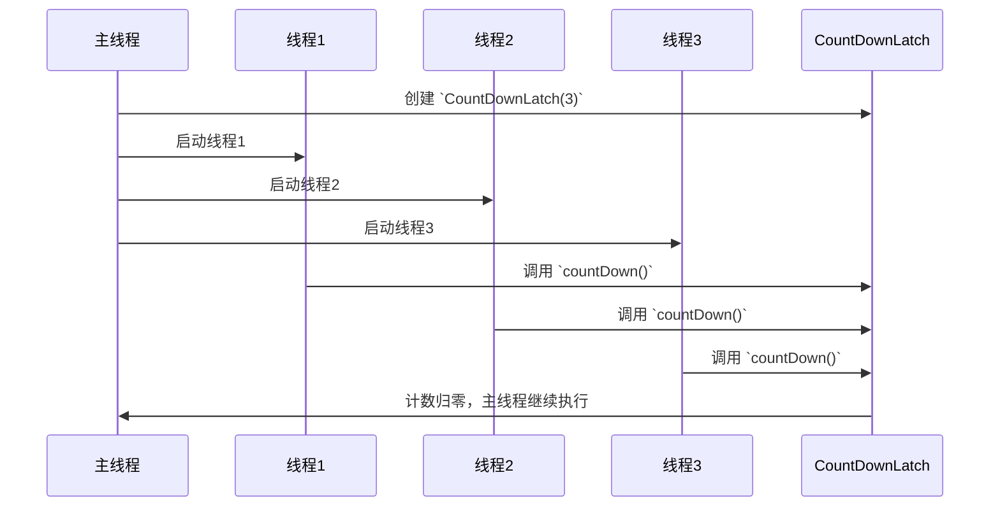
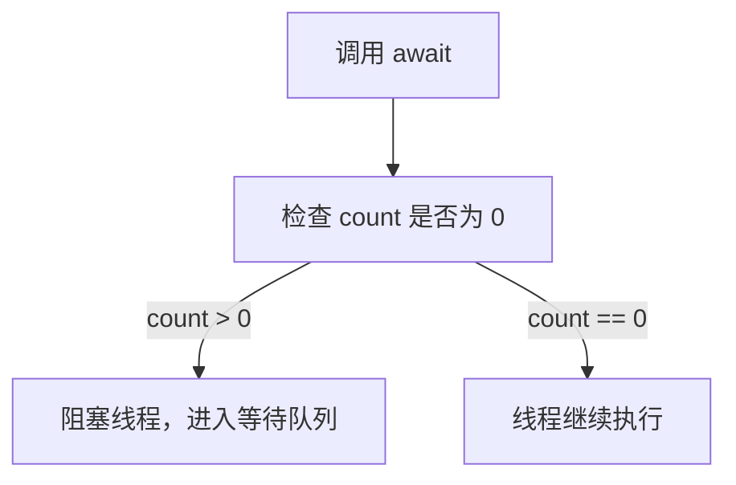
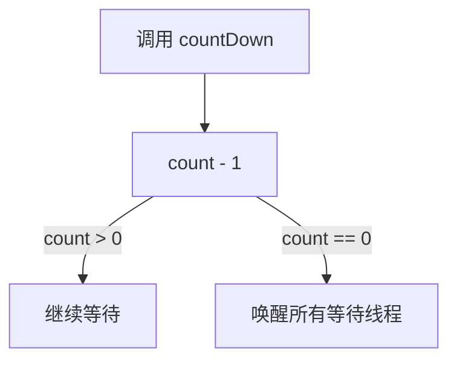

# JUC工具类: CountDownLatch详解

## 1. CountDownLatch 的作用

CountDownLatch 主要用于 多个线程并发执行任务，等所有任务执行完后，主线程继续执行，类似 计数器 的功能：

* 一个线程等待多个线程执行完成
* 多个线程等待某个操作完成后再同时开始执行

## 2. CountDownLatch 的工作流程




## 关键点

* 初始化 CountDownLatch，计数值 count = N。
* 多个线程启动，每个线程执行完任务后，调用 countDown() 使计数器 -1。
* 主线程调用 await()，等待 count == 0，然后继续执行。

## 3. 关键源码解析

## 3.1 构造方法

CountDownLatch 通过 构造方法 设置 初始计数值：

```java
public CountDownLatch(int count) {
    if (count < 0) throw new IllegalArgumentException("count < 0");
    this.sync = new Sync(count);
}
```

* count 初始计数，表示有 N 个线程需要执行。
* 底层依赖 Sync 类，使用 AQS（AbstractQueuedSynchronizer） 实现。

### 3.2 await() 方法（主线程等待）

主线程调用 await() 方法，会 阻塞当前线程，直到 count 变为 0：

```
public void await() throws InterruptedException {
    sync.acquireSharedInterruptibly(1);
}
```

* 调用 acquireSharedInterruptibly(1)，让当前线程 进入等待队列，直到 count == 0 才会继续执行。



### 3.3 countDown() 方法（子线程执行完任务）

每个子线程调用 countDown()，使 count - 1：

```java
public void countDown() {
    sync.releaseShared(1);
}
```

* countDown() 通过 releaseShared(1) 使 计数减 1。
* 当 count == 0 时，唤醒所有等待线程。



3.4 Sync 内部类（基于 AQS 实现）

CountDownLatch 的核心逻辑在 Sync 内部类中，继承 AQS，并 重写 tryAcquireShared() 和 tryReleaseShared()：

```java
private static final class Sync extends AbstractQueuedSynchronizer {
    Sync(int count) {
        setState(count); // 设置初始计数值
    }

    protected int tryAcquireShared(int acquires) {
        return (getState() == 0) ? 1 : -1; // 计数为 0 允许通过，否则阻塞
    }

    protected boolean tryReleaseShared(int releases) {
        for (;;) {
            int c = getState();
            if (c == 0) return false;
            int nextc = c - 1;
            if (compareAndSetState(c, nextc)) {
                return nextc == 0;
            }
        }
    }
}
```

* tryAcquireShared()：
* 如果 state == 0，表示所有线程执行完毕，返回 1（表示可以继续执行）。
* 如果 state > 0，返回 -1（表示阻塞）。
* tryReleaseShared()：
* CAS 操作减少 count。
* 当 count == 0 时，唤醒所有等待线程。

## 4. CountDownLatch 使用示例

### 场景 1：等待多个线程执行完毕

```java
import java.util.concurrent.CountDownLatch;

public class CountDownLatchExample {
    public static void main(String[] args) throws InterruptedException {
        CountDownLatch latch = new CountDownLatch(3);

        Runnable worker = () -> {
            try {
                System.out.println(Thread.currentThread().getName() + " 执行任务...");
                Thread.sleep(1000);
                latch.countDown();
                System.out.println(Thread.currentThread().getName() + " 任务完成");
            } catch (InterruptedException e) {
                e.printStackTrace();
            }
        };

        new Thread(worker).start();
        new Thread(worker).start();
        new Thread(worker).start();

        System.out.println("主线程等待子任务完成...");
        latch.await(); // 等待所有线程完成
        System.out.println("所有任务完成，主线程继续执行");
    }
}
```

执行结果

```sh
主线程等待子任务完成...
Thread-0 执行任务...
Thread-1 执行任务...
Thread-2 执行任务...
Thread-0 任务完成
Thread-1 任务完成
Thread-2 任务完成
所有任务完成，主线程继续执行
```

### 场景 2：模拟多个线程同时开始执行

```java
import java.util.concurrent.CountDownLatch;

public class CountDownLatchRace {
    public static void main(String[] args) throws InterruptedException {
        CountDownLatch startSignal = new CountDownLatch(1);
        CountDownLatch doneSignal = new CountDownLatch(3);

        Runnable runner = () -> {
            try {
                startSignal.await(); // 所有线程等待
                System.out.println(Thread.currentThread().getName() + " 开始跑步...");
                Thread.sleep((long) (Math.random() * 3000));
                System.out.println(Thread.currentThread().getName() + " 到达终点");
                doneSignal.countDown();
            } catch (InterruptedException e) {
                e.printStackTrace();
            }
        };

        new Thread(runner).start();
        new Thread(runner).start();
        new Thread(runner).start();

        System.out.println("裁判准备...");
        Thread.sleep(2000);
        System.out.println("比赛开始！");
        startSignal.countDown(); // 所有线程同时开始

        doneSignal.await(); // 等待所有线程到达终点
        System.out.println("比赛结束！");
    }
}
```

执行结果

```
裁判准备...
比赛开始！
Thread-0 开始跑步...
Thread-1 开始跑步...
Thread-2 开始跑步...
Thread-1 到达终点
Thread-0 到达终点
Thread-2 到达终点
比赛结束！
```

## 5. 总结

* CountDownLatch 适用于 线程间同步，用于 等待多个线程完成任务。
* 通过 countDown() 让计数递减，当计数归零时，唤醒等待的线程。
* 基于 AQS 实现，底层采用 state 变量 + CAS 机制 控制计数。
* 适用于 多线程并发控制、任务同步、模拟并发等场景 🚀。
