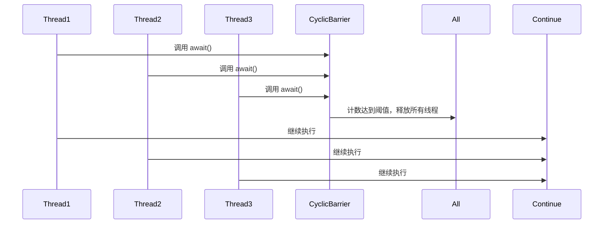
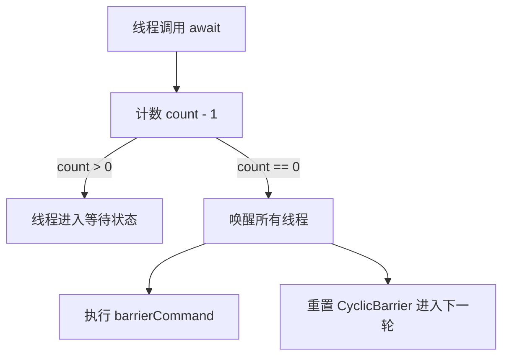

# JUC工具类: CyclicBarrier详解

## 1. CyclicBarrier 的作用

## 1.1 使用场景

CyclicBarrier 主要用于 多个线程相互等待，例如：

* 所有线程准备完毕后，同时开始执行任务（如并发测试、模拟比赛）。
* 多个线程分阶段计算，等所有线程完成某一阶段后，再进入下一阶段（如 MapReduce）。
* 任务分解后，多个线程执行完后再合并结果。

## 2. CyclicBarrier 的工作流程

### 2.1 工作原理

* CyclicBarrier 需要指定 参与线程数量 parties，所有线程调用 await() 进入等待状态。
* 当所有线程都调用 await() 后，屏障打开，所有线程 同时继续执行。
* CyclicBarrier 可以重复使用，一轮结束后，会自动重置计数，准备下一次屏障等待。



## 3. CyclicBarrier 核心源码解析

## 3.1 构造方法

```java
public CyclicBarrier(int parties, Runnable barrierAction) {
    if (parties <= 0) throw new IllegalArgumentException();
    this.parties = parties; // 需要的线程数
    this.count = parties; // 初始计数
    this.barrierCommand = barrierAction; // 触发屏障时执行的任务（可选）
}
```

#### 关键点

* parties：需要的线程数，所有线程调用 await() 进入等待状态。
* count：当前等待线程计数，每次 await() 计数 -1，当 count == 0 时释放所有线程。
* barrierCommand：可选任务，当所有线程到达屏障时执行。&#x20;

### 3.2 await() 方法

当线程到达屏障时，会调用 await()，等待其他线程。

```java
public int await() throws InterruptedException, BrokenBarrierException {
    final ReentrantLock lock = this.lock;
    lock.lock();
    try {
        int index = --count; // 计数 -1
        if (index == 0) { // 如果所有线程到达屏障
            nextGeneration(); // 进入下一轮
            return 0;
        }

        while (count > 0) {
            trip.await(); // 阻塞等待
        }

        return index;
    } finally {
        lock.unlock();
        
    }
}

```



#### 关键点

* 计数 count - 1，如果 count > 0，当前线程阻塞等待。
* 当 count == 0，执行 barrierCommand（如果有）。
* 所有等待线程被唤醒，count 重新初始化为 parties，进入下一轮。

### 3.3 nextGeneration() 方法

当所有线程到达屏障后，重置 CyclicBarrier 进入下一轮。

```java
private void nextGeneration() {
    trip.signalAll(); // 唤醒所有等待线程
    count = parties; // 重置计数
}
```

#### 关键点

* signalAll()：唤醒所有 await() 进入等待的线程。
* count = parties：重置计数，允许 CyclicBarrier 再次使用。

## 4. CyclicBarrier 使用示例

### 4.1 场景 1：等待所有线程到达屏障后再继续

```java
import java.util.concurrent.CyclicBarrier;

public class CyclicBarrierExample {
    public static void main(String[] args) {
        int threadCount = 3;
        CyclicBarrier barrier = new CyclicBarrier(threadCount, () -> 
            System.out.println("所有线程已到达屏障，执行任务...")
        );

        for (int i = 0; i < threadCount; i++) {
            new Thread(() -> {
                try {
                    System.out.println(Thread.currentThread().getName() + " 准备完成，等待其他线程...");
                    barrier.await(); // 等待所有线程到达
                    System.out.println(Thread.currentThread().getName() + " 继续执行");
                } catch (Exception e) {
                    e.printStackTrace();
                }
            }).start();
        }
    }
}
```

执行结果

```
Thread-0 准备完成，等待其他线程...
Thread-1 准备完成，等待其他线程...
Thread-2 准备完成，等待其他线程...
所有线程已到达屏障，执行任务...
Thread-1 继续执行
Thread-0 继续执行
Thread-2 继续执行
```

### 4.2 场景 2：模拟比赛，所有线程准备好后同时开始

```java
import java.util.concurrent.CyclicBarrier;

public class CyclicBarrierRace {
    public static void main(String[] args) {
        int playerCount = 3;
        CyclicBarrier barrier = new CyclicBarrier(playerCount, () -> 
            System.out.println("所有选手已准备，比赛开始！")
        );

        for (int i = 0; i < playerCount; i++) {
            new Thread(() -> {
                try {
                    System.out.println(Thread.currentThread().getName() + " 选手准备...");
                    Thread.sleep((long) (Math.random() * 3000));
                    System.out.println(Thread.currentThread().getName() + " 到达起点...");
                    barrier.await(); // 等待所有选手准备就绪
                    System.out.println(Thread.currentThread().getName() + " 开始比赛！");
                } catch (Exception e) {
                    e.printStackTrace();
                }
            }).start();
        }
    }
}
```

执行结果

```
Thread-0 选手准备...
Thread-1 选手准备...
Thread-2 选手准备...
Thread-1 到达起点...
Thread-2 到达起点...
Thread-0 到达起点...
所有选手已准备，比赛开始！
Thread-2 开始比赛！
Thread-0 开始比赛！
Thread-1 开始比赛！
```

## 5. CyclicBarrier vs. CountDownLatch

| 对比项        | CyclicBarrier       | CountDownLatch   |
| ---------- | ------------------- | ---------------- |
| 是否可复用      | ✅ 可复用               | ❌ 不可复用           |
| 线程等待       | 所有线程 互相等待           | 一个线程 等待多个线程      |
| 是否可以执行额外任务 | ✅ 支持 barrierCommand | ❌ 不支持            |
| 用途         | 同步多个线程，所有线程都必须等待    | 线程完成后，通知其他线程继续执行 |

## 6. 总结

* CyclicBarrier 适用于 多个线程互相等待，统一执行。
* 支持重复使用，不同于 CountDownLatch 只能使用一次。
* 支持屏障任务，在所有线程到达时执行。
* 适用于 并发控制、任务同步、模拟比赛、分阶段计算等场景 🚀。
