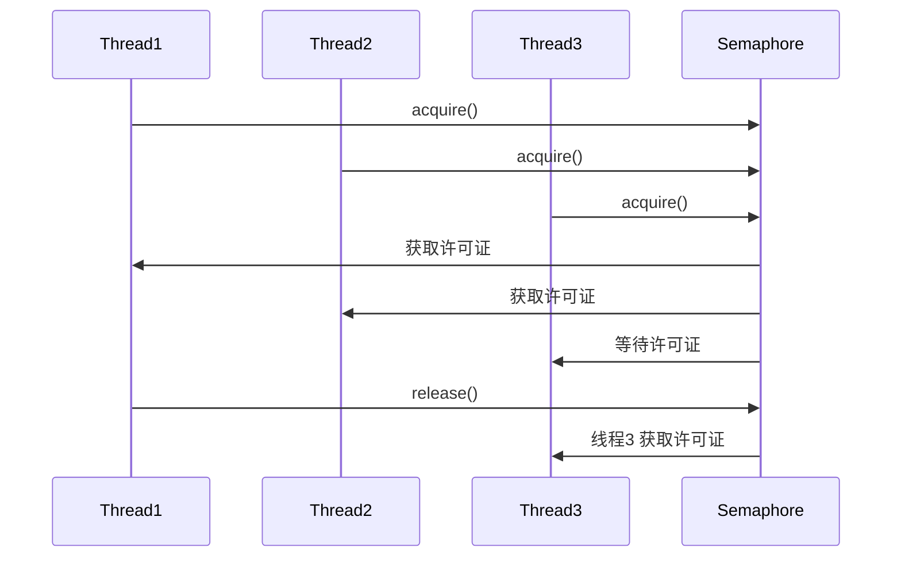
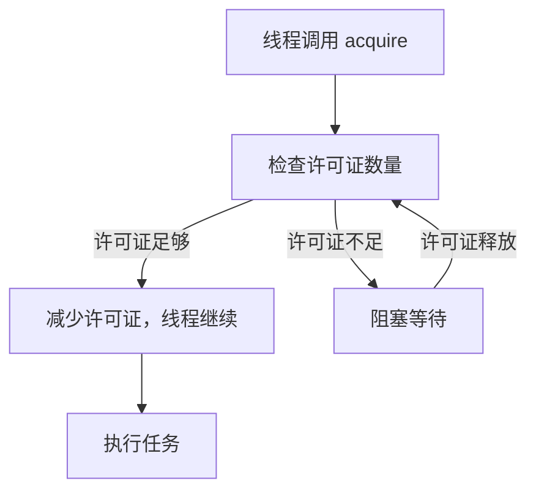
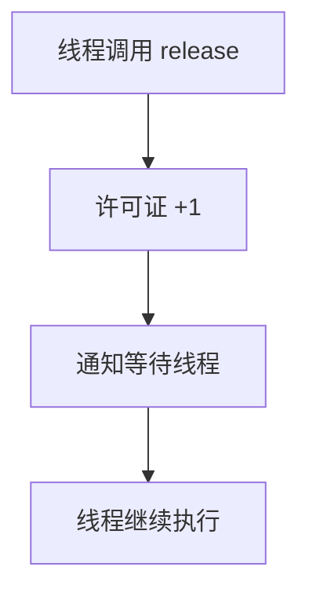

# JUC 工具类: Semaphore 详解

## 1. Semaphore 的作用

### 1.1 适用场景

Semaphore 主要用于 控制并发访问的线程数，例如：

* 数据库连接池：控制同时访问数据库的连接数。
* 限流控制：限制某个接口的并发请求数量。
* 多线程下载：控制同时下载的任务数量。
* 停车场管理：限制同时可停的车辆数。

## 2. Semaphore 的工作流程

### 2.1 Semaphore 如何工作

* Semaphore 维护一个 许可证（permits） 计数器，表示可用资源数量。
* 线程 获取许可证（acquire）：
* 如果有可用许可证，线程立即获取并执行任务。
* 如果没有可用许可证，线程阻塞等待。
* 线程 释放许可证（release）：
* 释放后，许可证计数增加，并允许等待中的线程继续执行。




## 3. Semaphore 核心源码解析

### 3.1 构造方法

```java
/**
 * 创建一个 Semaphore
 * @param permits 许可证数量，表示允许多少个线程同时访问
 * @param fair 是否使用公平策略
 */
public Semaphore(int permits, boolean fair) {
    sync = fair ? new FairSync(permits) : new NonfairSync(permits);
}
```

#### 关键点

* permits：最大许可证数量，即最多可同时访问的线程数。
* fair：
* true 公平模式（FIFO 先来先得）
* false 非公平模式（默认，性能更高，但可能有线程饿死）

### 3.2 acquire() 方法（获取许可证）

线程尝试获取许可证，如果 没有可用许可证，则阻塞等待：

```java
/**
 * 线程获取许可证
 * 若许可证可用，则立即返回
 * 若许可证不足，则阻塞等待
 */
public void acquire() throws InterruptedException {
    sync.acquireSharedInterruptibly(1);
}
```

底层逻辑

```java
protected int tryAcquireShared(int permits) {
    for (;;) {
        int available = getState(); // 获取当前许可证数量
        int remaining = available - permits; // 计算剩余许可证
        if (remaining < 0 || compareAndSetState(available, remaining))
            return remaining;
    }
}
```




#### 关键点

* getState() 获取当前许可证数量。
* 如果许可证足够，减少许可证，并允许线程继续执行。
* 如果许可证不足，线程进入等待队列，直到许可证可用。

### 3.3 release() 方法（释放许可证）

释放许可证，让等待的线程可以继续执行：

```java
/**
 * 线程释放许可证
 * 许可证数量增加，若有等待线程，则唤醒
 */
public void release() {
    sync.releaseShared(1);
}
```

底层逻辑

```java
protected boolean tryReleaseShared(int permits) {
    for (;;) {
        int current = getState(); // 获取当前许可证数量
        int next = current + permits; // 计算释放后的许可证数量
        if (compareAndSetState(current, next)) // 原子操作更新
            return true;
    }
}
```




#### 关键点

* getState() 获取当前许可证数量。
* CAS 操作 增加许可证，保证线程安全。
* 唤醒等待线程，允许其继续执行。

## 4. Semaphore 使用示例

### 4.1 场景 1：模拟停车场（限制同时停车的车辆数）

```java
import java.util.concurrent.Semaphore;

public class ParkingLot {
    public static void main(String[] args) {
        Semaphore parkingSlots = new Semaphore(2); // 2个停车位

        Runnable car = () -> {
            try {
                System.out.println(Thread.currentThread().getName() + " 等待停车...");
                parkingSlots.acquire(); // 获取许可证
                System.out.println(Thread.currentThread().getName() + " 停车成功");
                Thread.sleep(3000); // 模拟停车时间
                System.out.println(Thread.currentThread().getName() + " 离开停车场");
                parkingSlots.release(); // 释放许可证
            } catch (InterruptedException e) {
                e.printStackTrace();
            }
        };

        new Thread(car).start();
        new Thread(car).start();
        new Thread(car).start();
    }
}
```

执行结果

```
Thread-0 等待停车...
Thread-1 等待停车...
Thread-0 停车成功
Thread-1 停车成功
Thread-2 等待停车...
Thread-0 离开停车场
Thread-2 停车成功
Thread-1 离开停车场
Thread-2 离开停车场
```

### 4.2 场景 2：模拟限流控制

```
import java.util.concurrent.Semaphore;

public class ApiRateLimiter {
    private static final Semaphore semaphore = new Semaphore(3); // 最多允许3个并发请求

    public static void main(String[] args) {
        Runnable request = () -> {
            try {
                semaphore.acquire(); // 获取许可证
                System.out.println(Thread.currentThread().getName() + " 访问API...");
                Thread.sleep(2000); // 模拟请求处理时间
                System.out.println(Thread.currentThread().getName() + " 结束请求");
                semaphore.release(); // 释放许可证
            } catch (InterruptedException e) {
                e.printStackTrace();
            }
        };

        for (int i = 0; i < 5; i++) {
            new Thread(request).start();
        }
    }
}
```

执行结果

```
Thread-0 访问API...
Thread-1 访问API...
Thread-2 访问API...
Thread-3 等待许可证...
Thread-4 等待许可证...
Thread-0 结束请求
Thread-3 访问API...
Thread-1 结束请求
Thread-4 访问API...
Thread-2 结束请求
Thread-3 结束请求
Thread-4 结束请求
```

## 5. Semaphore vs. Lock

| 对比项  | Semaphore | Lock     |
| ---- | --------- | -------- |
| 用途   | 控制资源访问数量  | 保证临界区互斥  |
| 许可数量 | 可配置多个许可证  | 只能有一个持有者 |
| 公平性  | 支持公平/非公平  | 支持公平/非公平 |

## 6. 总结

* Semaphore 适用于 限流、资源管理。
* acquire() 获取许可证，release() 释放许可证，控制并发线程数。
* 适用于数据库连接池、停车场管理、限流控制等场景 🚀。
