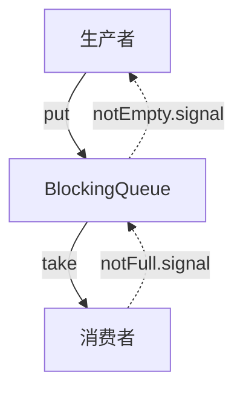

# JUC集合: BlockingQueue详解

## 1. BlockingQueue 简介

BlockingQueue 是 java.util.concurrent 包下的一个接口，继承自 Queue，主要用于生产者-消费者模型。

它支持阻塞式的 put() 和 take() 操作，保证在并发环境下的数据安全。


主要特性:

* 线程安全：内部使用锁机制（ReentrantLock）或其他并发控制方式（CAS）。

阻塞操作：&#x20;

* 入队（put）：当队列满时，生产者线程会被阻塞，直到队列有空闲位置。
* 出队（take）：当队列为空时，消费者线程会被阻塞，直到队列有元素可消费。
* 可选公平性：部分实现支持公平锁，以保证队列的公平访问。
* 支持不同的实现（ArrayBlockingQueue、LinkedBlockingQueue、PriorityBlockingQueue 等）。

## 2. BlockingQueue 关键方法

| 方法                                              | 描述                         |
| ----------------------------------------------- | -------------------------- |
| boolean offer(E e)                              | 尝试添加元素，如果队列满，则返回 false     |
| boolean offer(E e, long timeout, TimeUnit unit) | 在超时时间内尝试添加元素，超时失败返回 false  |
| void put(E e)                                   | 如果队列满，则阻塞生产者线程，直到队列有空闲位置   |
| E poll()                                        | 尝试获取队头元素，如果队列为空，则返回 null   |
| E poll(long timeout, TimeUnit unit)             | 在超时时间内尝试获取元素，超时失败返回 null   |
| E take()                                        | 如果队列为空，则阻塞消费者线程，直到队列有可消费元素 |
| int size()                                      | 返回当前队列大小                   |
| int remainingCapacity()                         | 返回队列剩余可用空间                 |

## 3. BlockingQueue 实现类对比

| 队列                    | 数据结构     | 是否有界   | 线程安全 | 适用场景               |
| --------------------- | -------- | ------ | ---- | ------------------ |
| ArrayBlockingQueue    | 数组       | ✅ 是    | ✅ 是  | 固定大小的阻塞队列，适用于高吞吐场景 |
| LinkedBlockingQueue   | 链表       | ❌ 默认无界 | ✅ 是  | 适用于多线程高并发场景        |
| PriorityBlockingQueue | 堆        | ❌ 无界   | ✅ 是  | 具有优先级排序的队列         |
| DelayQueue            | 优先队列+定时器 | ❌ 无界   | ✅ 是  | 用于定时任务执行           |
| SynchronousQueue      | 无存储      | ✅ 是    | ✅ 是  | 适用于任务直接交接的场景       |

## 4. BlockingQueue 典型实现源码解析（以 ArrayBlockingQueue 为例）

### 4.1ArrayBlockingQueue 数据结构

* items：用于存储元素的数组（固定大小）。
* &#x20;lock：ReentrantLock，保证线程安全
* notEmpty 和 notFull：Condition 变量，分别控制阻塞的生产者和消费者。

```
final Object[] items;
final ReentrantLock lock;
private final Condition notEmpty;
private final Condition notFull;
```

### javajava4.2 入队操作 put()

```java
public void put(E e) throws InterruptedException {
    checkNotNull(e);
    final ReentrantLock lock = this.lock;
    lock.lockInterruptibly();
    try {
        while (count == items.length)  // 队列满时阻塞
            notFull.await();
        enqueue(e);
    } finally {
        lock.unlock();
    }
}
```

逻辑:

1\. 获取锁 lock.lockInterruptibly()，支持可中断。

2\. 如果队列满了，则调用 notFull.await() 让生产者线程进入等待状态。

3\. 插入元素后，调用 notEmpty.signal() 唤醒等待的消费者线程。

4.3 出队操作 take()

```java
public E take() throws InterruptedException {
    final ReentrantLock lock = this.lock;
    lock.lockInterruptibly();
    try {
        while (count == 0)  // 队列空时阻塞
            notEmpty.await();
        return dequeue();
    } finally {
        lock.unlock();
    }
}
```

逻辑:

1\. 获取锁 lock.lockInterruptibly()。

2\. 如果队列为空，则调用 notEmpty.await() 让消费者线程进入等待状态。

3\. 取出元素后，调用 notFull.signal() 唤醒等待的生产者线程。

## 5. BlockingQueue 适用场景

| 场景      | 适用队列                                   |
| ------- | -------------------------------------- |
| 高并发队列   | LinkedBlockingQueue                    |
| 生产者-消费者 | ArrayBlockingQueue、LinkedBlockingQueue |
| 任务优先级调度 | PriorityBlockingQueue                  |
| 定时任务    | DelayQueue                             |
| 线程池任务队列 | SynchronousQueue                       |

## 6. BlockingQueue 总结

✅ 线程安全：内部使用 ReentrantLock + Condition 保证并发安全。

✅ 阻塞机制：生产者-消费者模式，自动阻塞 put() / take() 线程。

✅ 多种实现：适用于不同并发场景。

❌ 可能造成线程饥饿：需要正确选择 公平锁 / 非公平锁 机制。

## 7. BlockingQueue 结构图

BlockingQueue 在高并发场景下的核心作用是 线程间的安全通信，适用于 线程池、消息队列、任务调度 等场景。



