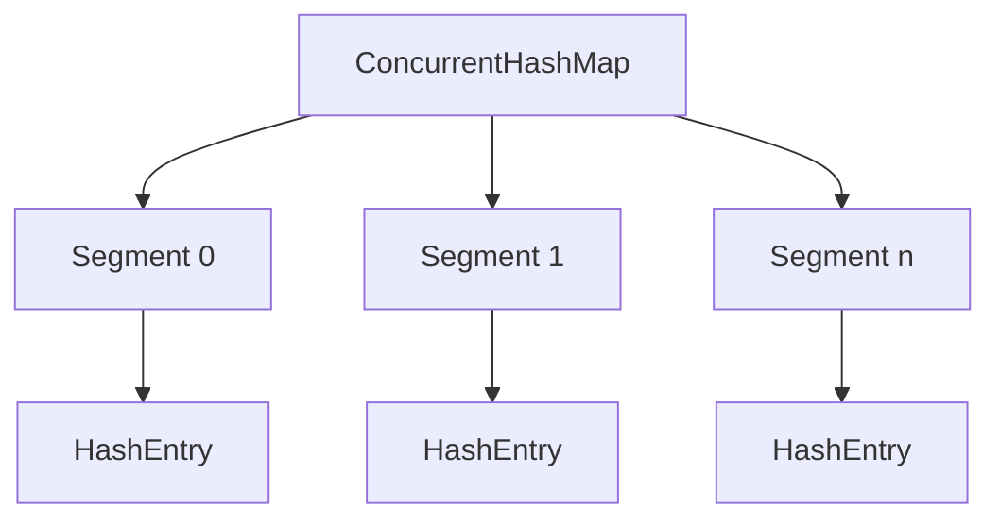
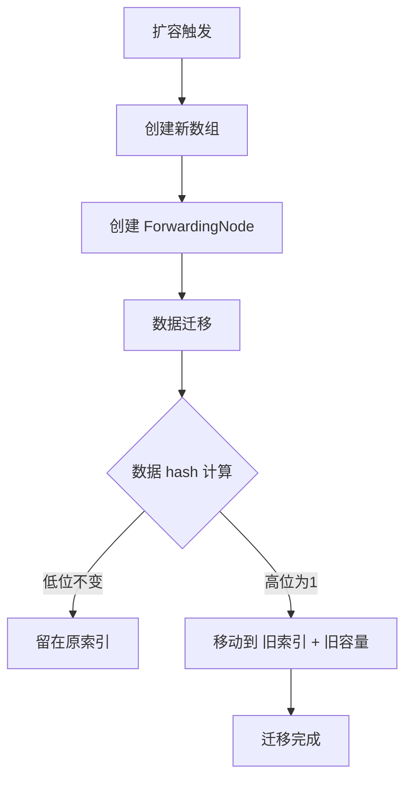
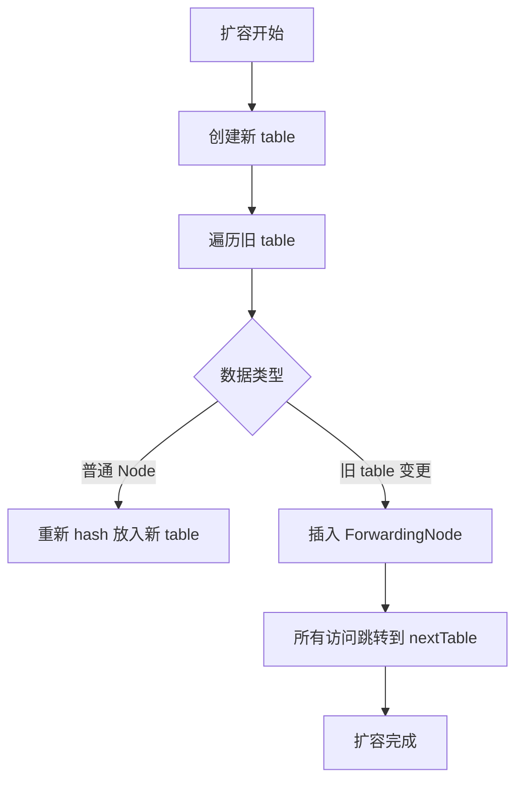

# JUC集合: ConcurrentHashMap详解

## 1.为什么 HashTable 慢？

### 1.1全局同步锁（synchronized）

* HashTable 使用 synchronized 关键字对 put、get 方法进行同步，所有操作必须争夺 同一把锁，导致性能下降。

### 1.2单线程访问瓶颈

* 即使多个线程操作 不同的 key，仍然会因为锁的粒度太大而阻塞。

### 1.3缺乏分段优化

* 1.7 版本的 ConcurrentHashMap 采用 分段锁 机制，提升并发能力，而 HashTable 没有这个优化。

## 2.ConcurrentHashMap - JDK 1.7

### 2.1数据结构

JDK 1.7 采用 **分段锁（Segment）**+ **HashEntry** 结构：

* **Segment 继承 ReentrantLock**，用作 分段锁，可以并行操作不同的 Segment。
* 每个 **Segment** 维护一个 HashEntry 数组，类似 HashMap，但 **每个 Segment 有独立的锁**。

```java
static class Segment<K, V> extends ReentrantLock {
    transient volatile HashEntry<K, V>[] table;
}
```

**整体数据结构**



### 2.2初始化

* 先初始化 Segment 数组，每个 Segment 懒加载，只有插入数据时才初始化。

### 2.3put 过程分析

1. **计算 hash，找到对应的 Segment。**
2. **尝试获取 Segment 的锁（ReentrantLock）。**
3. **遍历链表**，如果 key 存在则更新，否则插入新节点
4. 检查是否**需要**扩容（rehash）
5. 释放锁

```java
void put(K key, V value) {
    Segment<K, V> segment = ensureSegment(hash);
    segment.lock(); // 加锁
    try {
        segment.put(key, value);
    } finally {
        segment.unlock();
    }
}
```

### 2.4扩容（rehash）

* 扩容条件：当 Segment 中 HashEntry 数量超出阈值（默认 0.75 \* capacity）
* 扩容过程

&#x20;              1\. 加锁，创建 新的 HashEntry 数组，大小为原来的 2 倍。

&#x20;              2\. 迁移数据：遍历原数组，将旧数据 重新计算 hash 并分配到 新数组。

&#x20;              3\. 释放锁。

```java
void rehash() {
    HashEntry<K, V>[] oldTable = table;
    int newCapacity = oldTable.length * 2;
    HashEntry<K, V>[] newTable = new HashEntry[newCapacity];
    for (HashEntry<K, V> e : oldTable) {
        while (e != null) {
            int newIndex = e.hash & (newCapacity - 1);
            HashEntry<K, V> next = e.next;
            e.next = newTable[newIndex];
            newTable[newIndex] = e;
            e = next;
        }
    }
    table = newTable;
}
```

## 3.ConcurrentHashMap - JDK 1.8

### 3.1 数据结构

JDK 1.8 采用 **CAS + synchronized**，去掉 Segment，改用 Node 数组：

* Node\[] table：存放 key-value 对，数组 + 链表 + 红黑树 结构。
* ForwardingNode：扩容时的 占位符，标识数据正在迁移。
* TreeBin：当 链表长度 > 8 时转换为 红黑树，减少查询时间。

```java
static class Node<K,V> {
    final int hash;
    final K key;
    volatile V val;
    volatile Node<K,V> next;
}
```

### 3.2初始化

ConcurrentHashMap 采用 **懒加载** 方式，在 **第一次 put 时初始化数组。**

```java
private final Node<K,V>[] initTable() {
    for (;;) {
        Node<K,V>[] tab = table;
        if (tab != null) return tab;
        if (CAS(&table, null, new Node[DEFAULT_CAPACITY])) return table;
    }
}
```

### 3.3put 过程分析

1.计算 hash，找到 table 索引 i。

2.判断 table\[i] 是否为空：

* 为空：CAS 无锁插入。
* 非空：进入 synchronized 逻辑，加锁操作链表或树。

3.链表 or 红黑树：

* 链表长度 < 8，直接插入。
* 链表长度 >= 8，转换为红黑树（treeifyBin）。

4.检查是否需要扩容，调用 tryPresize()

```java
final V putVal(int hash, K key, V value) {
    Node<K,V>[] tab;
    int i;
    if ((tab = table) == null) initTable();
    if ((i = (tab.length - 1) & hash) == null) {
        if (CAS(&table[i], null, new Node<>(hash, key, value))) return null;
    }
    synchronized (tab[i]) { // 加锁
        ...
    }
}
```

### 3.4扩容过程（tryPresize + transfer）

**触发条件**

* size > threshold（默认 0.75 \* capacity）

**扩容流程**

1.新建 Node\[] newTable，大小 2 倍。

2.创建 ForwardingNode，标记旧 table\[i]。

3.多线程并发迁移：

* 线程尝试获取 ForwardingNode，并执行 transfer。
* synchronized 保证 单线程迁移某个桶。

4.数据重新分布：

* hash & (newCap - 1) 计算 新索引。
* 低位不变 的数据留在原索引。
* 高位为 1 的数据移动到 旧索引 + 旧容量。




### 3.5 get 过程分析

* 计算 hash 找到索引 i
* 直接读取 tab\[i]，不加锁（volatile 保障可见性）
* 遍历链表/红黑树 查找 key，返回 value

## 4.什么是 ForwardingNode

* ForwardingNode 是 ConcurrentHashMap.Node 的 子类，用于 扩容时的占位符。
* 当 ConcurrentHashMap 触发扩容，旧桶的数据会被迁移到新桶，但在此期间，可能有其他线程访问这些旧桶的数据，因此需要 标记此桶已迁移，避免并发冲突。
* 访问 ForwardingNode 的线程，会被引导到新 table 继续查找，避免访问失效数据。

```java
static final class ForwardingNode<K, V> extends Node<K, V> {
    final Node<K, V>[] nextTable;

    ForwardingNode(Node<K, V>[] tab) {
        super(MOVED, null, null, null);
        this.nextTable = tab;
    }

    Node<K, V> find(int h, Object k) {
        // 进入新 table 继续查找
        return (nextTable == null) ? null : ConcurrentHashMap.<K, V>tabAt(nextTable, h).find(h, k);
    }
}
```

### 4.1ForwardingNode 的作用

#### **(1)标记旧数据已迁移，避免并发操作**

* 当某个 bucket（槽位） 迁移完成后，原桶 table\[i] 不再存储数据，而是存放 ForwardingNode，标识 该位置数据已迁移。
* 这样，其他访问该位置的线程就知道应该去新数组 nextTable 查询。

#### (2)并发查询时，避免访问失效数据

* 当 get() 操作遇到 ForwardingNode，线程不会继续在 旧 table 查找，而是跳转到 nextTable 继续查找，确保读操作的一致性。

```java
public V get(Object key) {
    int hash = spread(key.hashCode());
    Node<K, V>[] tab = table;
    Node<K, V> first = tabAt(tab, hash);
    
    // 如果遇到 ForwardingNode，跳转到新 table 继续查找
    if (first instanceof ForwardingNode) {
        tab = ((ForwardingNode<K, V>) first).nextTable;
        first = tabAt(tab, hash);
    }
    
    return first != null ? first.find(hash, key) : null;
}
```

#### (3)帮助新数据迁移

* 在 扩容过程中，新的 put() 操作如果命中 ForwardingNode，也会被引导到新数组，确保数据直接存储在新 table，避免无效插入。

```java
final V putVal(int hash, K key, V value) {
    for (Node<K, V>[] tab = table;;) {
        Node<K, V> f = tabAt(tab, hash);
        
        if (f instanceof ForwardingNode) {
            tab = ((ForwardingNode<K, V>) f).nextTable; // 迁移后插入新 table
        } else {
            synchronized (f) {
                // 在当前 bucket 上插入新数据
            }
        }
    }
}
```

### 4.2ForwardingNode 在扩容（transfer）中的流程

1.初始化新 table，创建 nextTable，大小是原 table 的 2 倍。

2.迁移数据

* 遍历 table\[i]，如果是 Node，将其 hash 重新计算后迁移到 nextTable。
* 如果是 链表，则遍历迁移。
* 如果是 红黑树，则转换成 TreeBin 并迁移。

3.用 ForwardingNode 替换 旧 table\[i]，标记该桶已迁移。

4.查询和插入操作都会被引导到 nextTable，保证一致性。



### 4.3ForwardingNode 在不同操作中的行为

| 操作           | 遇到 ForwardingNode 的行为              |
| ------------ | ---------------------------------- |
| **get()**    | 跳转到 `nextTable`，继续查找               |
| **put()**    | 直接存入 `nextTable`，避免在旧 `table` 影响迁移 |
| **扩容**       | 标记 `table[i]`，通知其他线程数据已迁移          |
| **remove()** | 查询 `nextTable` 进行删除                |


## 5.总结

| 版本          | 数据结构                          | 并发控制                 | put 方式                     | 扩容方式             |
| ----------- | ----------------------------- | -------------------- | -------------------------- | ---------------- |
| **JDK 1.7** | `Segment + HashEntry`         | `ReentrantLock`（分段锁） | `ReentrantLock`            | **单线程 rehash**   |
| **JDK 1.8** | `Node[] + CAS + synchronized` | `CAS + synchronized` | `CAS` 插入失败后 `synchronized` | **多线程 transfer** |


