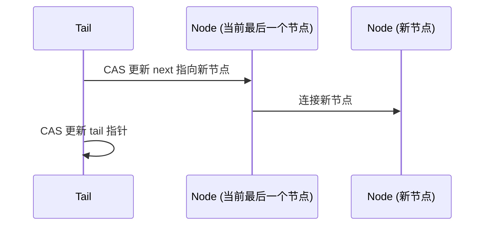
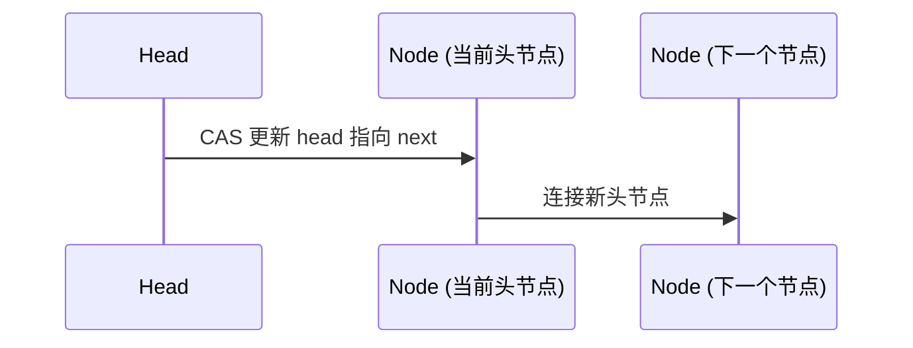

# JUC集合: ConcurrentLinkedQueue 详解

## 1.ConcurrentLinkedQueue 简介

ConcurrentLinkedQueue 是 基于 CAS（Compare-And-Swap）+ 自旋锁 实现的 线程安全 非阻塞 FIFO（先进先出）队列，适用于 高并发场景，比如 生产者-消费者模型 或 日志处理。

## 2.数据结构

* 采用 单向链表 结构，维护 head 和 tail 指针：
* 头指针 (head)：指向 队列的第一个节点，用于 poll() 操作。
* 尾指针 (tail)：指向 队列的最后一个节点，用于 offer() 操作。

## 3.核心方法

### 3.1 offer(E e) - 入队

作用: 在队列尾部 添加元素。

**入队流程**

1. 通过 CAS 修改 tail.next 指向 新节点。
2. CAS 更新 tail 指向新节点。

```java
public boolean offer(E e) {
    if (e == null) throw new NullPointerException();
    Node<E> newNode = new Node<>(e);
    for (Node<E> t = tail, p = t;;) {
        Node<E> q = p.next;
        if (q == null) { // 说明 p 是尾节点
            if (p.casNext(null, newNode)) { // cas 修改 next 指针
                casTail(t, newNode); // cas 更新 tail
                return true;
            }
        } else { // 说明 p 不是尾节点，需要推进 tail
            casTail(t, q);
        }
        p = tail;
    }
}
```

入队示意图



### 3.2 poll() - 出队

作用: 获取并删除队列头部的元素。

出队流程

1. 通过 CAS 修改 head，指向 head.next，并返回 head.item。
2. 旧的 head 通过 GC 回收。

```java
public E poll() {
    for (Node<E> h = head, p = h;;) {
        Node<E> q = p.next;
        if (q == null) return null; // 队列为空
        if (casHead(h, q)) { // cas 更新 head
            E item = q.item;
            q.item = null; // help GC
            return item;
        }
        p = head;
    }
}
```

出队示意图




## 4.为什么 ConcurrentLinkedQueue 适用于高并发

1.无锁 CAS：避免锁竞争，提高并发性能。

2.读写分离

* poll() 修改 head
* offer() 修改 tail
* 读写互不干扰，提升吞吐量。

3.自旋重试：CAS 失败时 自动重试，保证成功。

## 5. 适用场景

| 场景          | 适用 | 不适用                         |
| ----------- | -- | --------------------------- |
| **高并发队列**   | ✅  | ❌                           |
| **生产者-消费者** | ✅  | ❌                           |
| **元素有优先级**  | ❌  | ✅（应使用 `PriorityQueue`）      |
| **有界队列**    | ❌  | ✅（`ArrayBlockingQueue` 更合适） |

***

## 6. 总结

* **`ConcurrentLinkedQueue` 采用 CAS + 无锁 实现高并发** 的 **FIFO** 队列。
* 适用于 **读多写多** 场景，**读写互不影响**，提高并发吞吐量。
* **不适用于** 需要阻塞等待的场景（可使用 `BlockingQueue`）。
* **适用于** **高吞吐量** 和 **生产者-消费者模型**。


