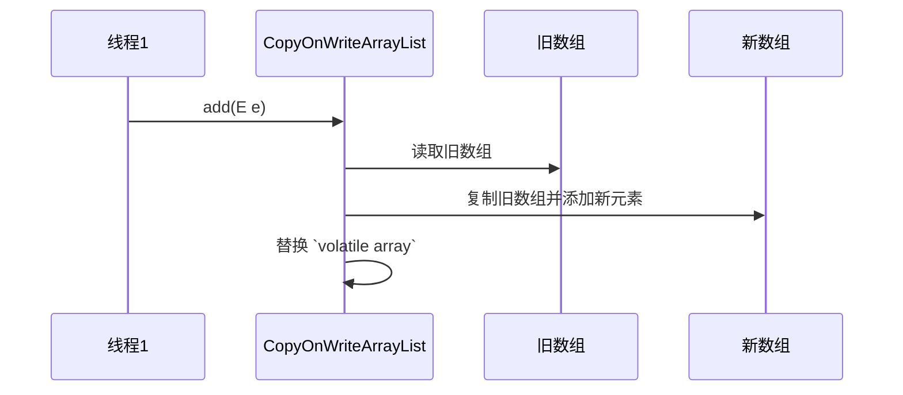
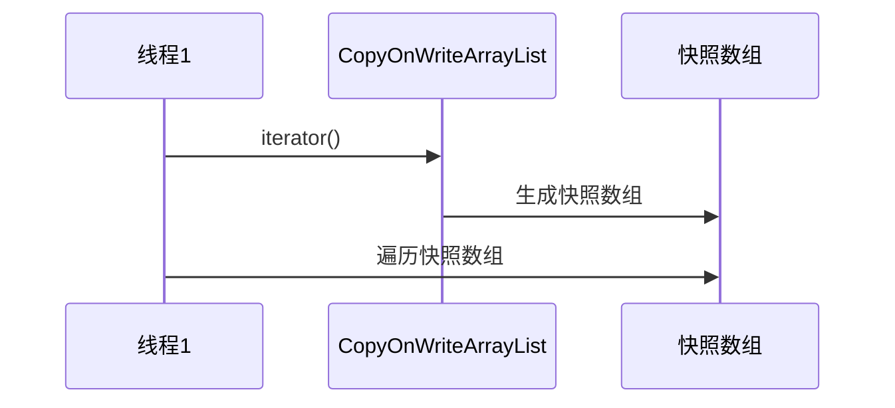

# JUC集合: CopyOnWriteArrayList详解

## 1.CopyOnWriteArrayList 的基本原理

主要特性

### 1.写时复制（Copy-On-Write）

* 读操作无锁，直接访问 volatile 数组。
* 写操作（add、set、remove） 时，会创建 新数组，修改完成后再替换旧数组，保证线程安全。

### 2.适用于 读多写少 场景

* 读操作：多个线程可同时访问，提高并发性能。
* 写操作：由于 复制整个数组，写入开销大，适用于写操作较少的情况。

### 3.弱一致性

* 读操作访问的是 写操作前的快照，不会看到最新的写入。
* 适用于 系统配置、黑名单列表、缓存数据等。

### 4.不会抛出 ConcurrentModificationException

* 迭代器使用 快照数组，不会因并发修改而异常，但也不会读取到最新的数据。

## 2.CopyOnWriteArrayList 关键实现

### 内部数据结构

CopyOnWriteArrayList 内部维护了一个 volatile 修饰的数组：

```java
public class CopyOnWriteArrayList<E> implements List<E>, RandomAccess, Cloneable, java.io.Serializable {
    /** 保护所有写操作的锁 */
    final transient ReentrantLock lock = new ReentrantLock();
    
    /** `volatile` 保证可见性 */
    private transient volatile Object[] array;

    /** 获取当前数组 */
    final Object[] getArray() {
        return array;
    }

    /** 设置数组 */
    final void setArray(Object[] a) {
        array = a;
    }
}
```

* volatile array 保证 所有线程都能读取到最新的数组。
* ReentrantLock 保证 写操作的互斥性。

### add(E e) 方法（写操作）

```java
public boolean add(E e) {
    final ReentrantLock lock = this.lock;
    lock.lock(); // 加锁，保证写操作原子性
    try {
        Object[] elements = getArray();
        int len = elements.length;
        Object[] newElements = Arrays.copyOf(elements, len + 1); // 复制数组
        newElements[len] = e; // 添加新元素
        setArray(newElements); // 替换旧数组
        return true;
    } finally {
        lock.unlock(); // 释放锁
    }
}
```

* 加锁 (lock.lock()) 保护写操作，防止多个线程同时修改数组。
* 创建新数组 (Arrays.copyOf())，扩展容量 +1，并添加新元素。
* 替换旧数组 (setArray(newElements))，保证 volatile 修饰的 array 可见性。



### get(int index) 方法（读操作）

```java
public E get(int index) {
    return get(getArray(), index);
}
```

* volatile 修饰 array 确保所有线程都能读取最新的数组。
* 读操作无锁，多个线程可以同时读取。

### remove(int index) 方法（删除操作）

创建新数组，去掉对应索引的数据，避免并发修改异常：

```java
public E remove(int index) {
    final ReentrantLock lock = this.lock;
    lock.lock(); // 加锁
    try {
        Object[] elements = getArray();
        int len = elements.length;
        E oldValue = get(elements, index);

        Object[] newElements = new Object[len - 1];
        System.arraycopy(elements, 0, newElements, 0, index);
        System.arraycopy(elements, index + 1, newElements, index, len - index - 1);
        setArray(newElements); // 更新数组
        return oldValue;
    } finally {
        lock.unlock();
    }
}
```


### iterator() 方法（快照迭代器）

创建快照数组，避免 ConcurrentModificationException：

```java
public Iterator<E> iterator() {
    return new COWIterator<E>(getArray(), 0);
}

private static class COWIterator<E> implements ListIterator<E> {
    private final Object[] snapshot; // 迭代器的快照数组
    private int cursor;

    private COWIterator(Object[] elements, int initialCursor) {
        this.snapshot = elements;
        this.cursor = initialCursor;
    }

    public boolean hasNext() {
        return cursor < snapshot.length;
    }

    public E next() {
        if (!hasNext()) throw new NoSuchElementException();
        return (E) snapshot[cursor++];
    }
}
```

* 迭代时不会抛 ConcurrentModificationException，但不会读取最新数据。
* 创建快照数组 (snapshot)，保证迭代期间数据不变。



## 4. CopyOnWriteArrayList 总结

| 特性       | CopyOnWriteArrayList                             |
| -------- | ------------------------------------------------ |
| **线程安全** | ✅ 通过 **写时复制** 实现                                 |
| **读性能**  | ✅ **高**（无锁访问）                                    |
| **写性能**  | ❌ **低**（O(N) 复制数组）                               |
| **适用场景** | **读多写少**                                         |
| **迭代器**  | ✅ **快照迭代器**，不抛 `ConcurrentModificationException` |

