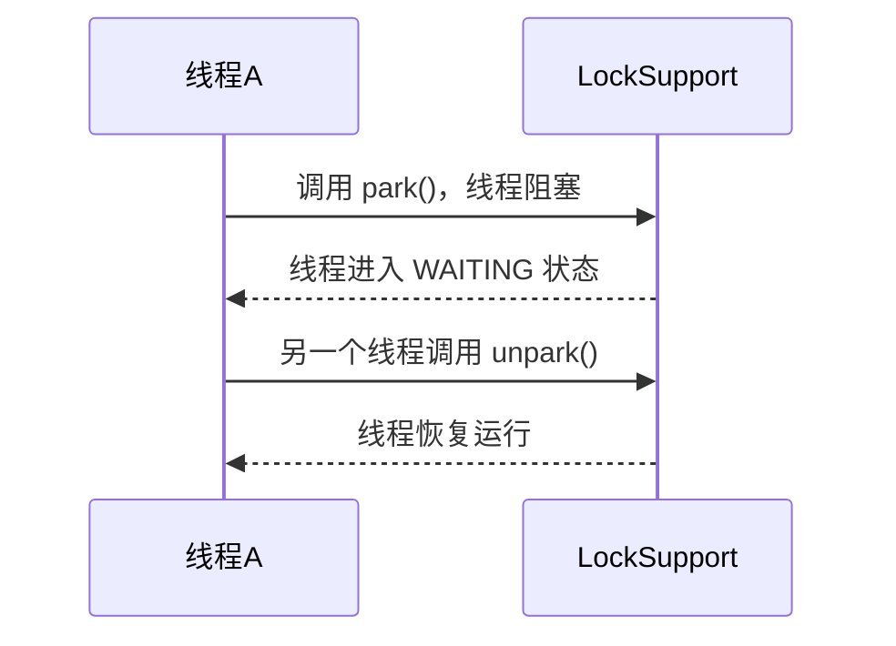

# JUC 锁：LockSupport 详解

## 1. LockSupport 是什么？

### 主要作用

• 线程阻塞：让线程进入 等待状态，直到被唤醒。

• 线程唤醒：可以随时唤醒指定线程，不需要 notify()/notifyAll() 的锁配合。

• 不依赖 synchronized，比 Object.wait()/notify() 更灵活。

## 适用场景

• 实现线程间的精准唤醒

• 替代 wait()/notify()，避免 synchronized 的局限性

• 底层用于 AQS（AbstractQueuedSynchronizer）

## 2. LockSupport 的核心方法

### park()（阻塞当前线程）

• LockSupport.park(); 让当前线程 挂起（进入 WAITING 状态）。

### 只有 调用 unpark(thread) 才能唤醒它。

unpark(Thread thread)（唤醒指定线程）

• LockSupport.unpark(thread); 可以让 指定线程恢复执行。

• unpark() 可以先调用，park() 后调用时不会阻塞。

### parkNanos(long nanos)（超时等待）

• 让线程等待 指定纳秒 后自动恢复。

### parkUntil(long deadline)（固定时间唤醒）

• 让线程 阻塞到指定时间点（以 System.currentTimeMillis() 计算）。

## 3. LockSupport 的工作流程




```
sequenceDiagram
    participant 线程A
    participant LockSupport

    线程A ->> LockSupport: 调用 park()，线程阻塞
    LockSupport -->> 线程A: 线程进入 WAITING 状态
    线程A ->> LockSupport: 另一个线程调用 unpark()
    LockSupport -->> 线程A: 线程恢复运行
```

## 4. LockSupport.park() & LockSupport.unpark() 示例

### 线程阻塞 & 唤醒

```
import java.util.concurrent.locks.LockSupport;

public class LockSupportExample {
    public static void main(String[] args) {
        Thread thread = new Thread(() -> {
            System.out.println(Thread.currentThread().getName() + " 正在运行...");
            LockSupport.park(); // 阻塞当前线程
            System.out.println(Thread.currentThread().getName() + " 被唤醒！");
        });

        thread.start();

        try {
            Thread.sleep(2000); // 让主线程等待 2s
        } catch (InterruptedException e) {
            e.printStackTrace();
        }

        System.out.println("主线程唤醒子线程...");
        LockSupport.unpark(thread); // 唤醒子线程
    }
}
```

输出

```
Thread-0 正在运行...
主线程唤醒子线程...
Thread-0 被唤醒！
```

✅ \*\*park() 让线程阻塞，unpark() 唤醒它，\*\*比 wait()/notify() 更灵活！

## 5. LockSupport 先 unpark()，再 park()

先唤醒再阻塞，线程不会阻塞

```
public class LockSupportExample2 {
    public static void main(String[] args) {
        Thread thread = new Thread(() -> {
            System.out.println(Thread.currentThread().getName() + " 先 unpark");
            LockSupport.unpark(Thread.currentThread()); // 先唤醒自己
            LockSupport.park(); // 但不会阻塞（因为有 permit）
            System.out.println(Thread.currentThread().getName() + " 没有被阻塞！");
        });

        thread.start();
    }
}
```

结果

```
Thread-0 先 unpark
Thread-0 没有被阻塞！
```

✅ unpark() 调用后，线程获得了 “许可”，下一次 park() 时不会再阻塞。

## 6. LockSupport vs Object.wait()/notify()

| 特性      | LockSupport.park/unpark      | Object.wait/notify           |
| ------- | ---------------------------- | ---------------------------- |
| 是否需要获取锁 | ❌ 不需要 synchronized           | ✅ 需要 synchronized            |
| 精确唤醒线程  | ✅ 可以 精准唤醒 指定线程               | ❌ 只能 notify()，无法指定           |
| 顺序要求    | ✅ unpark() 可先调用，park() 后仍可生效 | ❌ notify() 必须先调用 wait() 否则无效 |
| 适用范围    | ✅ 适用于 并发控制（JUC）              | ❌ 适用于 传统线程通信                 |

✅ LockSupport 更灵活，不依赖 synchronized，更适用于 JUC 并发编程！

## 7. LockSupport 在 AQS 中的应用

LockSupport 在 AbstractQueuedSynchronizer (AQS) 中被大量使用！

🌟 AQS 的 park() 代码

```
static void selfInterrupt() {
    Thread.currentThread().interrupt();
}

static void parkAndCheckInterrupt() {
    LockSupport.park();
    if (Thread.interrupted()) selfInterrupt();
}
```

• park() 用于阻塞线程

• unpark() 解除阻塞，恢复执行

• AQS 用它来管理 线程等待队列

## 8. 总结

| 特性               | 描述                                      |
| ---------------- | --------------------------------------- |
| 线程阻塞             | LockSupport.park() 让线程 挂起               |
| 线程唤醒             | LockSupport.unpark(Thread) 唤醒指定线程       |
| 避免死锁             | unpark() 可以先调用，不会造成 “丢失唤醒”              |
| 不需要 synchronized | 比 wait()/notify() 更灵活                   |
| 底层应用             | 用于 ReentrantLock、AQS、ThreadPoolExecutor |
