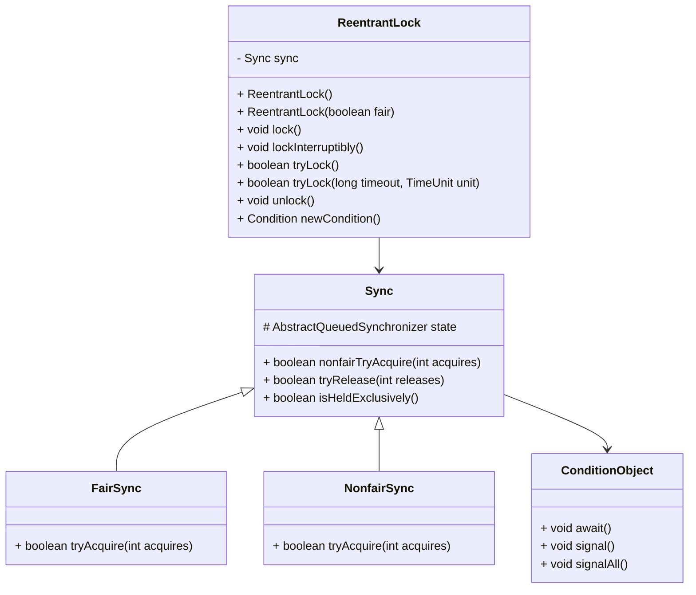
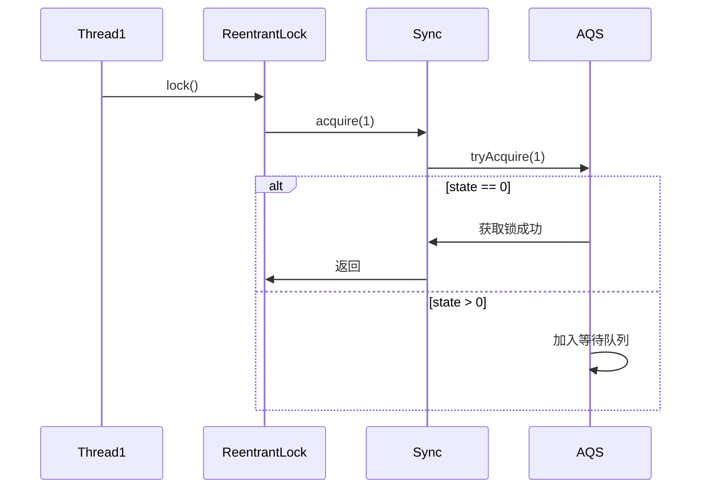
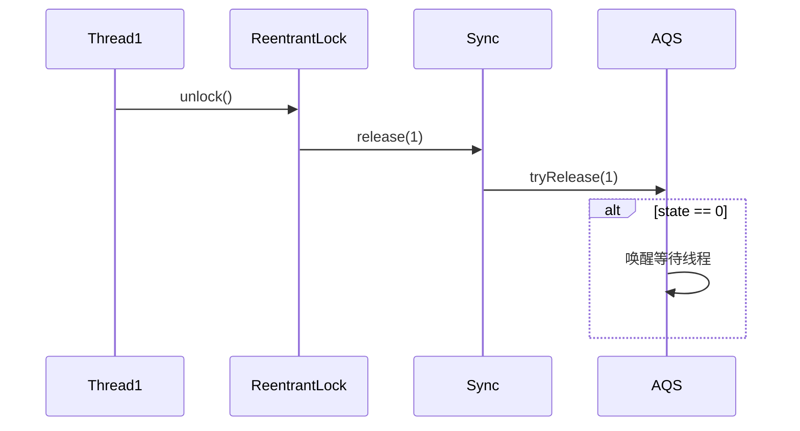
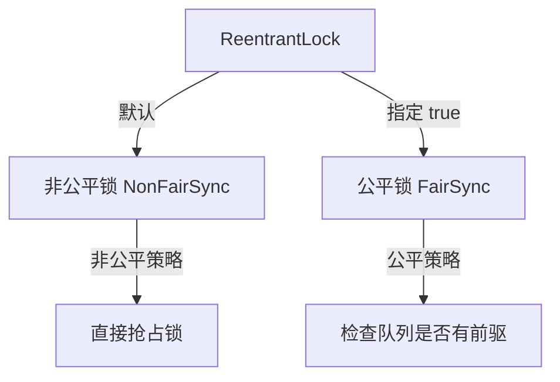

# JUC锁: ReentrantLock详解

## 1.ReentrantLock 简介

ReentrantLock 是 java.util.concurrent.locks 包下的可重入锁，它提供了比 synchronized 关键字更灵活的锁机制，例如：

* **可重入性**：一个线程可以多次获得同一把锁
* **公平锁 / 非公平锁**：可以选择线程获取锁的公平性
* **可中断锁**：支持 lockInterruptibly() 方法，可以在获取锁时响应中断
* **超时获取锁**：支持 tryLock(long timeout, TimeUnit unit) 方法

## 2.ReentrantLock 内部结构



## 3.ReentrantLock 的工作机制

### **锁的获取**

* lock() 方法会调用 Sync 的 acquire(int arg) 方法
* Sync 继承 AbstractQueuedSynchronizer (AQS)，使用 state 变量来表示锁的状态
* FairSync 和 NonfairSync 通过 tryAcquire(int acquires) 方法尝试获取锁

### 锁的释放

* unlock() 方法会调用 Sync 的 release(int arg) 方法
* release() 方法调用 tryRelease(int releases)，当 state 变为 0 时，释放锁，并唤醒等待线程

## 4.ReentrantLock 获取锁的流程



## 5.ReentrantLock 释放锁的流程



## 6.公平锁 vs 非公平锁



* 非公平锁（默认）：不会检查等待队列，可能会让后来的线程直接抢占锁
* 公平锁：会检查等待队列，保证先来的线程先获得锁

## 7.ReentrantLock 代码示例

```java
import java.util.concurrent.locks.ReentrantLock;

public class ReentrantLockExample {
    private static final ReentrantLock lock = new ReentrantLock();

    public static void main(String[] args) {
        Runnable task = () -> {
            lock.lock();
            try {
                System.out.println(Thread.currentThread().getName() + " 获取了锁");
                Thread.sleep(1000);
            } catch (InterruptedException e) {
                e.printStackTrace();
            } finally {
                lock.unlock();
                System.out.println(Thread.currentThread().getName() + " 释放了锁");
            }
        };

        Thread t1 = new Thread(task, "线程1");
        Thread t2 = new Thread(task, "线程2");

        t1.start();
        t2.start();
    }
}
```

## 总结

#### ReentrantLock vs synchronized 对比

| 特性       | ReentrantLock | synchronized |
| -------- | ------------- | ------------ |
| **可重入性** | ✅ 支持          | ✅ 支持         |
| **公平锁**  | ✅ 可选          | ❌ 不支持        |
| **可中断**  | ✅ 支持          | ❌ 不支持        |
| **超时获取** | ✅ 支持          | ❌ 不支持        |
| **性能**   | 高并发优势         | 低并发优化好       |

ReentrantLock 提供了更多的控制方式，比如 **公平锁**、**可中断锁**、**超时获取**，在高并发场景下比 synchronized 更加高效。
