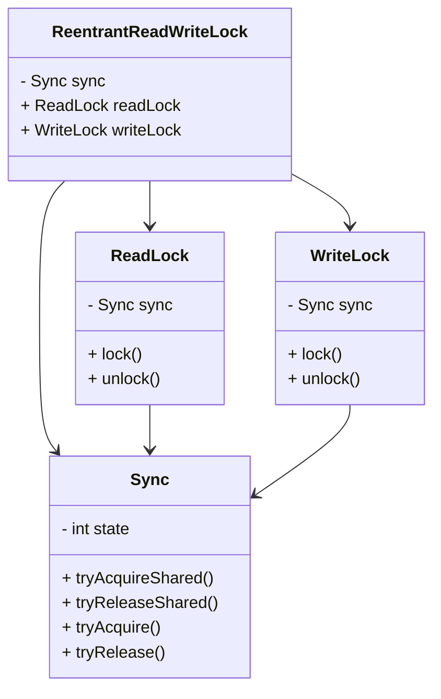
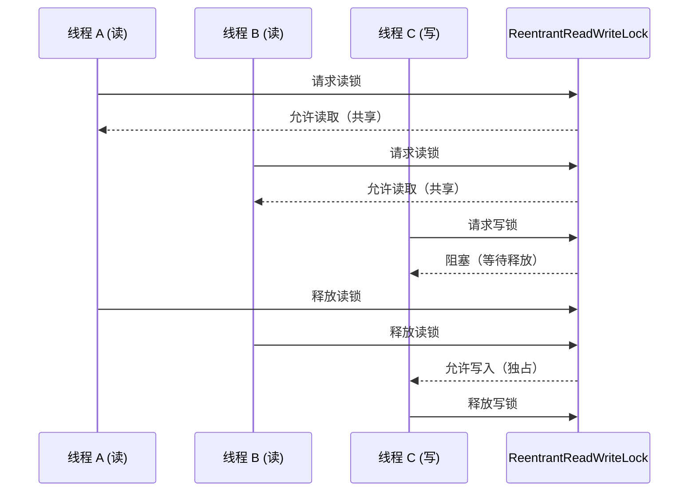

# JUC锁: ReentrantReadWriteLock详解

## 1.ReentrantReadWriteLock 结构

ReentrantReadWriteLock 由读锁（ReadLock）和写锁（WriteLock）组成，并基于 AbstractQueuedSynchronizer（AQS）实现。整体结构如下：



**核心组件：**

* Sync：继承 AbstractQueuedSynchronizer，管理读/写锁的状态
* ReadLock：使用 Sync 的 共享模式，多个线程可同时获取
* WriteLock：使用 Sync 的 独占模式，只有一个线程可获取

## 2.读锁、写锁的获取流程

在 ReentrantReadWriteLock 中：

* 读锁是共享锁（多个线程可同时获取）
* 写锁是独占锁（同一时刻只有一个线程能持有）



**核心逻辑**

* 读-读共享，多个线程可以同时读
* 读-写互斥，有写线程时，所有读线程必须等待
* 写-写互斥，多个线程不能同时写

## 3.源码分析

### 3.1 写锁获取

```java
protected final boolean tryAcquire(int acquires) {
    Thread current = Thread.currentThread();
    int state = getState();
    int writeCount = exclusiveCount(state);
    
    // 如果 state != 0 且 当前线程不是持有锁的线程，说明有其他线程在写，直接返回 false
    if (state != 0) {
        if (writeCount == 0 || current != getExclusiveOwnerThread())
            return false;
        if (writeCount + exclusiveCount(acquires) > MAX_COUNT)
            throw new Error("Maximum lock count exceeded");
        setState(state + acquires);
        return true;
    }

    // 读锁被占用时，不能获取写锁
    if (readerCount(state) != 0) return false;

    // CAS 尝试获取写锁
    if (compareAndSetState(0, acquires)) {
        setExclusiveOwnerThread(current);
        return true;
    }
    return false;
}
```

**核心逻辑**

**1.**&#x5982;果 state ≠ 0，检查当前线程是否已经持有锁：

* 若是，则增加写锁计数并返回 true
* 若否，则返回 false

2.若 state = 0，检查是否有读锁：

* 若无，则 CAS 设置 state 并获取写锁
* 若有，则返回 false

### 3.2读锁获取

在 Sync 类中，tryAcquireShared(int unused) 方法用于获取 读锁：

```java
protected final int tryAcquireShared(int unused) {
    Thread current = Thread.currentThread();
    for (;;) {
        int state = getState();
        int writeCount = exclusiveCount(state);

        // 写锁被占用，则无法获取读锁
        if (writeCount != 0 && getExclusiveOwnerThread() != current)
            return -1;

        // 计算当前读线程数
        int readers = sharedCount(state);
        if (readers >= MAX_COUNT)
            throw new Error("Maximum lock count exceeded");

        // CAS 设置新的读锁状态
        if (compareAndSetState(state, state + SHARED_UNIT))
            return 1;
    }
}
```

**核心逻辑**

1.如果有写锁：

* 只有持有该写锁的线程可以获取读锁（防止写锁的锁降级）

2.没有写锁：

* 允许多个线程同时获取读锁，并增加 state 读锁计数

3.CAS 方式更新 state：

* 如果 state 变更成功，则返回 1，表示读锁获取成功

### 3.3释放锁

释放写锁

```java
protected final boolean tryRelease(int releases) {
    int state = getState() - releases;
    if (Thread.currentThread() != getExclusiveOwnerThread())
        throw new IllegalMonitorStateException();
    
    if (state == 0)
        setExclusiveOwnerThread(null);
    setState(state);
    return state == 0;
}
```

**逻辑**

* 只有持有锁的线程才能释放
* state = 0 时，释放锁的持有线程

释放读锁

```java
protected final boolean tryReleaseShared(int unused) {
    for (;;) {
        int state = getState();
        int nextState = state - SHARED_UNIT;
        if (compareAndSetState(state, nextState))
            return nextState == 0;
    }
}
```

## 4.ReentrantReadWriteLock 代码示例

```java
import java.util.concurrent.locks.ReentrantReadWriteLock;

public class ReadWriteLockExample {
    private final ReentrantReadWriteLock lock = new ReentrantReadWriteLock();
    private final ReentrantReadWriteLock.ReadLock readLock = lock.readLock();
    private final ReentrantReadWriteLock.WriteLock writeLock = lock.writeLock();
    private int data = 0;

    public void read() {
        readLock.lock();
        try {
            System.out.println(Thread.currentThread().getName() + " 读取数据: " + data);
        } finally {
            readLock.unlock();
        }
    }

    public void write(int value) {
        writeLock.lock();
        try {
            data = value;
            System.out.println(Thread.currentThread().getName() + " 写入数据: " + data);
        } finally {
            writeLock.unlock();
        }
    }
}
```

## 总结

* ReentrantReadWriteLock 通过 读共享/写独占 提高并发性能
* 基于 AQS，利用 state 变量存储锁状态
* 适用于读多写少场景，如缓存、数据库连接池等
* 锁降级机制，但不支持锁升级


