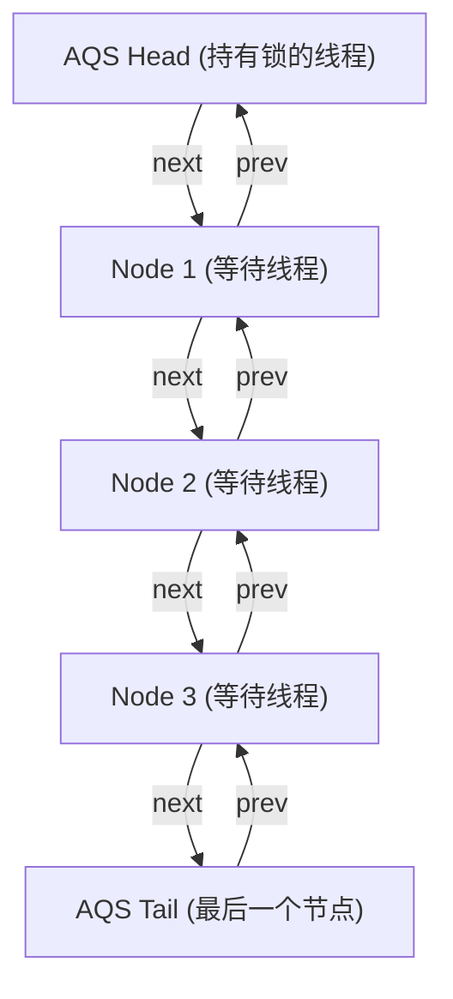
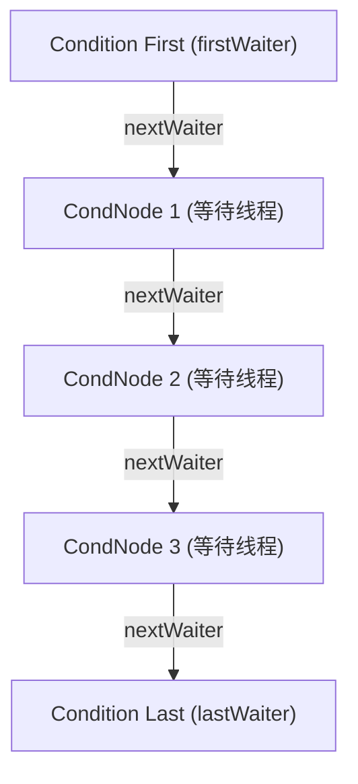
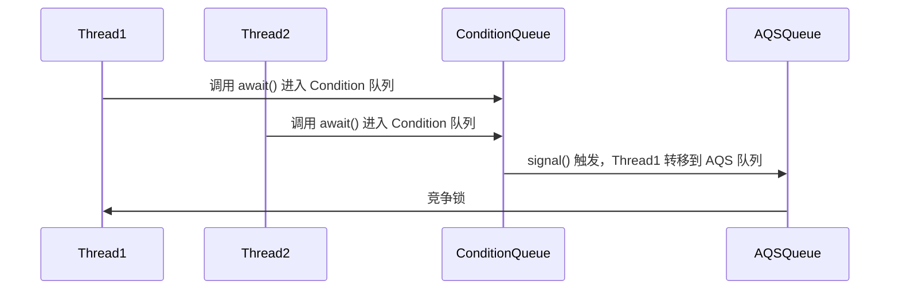
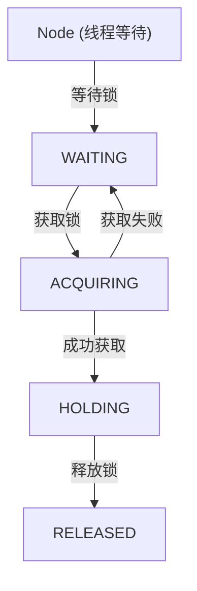
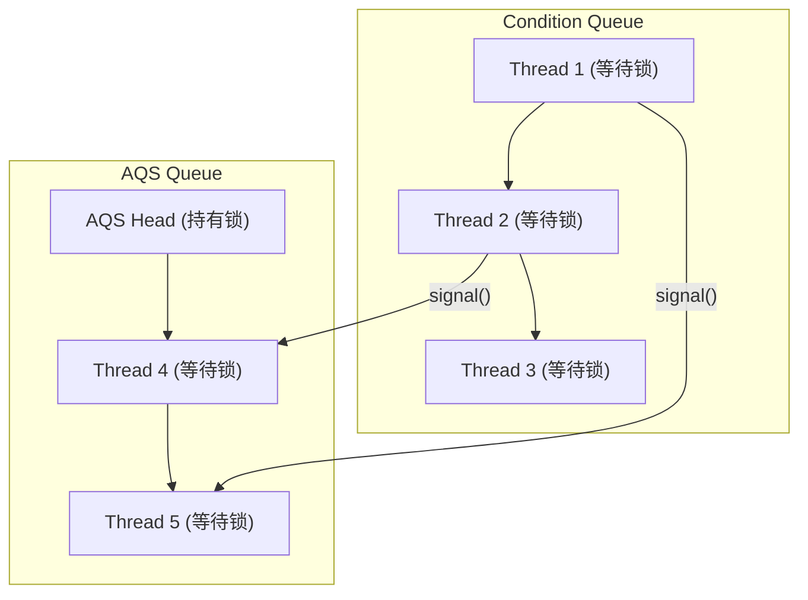

# JUC锁: 锁核心类AQS详解

## 1.AbstractQueuedSynchronizer简介

AbstractQueuedSynchronizer（AQS）是 **Java 并发工具包（JUC） 的核心组件**，用于构建 锁（Lock） 和 同步器（如 ReentrantLock、Semaphore、CountDownLatch）。AQS 通过 state 变量 控制同步状态，并使用 FIFO 队列（CLH） 管理等待线程。它支持 **独占模式（Exclusive）** 和 **共享模式（Shared）**，并通过 park()/unpark() 实现线程阻塞与唤醒。AQS 是 ReentrantLock、ReadWriteLock、Condition 等同步组件的底层实现。

## 2.AQS 对资源的共享方式 <a href="#aqs-dui-zi-yuan-de-gong-xiang-fang-shi" id="aqs-dui-zi-yuan-de-gong-xiang-fang-shi"></a>

AQS 提供了 两种资源共享模式，用于实现不同类型的同步器：

### 1.独占模式（Exclusive）

* 同一时刻只有一个线程能执行，如 ReentrantLock。

&#x20;      可进一步分为：

* 公平锁：按队列顺序获取锁，先到先得。
* 非公平锁：线程直接尝试抢占锁，不考虑队列顺序。

### 2.共享模式（Shared）

* 多个线程可以同时执行，适用于读多写少的场景。

典型应用：

* Semaphore（信号量）：允许多个线程同时访问资源。
* CountDownLatch（倒计时器）：多个线程等待某个事件完成。
* ReentrantReadWriteLock（读写锁）：多个线程可同时读取，写入时互斥。

### 3.ReentrantReadWriteLock 组合模式

* ReentrantReadWriteLock 是 组合锁，同时具备 独占模式（写锁） 和 共享模式（读锁）：
* 写锁（独占模式）：只有一个线程可以写，其他线程必须等待。
* 读锁（共享模式）：多个线程可以同时读取。

## 3.AQS底层使用了模板方法模式 <a href="#aqs-di-ceng-shi-yong-le-mu-ban-fang-fa-mo-shi" id="aqs-di-ceng-shi-yong-le-mu-ban-fang-fa-mo-shi"></a>

```java
isHeldExclusively()//该线程是否正在独占资源。只有用到condition才需要去实现它。
tryAcquire(int)//独占方式。尝试获取资源，成功则返回true，失败则返回false。
tryRelease(int)//独占方式。尝试释放资源，成功则返回true，失败则返回false。
tryAcquireShared(int)//共享方式。尝试获取资源。负数表示失败；0表示成功，但没有剩余可用资源；正数表示成功，且有剩余资源。
tryReleaseShared(int)//共享方式。尝试释放资源，成功则返回true，失败则返回false。
```

以ReentrantLock为例，state初始化为0，表示未锁定状态。A线程lock()时，会调用tryAcquire()独占该锁并将state+1。此后，其他线程再tryAcquire()时就会失败，直到A线程unlock()到state=0(即释放锁)为止，其它线程才有机会获取该锁。当然，释放锁之前，A线程自己是可以重复获取此锁的(state会累加)，这就是可重入的概念。但要注意，获取多少次就要释放多么次，这样才能保证state是能回到零态的。

## 4.AbstractQueuedSynchronizer数据结构

AbstractQueuedSynchronizer类底层的数据结构是使用`CLH(Craig,Landin,and Hagersten)队列`是一个虚拟的双向队列(虚拟的双向队列即不存在队列实例，仅存在结点之间的关联关系)。AQS是将每条请求共享资源的线程封装成一个CLH锁队列的一个结点(Node)来实现锁的分配。其中Sync queue，即同步队列，是双向链表，包括head结点和tail结点，head结点主要用作后续的调度。而Condition queue不是必须的，其是一个单向链表，只有当使用Condition时，才会存在此单向链表。并且可能会有多个Condition queue。

<figure><figcaption></figcaption></figure>

## 5.AbstractQueuedSynchronizer源码分析

### 5.1类的继承关系

AbstractQueuedSynchronizer继承自AbstractOwnableSynchronizer抽象类，并且实现了Serializable接口，可以进行序列化。

```java
public abstract class AbstractQueuedSynchronizer extends AbstractOwnableSynchronizer implements java.io.Serializable
```

其中AbstractOwnableSynchronizer抽象类的源码如下:

```java
public abstract class AbstractOwnableSynchronizer implements java.io.Serializable {
    
    // 版本序列号
    private static final long serialVersionUID = 3737899427754241961L;
    // 构造方法
    protected AbstractOwnableSynchronizer() { }
    // 独占模式下的线程
    private transient Thread exclusiveOwnerThread;
    
    // 设置独占线程 
    protected final void setExclusiveOwnerThread(Thread thread) {
        exclusiveOwnerThread = thread;
    }
    
    // 获取独占线程 
    protected final Thread getExclusiveOwnerThread() {
        return exclusiveOwnerThread;
    }
}
```

AbstractOwnableSynchronizer抽象类中，可以设置独占资源线程和获取独占资源线程。分别为setExclusiveOwnerThread与getExclusiveOwnerThread方法，这两个方法会被子类调用。

### 5.2Node类与ConditionObject类

Node 代表 **AQS 的等待队列节点**，用于 **线程排队等待锁**。

```java
static final class Node {
    // 共享模式节点
    static final Node SHARED = new Node();
    // 独占模式节点
    static final Node EXCLUSIVE = null;

    // 线程已取消
    static final int CANCELLED =  1;
    // 线程需要唤醒
    static final int SIGNAL    = -1;
    // 线程在 Condition 队列中等待
    static final int CONDITION = -2;
    // 共享锁的传播状态
    static final int PROPAGATE = -3;

    // 当前节点的状态
    volatile int waitStatus;

    // 前驱节点
    volatile Node prev;
    // 后继节点
    volatile Node next;

    // 当前节点对应的线程
    volatile Thread thread;

    // Condition 队列中的下一个等待节点
    Node nextWaiter;
}
```



ConditionObject 负责 管理 Condition 变量的等待队列，线程 调用 await() 进入 Condition 队列，等待 signal() 唤醒。

```java
public class ConditionObject implements Condition {
    private transient Node firstWaiter; // Condition 队列头结点
    private transient Node lastWaiter;  // Condition 队列尾结点

    // 添加线程到 Condition 队列
    private Node addConditionWaiter() {
        Node node = new Node(Thread.currentThread(), Node.CONDITION);
        if (lastWaiter == null) 
            firstWaiter = node;
        else
            lastWaiter.nextWaiter = node;
        lastWaiter = node;
        return node;
    }

    // 线程 signal() 后转移到 AQS 队列
    private void doSignal(Node first) {
        do {
            firstWaiter = first.nextWaiter;
            first.nextWaiter = null;
        } while (!transferForSignal(first) && (first = firstWaiter) != null);
    }
}
```



说明

* ConditionObject 维护 Condition 队列，存储 await() 进入的线程。
* 线程 调用 await() 进入 Condition 队列，等待 signal() 唤醒。
* ConditionObject 队列是 单向链表，使用 nextWaiter 连接节点。

#### ConditionObject 线程如何转换到 AQS 队列



说明

* Thread1 和 Thread2 调用 await() 进入 Condition 队列。
* signal() 让 Thread1 转移到 AQS 队列，等待重新竞争锁。
* AQSQueue 负责 管理锁的竞争。

#### Node 在 AQS 中的状态变化



说明

* 线程 Node 进入 AQS 队列后 进入 WAITING 状态。
* 当锁可用时，线程进入 ACQUIRING 状态，尝试获取锁。
* 如果获取成功，进入 HOLDING 状态，持有锁。
* 线程 释放锁 后进入 RELEASED 状态，后续线程唤醒。

#### AQS + Condition 总体结构



说明

* Condition 队列 和 AQS 队列是 独立的。
* signal() 让 Condition 线程 转移到 AQS 队列，等待重新竞争锁。

### Node与ConditionObject 作用

#### Node 作用

* 负责 维护 AQS 双向同步队列，用于线程等待获取锁。
* 每个 Node 维护 prev 和 next 指针，形成 FIFO 结构。

#### ConditionObject 作用

* 维护 Condition 队列，存储 await() 进入的线程。
* signal() 让线程 转移到 AQS 队列，重新竞争锁。

#### 整体关系

* ConditionObject 和 AQS 协同工作，管理锁的等待和唤醒机制。
* Node 在 AQS 队列中管理同步，提供 公平锁机制。

