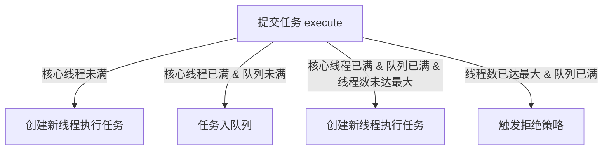
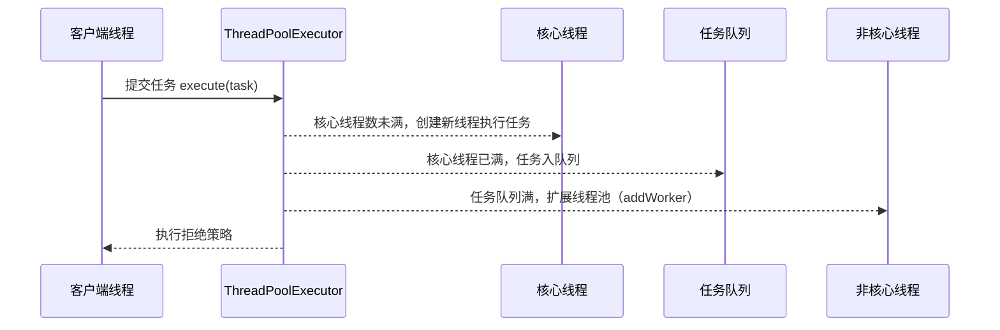

# JUC线程池: ThreadPoolExecutor

这里是对 JUC 线程池（ThreadPoolExecutor） 的详细讲解，包含：

• 线程池的工作流程

• 核心源码解析

• 详细的源码注释

• 关键逻辑的 Mermaid 流程图

## 1. ThreadPoolExecutor 线程池概述

ThreadPoolExecutor 是 Java 并发库 (java.util.concurrent) 提供的线程池实现，负责 管理、复用线程，从而提升并发任务执行的效率，避免频繁创建和销毁线程带来的开销。

### 1.1 线程池核心参数

| 参数              | 作用                                                  |
| --------------- | --------------------------------------------------- |
| corePoolSize    | 核心线程数，即始终维持的线程数量，即使线程空闲                             |
| maximumPoolSize | 最大线程数，即线程池能容纳的最大线程数                                 |
| keepAliveTime   | 非核心线程存活时间，当线程空闲时间超过此值后会被回收（corePoolSize 以内的线程不会被回收） |
| unit            | keepAliveTime 的时间单位                                 |
| workQueue       | 任务队列，存放待执行任务                                        |
| threadFactory   | 线程工厂，用于创建新线程                                        |
| handler         | 拒绝策略，当线程池无法接受新任务时的处理方式                              |

## 2. 线程池的工作流程

当任务提交到 ThreadPoolExecutor 时：

1. 核心线程未满：创建新线程执行任务。
2. 核心线程已满，队列未满：任务放入任务队列等待执行。
3. 核心线程已满，队列已满，线程数未达最大值：创建新线程执行任务。
4. 达到最大线程数 & 任务队列已满：触发 拒绝策略。&#x20;

### 2.1 任务提交流程（Mermaid 流程图）



## 3. 关键源码解析

### 3.1 构造方法

线程池的 构造方法 负责初始化参数，并进行 合法性检查：

```java
public ThreadPoolExecutor(int corePoolSize,
                          int maximumPoolSize,
                          long keepAliveTime,
                          TimeUnit unit,
                          BlockingQueue<Runnable> workQueue,
                          ThreadFactory threadFactory,
                          RejectedExecutionHandler handler) {
    if (corePoolSize < 0 ||        // 核心线程数不能为负数
        maximumPoolSize <= 0 ||    // 最大线程数必须大于 0
        maximumPoolSize < corePoolSize || // 最大线程数不能小于核心线程数
        keepAliveTime < 0)         // 存活时间不能为负数
        throw new IllegalArgumentException();

    if (workQueue == null || threadFactory == null || handler == null)
        throw new NullPointerException();  // 任务队列、线程工厂、拒绝策略不能为 null

    this.corePoolSize = corePoolSize;
    this.maximumPoolSize = maximumPoolSize;
    this.workQueue = workQueue;
    this.keepAliveTime = unit.toNanos(keepAliveTime);
    this.threadFactory = threadFactory;
    this.handler = handler;
}
```

### 3.2 任务提交（execute() 方法）

当任务被提交时，execute() 方法决定 如何执行任务：

```java
public void execute(Runnable command) {
    if (command == null) 
        throw new NullPointerException(); // 任务不能为空

    int c = ctl.get();
    if (workerCountOf(c) < corePoolSize) {
        if (addWorker(command, true)) // 1. 核心线程未满，创建核心线程
            return;
        c = ctl.get();
    }

    if (isRunning(c) && workQueue.offer(command)) { // 2. 核心线程满，加入任务队列
        int recheck = ctl.get();
        if (!isRunning(recheck) && remove(command)) // 任务入队后，发现线程池关闭，则移除任务
            reject(command);
        else if (workerCountOf(recheck) == 0)
            addWorker(null, false);
    } else if (!addWorker(command, false)) // 3. 线程池满但未达最大值，创建非核心线程
        reject(command); // 4. 任务队列已满 & 线程数达最大，执行拒绝策略
}
```

### 3.3 addWorker() 方法（创建线程）

```java
/**
 * 尝试创建并启动一个新的工作线程。
 * 
 * @param firstTask 第一个要执行的任务（可以为 null）
 * @param core 是否按照 corePoolSize 还是 maximumPoolSize 限制线程数量
 * @return 是否成功启动新线程
 */
private boolean addWorker(Runnable firstTask, boolean core) {
    retry:
    for (;;) {  // 外层循环，确保线程状态检查的一致性
        int c = ctl.get();
        int rs = runStateOf(c); // 获取线程池状态（RUNNING、SHUTDOWN、STOP、TIDYING、TERMINATED）

        // 1. 如果线程池是 STOP、TIDYING 或 TERMINATED，则拒绝创建新线程
        // 2. 如果线程池是 SHUTDOWN 且任务队列为空，则也不创建新线程
        if (rs >= SHUTDOWN &&
            !(rs == SHUTDOWN && firstTask == null && !workQueue.isEmpty())) {
            return false;
        }

        for (;;) { // 内层循环，尝试增加 workerCount
            int wc = workerCountOf(c); // 获取当前线程数
            if (wc >= CAPACITY || wc >= (core ? corePoolSize : maximumPoolSize)) {
                return false; // 如果线程数已达上限，则返回 false
            }

            // 尝试增加 workerCount（CAS 操作，保证线程安全）
            if (compareAndIncrementWorkerCount(c)) {
                break retry; // 成功增加 workerCount，则跳出循环
            }

            // 获取最新的线程池状态，避免并发修改
            c = ctl.get(); 
            if (runStateOf(c) != rs) { 
                continue retry; // 如果线程池状态发生变化，则重新检查
            }
        }
    }

    boolean workerStarted = false; // 标记是否成功启动线程
    boolean workerAdded = false; // 标记是否成功添加 Worker
    Worker w = null;

    try {
        // 创建 Worker 线程，并包装 firstTask
        w = new Worker(firstTask);
        final Thread t = w.thread;
        if (t != null) {
            final ReentrantLock mainLock = this.mainLock;
            mainLock.lock(); // 获取锁，确保线程安全
            try {
                int c = ctl.get();
                int rs = runStateOf(c);

                // 再次检查线程池状态，确保可以添加 Worker
                if (rs < SHUTDOWN || (rs == SHUTDOWN && firstTask == null)) {
                    if (t.isAlive()) { 
                        throw new IllegalThreadStateException(); // 确保线程未启动
                    }
                    workers.add(w); // 添加到工作线程集合
                    workerAdded = true;
                }
            } finally {
                mainLock.unlock(); // 释放锁
            }

            if (workerAdded) {
                t.start(); // 启动线程
                workerStarted = true;
            }
        }
    } finally {
        if (!workerStarted) { // 线程未成功启动，执行失败处理
            addWorkerFailed(w);
        }
    }

    return workerStarted; // 返回线程是否成功启动
}
```

### 3.4 任务执行（runWorker() 方法）

```
final void runWorker(Worker w) {
    Thread wt = Thread.currentThread();
    Runnable task = w.firstTask;
    try {
        while (task != null || (task = getTask()) != null) { // 获取任务
            w.lock();
            try {
                beforeExecute(wt, task); // 任务执行前 hook
                task.run(); // 执行任务
                afterExecute(task, null); // 任务执行后 hook
            } finally {
                w.unlock();
            }
            task = null;
        }
    } finally {
        processWorkerExit(w, false);
    }
}
```

## 4. 线程池整体流程




5\. 总结

* execute() 负责任务提交，决定是否创建线程或放入任务队列。
* addWorker() 负责 创建并启动新线程。
* runWorker() 负责 执行任务循环，从 workQueue 获取任务并执行。
* 提供 四种拒绝策略，适应不同业务需求。
