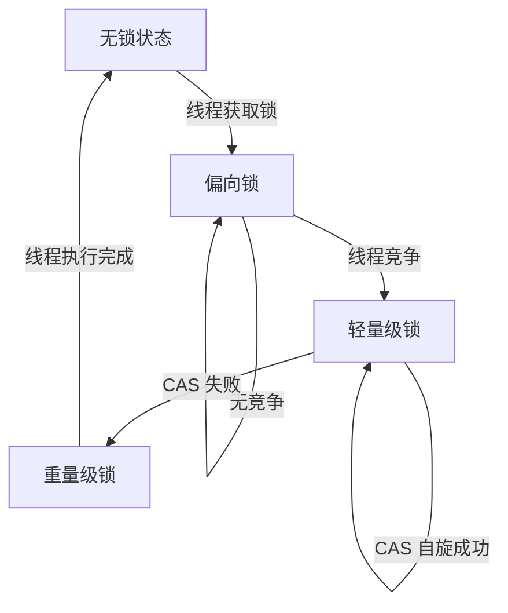

# synchronized 锁升级机制详解

在 JDK 1.6 之后，Java 对 synchronized 进行了优化，引入了 锁升级机制，以减少不必要的上下文切换，提高性能。锁升级主要经历**四个阶段**：

* 无锁（No Lock）
* 偏向锁（Biased Locking）
* 轻量级锁（Lightweight Locking）
* 重量级锁（Heavyweight Locking）\


## 1. 锁的四个状态

| 锁状态                    | 升级条件       | 特性                | 适用场景         |
| ---------------------- | ---------- | ----------------- | ------------ |
| 无锁（No Lock）            | 线程未竞争锁     | 线程安全问题未出现         | 代码未加锁        |
| 偏向锁（Biased Lock）       | 只有一个线程访问该锁 | 线程获取锁无竞争          | 单线程多次进入同步块   |
| 轻量级锁（Lightweight Lock） | 另一个线程尝试获取锁 | 使用 CAS + 自旋 方式竞争锁 | 线程竞争少，执行时间短  |
| 重量级锁（Heavyweight Lock） | 线程自旋失败     | 线程阻塞，使用操作系统 Mutex | 线程竞争激烈，执行时间长 |

## 2. 锁升级的具体流程

🔹 线程竞争的变化 → 触发锁升级。如果锁竞争变得激烈，JVM 会自动升级锁。

🔹 ① 偏向锁（Biased Locking）

• 默认启用（JDK 6+），但 JDK 15 及以上被移除。

• 第一次获取锁时，将锁的对象头 Mark Word 记录为该线程 ID，之后进入同步代码时无需重新获取锁，提升性能。

• 适用于 无竞争的单线程场景。

🌟 示例

```
public class BiasedLockExample {
    private static final Object lock = new Object();

    public static void main(String[] args) {
        new Thread(() -> {
            synchronized (lock) {
                System.out.println(Thread.currentThread().getName() + " 获取偏向锁");
            }
        }).start();
    }
}
```

📌 偏向锁特点

• 线程 A 第一次获取锁时，将线程 ID 记录到对象头，后续 A 进入锁区域无需重新加锁。

• 线程 B 尝试获取锁时，偏向锁撤销，升级为轻量级锁。

🔹 ② 轻量级锁（Lightweight Locking）

• 适用于少量竞争的线程场景。

• 线程尝试通过 CAS（Compare And Swap）修改对象头获取锁，避免线程阻塞。

\


🌟 示例

```
public class LightweightLockExample {
    private static final Object lock = new Object();

    public static void main(String[] args) {
        Thread t1 = new Thread(() -> {
            synchronized (lock) {
                System.out.println(Thread.currentThread().getName() + " 获取轻量级锁");
                try { Thread.sleep(1000); } catch (InterruptedException e) { e.printStackTrace(); }
            }
        });

        Thread t2 = new Thread(() -> {
            synchronized (lock) {
                System.out.println(Thread.currentThread().getName() + " 获取轻量级锁");
            }
        });

        t1.start();
        t2.start();
    }
}
```

📌 轻量级锁特点

• 线程 A 获取锁后，会在 对象头 Mark Word 记录锁状态。

• 线程 B 竞争锁时，使用 CAS 尝试加锁，如果失败，则自旋等待（降低线程阻塞开销）。

• 自旋失败后，升级为重量级锁。

🔹 ③ 重量级锁（Heavyweight Locking）

• 适用于 线程竞争激烈的场景。

• 线程竞争时，自旋失败，JVM 通过操作系统 Mutex 机制阻塞线程。

\


🌟 示例

```
public class HeavyweightLockExample {
    private static final Object lock = new Object();

    public static void main(String[] args) {
        for (int i = 0; i < 3; i++) {
            new Thread(() -> {
                synchronized (lock) {
                    System.out.println(Thread.currentThread().getName() + " 获取重量级锁");
                    try { Thread.sleep(1000); } catch (InterruptedException e) { e.printStackTrace(); }
                }
            }).start();
        }
    }
}
```

📌 重量级锁特点

• 大量线程竞争时，CAS + 自旋失败后，线程会进入阻塞（Blocked）状态。

• 线程需要通过 操作系统内核态 mutex（互斥锁） 控制锁释放，切换开销大。

• 适用于高并发、锁竞争严重的场景。

📌 3. 锁升级示意图（流程图）




📌 说明

1\. 线程第一次获取锁 → 进入 偏向锁。

2\. 多个线程竞争锁 → 偏向锁 升级为轻量级锁（CAS + 自旋）。

3\. 线程竞争激烈，CAS 失败 → 轻量级锁 升级为重量级锁。

4\. 所有线程执行完毕 → 释放锁，恢复无锁状态。

## 4. 如何手动控制锁的升级

在 JDK 1.6 以上，锁的升级过程是自动的，但可以通过 JVM 参数调整或禁用锁优化：

| 参数                                 | 作用                            |
| ---------------------------------- | ----------------------------- |
| -XX:+UseBiasedLocking              | 启用偏向锁（默认开启，JDK 15 以上移除）       |
| -XX:-UseBiasedLocking              | 禁用偏向锁（会直接使用轻量级锁）              |
| -XX:BiasedLockingStartupDelay=0    | 立即启用偏向锁（默认有 4s 延迟）            |
| -XX:+PrintGCApplicationStoppedTime | 观察 锁升级导致的 STW（Stop The World） |

## 5. 总结

| 锁状态                    | 特点       | 适用场景    |
| ---------------------- | -------- | ------- |
| 无锁（No Lock）            | 线程未竞争    | 代码未加锁   |
| 偏向锁（Biased Lock）       | 适用于单线程   | 线程少、无竞争 |
| 轻量级锁（Lightweight Lock） | CAS + 自旋 | 低竞争、多线程 |
| 重量级锁（Heavyweight Lock） | 线程阻塞     | 线程竞争激烈  |

🚀 最佳实践

1\. 尽量减少锁竞争，避免锁升级到重量级锁（影响性能）。

2\. 尽可能使用局部变量代替全局变量，避免不必要的同步。

3\. JVM 自动管理锁升级，建议使用 synchronized，性能已大幅优化。
