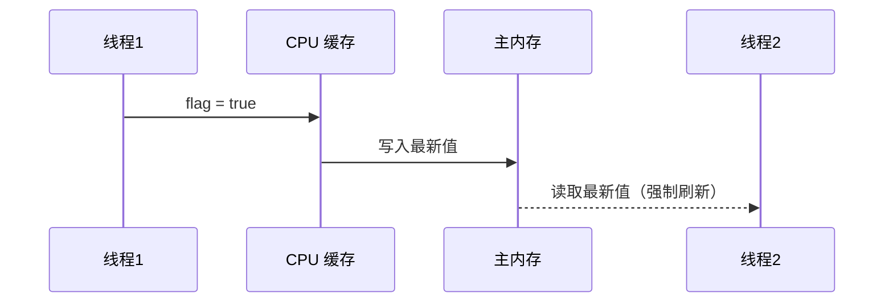
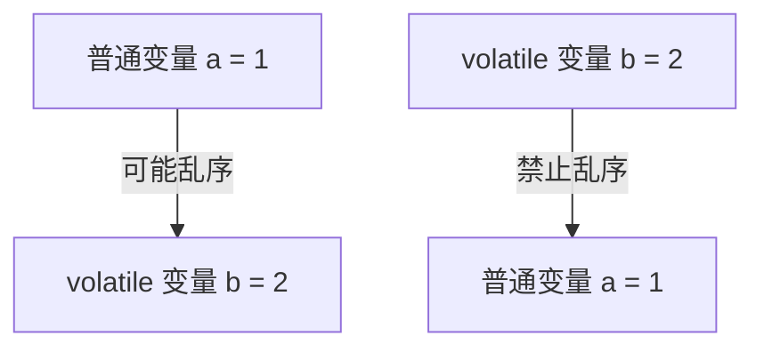

# volatile 关键字详解

在 Java 并发编程中，volatile 是 轻量级同步机制，用于确保 可见性 和 有序性，但不保证原子性。它适用于多线程共享变量的读写，但不能用于需要原子操作的场景。

## 1. volatile 能解决什么问题？

| 特性               | volatile 是否保证？ | 实现方式                         |
| ---------------- | -------------- | ---------------------------- |
| 可见性（Visibility）  | ✅ 保证           | CPU 缓存一致性协议（MESI），主内存可见      |
| 有序性（Orderliness） | ✅ 保证           | 内存屏障（Memory Barrier），防止指令重排序 |
| 原子性（Atomicity）   | ❌ 不保证          | 多线程下可能会丢失更新                  |

## 2. volatile 如何保证可见性？

### 什么是可见性？

**可见性（Visibility）**&#x6307;的是 当一个线程修改了共享变量，其他线程能够立即看到最新值，而不会读取 CPU 缓存中的旧值。

### 示例

```java
class VisibilityExample {
    private volatile boolean flag = false;

    public void setFlag() {
        flag = true; // 线程 1 修改变量
    }

    public boolean getFlag() {
        return flag; // 线程 2 读取变量
    }
}
```

### volatile 可见性原理

1\. 线程 1 修改 flag，该值会 立即写入主存（写屏障 StoreBarrier）。

2\. 线程 2 读取 flag 时，会 强制从主内存读取最新值，而不是 CPU 缓存（读屏障 LoadBarrier）。

3\. JVM 通过 CPU 缓存一致性协议（MESI） 确保所有 CPU 核心能看到最新变量值。



### 底层实现

• volatile 变量的写操作会触发 lock 指令，该指令：

• 刷新 CPU 缓存

• 通知其他 CPU 失效缓存

• 保证所有 CPU 看到最新值

✅ volatile 通过 MESI 缓存一致性协议，确保变量的可见性！

## 3. volatile 如何保证有序性？

### 什么是有序性？

有序性（Orderliness） 指的是 程序的执行顺序不会被 CPU 乱序优化（Reordering），确保代码执行顺序符合预期。

### 示例

```
class OrderingExample {
    private volatile int a = 0, b = 0;

    public void write() {
        a = 1;  // 1️⃣ 普通变量
        b = 2;  // 2️⃣ volatile 变量
    }

    public void read() {
        int x = b; // 3️⃣
        int y = a; // 4️⃣
        System.out.println("x=" + x + ", y=" + y);
    }
}
```

### volatile 保证有序性的原理

* 普通变量可能被 CPU 乱序优化（Reordering）：
* 可能 a = 1 还没执行完，b = 2 已经写入了。
* 导致 read() 方法可能输出 x=2, y=0（预期是 x=2, y=1）。
* volatile 变量写入时，会插入 内存屏障（Memory Barrier）：
* StoreStore 屏障（禁止 a = 1 被重排到 b = 2 之后）。
* LoadLoad 屏障（禁止 b = 2 读取操作被重排到 a = 1 之前）。&#x20;



### 内存屏障

| 内存屏障类型     | 作用                                  |
| ---------- | ----------------------------------- |
| StoreStore | 禁止 普通变量的 写 操作重排序到 volatile 变量的 写 之后 |
| LoadLoad   | 禁止 volatile 变量的 读 操作重排序到普通变量的 读 之前  |

✅ volatile 通过 Memory Barrier 禁止指令重排序，确保代码按正确顺序执行！

## 4. volatile 不能保证原子性

### 什么是原子性？

原子性（Atomicity） 指的是 多个线程访问共享变量时，操作必须不可分割，不能被中断。

### 错误示例

```
class AtomicExample {
    private volatile int count = 0;

    public void increment() {
        count++; // 非原子操作 (读取 -> 计算 -> 写入)
    }
}
```

为什么 volatile 不能保证原子性？

• count++ 包含多个操作：

1\. 读取 count 的值。

2\. 执行加 1 计算。

3\. 写回 count。

• 线程 A 读取 count=5，在计算过程中，线程 B 也读取 count=5，最终两个线程都写入 count=6（丢失更新）。

### 解决方案

• 使用 synchronized 或 AtomicInteger 代替 volatile：

```
import java.util.concurrent.atomic.AtomicInteger;

class AtomicSolution {
    private AtomicInteger count = new AtomicInteger(0);

    public void increment() {
        count.incrementAndGet(); // 线程安全
    }
}
```

✅ volatile 不能保证原子性，推荐使用 AtomicInteger 或 synchronized！

## 5. 总结

| 特性  | 是否保证？ | 实现方式                            |
| --- | ----- | ------------------------------- |
| 可见性 | ✅ 保证  | MESI 缓存一致性协议，变量写入主存             |
| 有序性 | ✅ 保证  | Memory Barrier，防止指令重排序          |
| 原子性 | ❌ 不保证 | 需要 AtomicInteger 或 synchronized |

🚀 最佳实践

1\. 适用于状态标志变量

```java
class FlagExample {
    private volatile boolean running = true;

    public void stop() {
        running = false;
    }
}
```

2\. 适用于双重检查锁（DCL 单例模式）

```java
class Singleton {
    private static volatile Singleton instance;

    public static Singleton getInstance() {
        if (instance == null) {
            synchronized (Singleton.class) {
                if (instance == null) {
                    instance = new Singleton();
                }
            }
        }
        return instance;
    }
}
```
