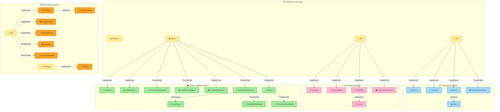

# Java集合分类

```mermaid
graph TD;
    %% Define Subgraphs
    subgraph "🛠 Collection Framework"
        A1["📦 Collection"]
        A2["📜 List"]
        A3["🔢 Set"]
        A4["📤 Queue"]
    end

    subgraph "📋 List Implementations"
        A2 -->|Implements| L1["📂 ArrayList"]
        A2 -->|Implements| L2["🔗 LinkedList"]
        A2 -->|Implements| L3["📦 Vector"]
        L3 -->|Subclass| L4["📚 Stack"]
        A2 -->|Thread-Safe| L5["🛡 CopyOnWriteArrayList"]
    end

    subgraph "📌 Set Implementations"
        A3 -->|Implements| S1["♻️ HashSet"]
        A3 -->|Implements| S2["📜 LinkedHashSet"]
        A3 -->|Implements| S3["🌳 SortedSet"]
        S3 -->|Implements| S4["🌲 TreeSet"]
        A3 -->|Thread-Safe| S5["🛡 CopyOnWriteArraySet"]
    end

    subgraph "🛤 Queue Implementations"
        A4 -->|Implements| Q1["🔗 LinkedList"]
        A4 -->|Implements| Q2["📊 PriorityQueue"]
        A4 -->|Thread-Safe| Q3["⚡ ConcurrentLinkedQueue"]
        A4 -->|Thread-Safe| Q4["📥 LinkedBlockingQueue"]
        A4 -->|Thread-Safe| Q5["📤 ArrayBlockingQueue"]
        A4 -->|Thread-Safe| Q6["🎯 PriorityBlockingQueue"]
        A4 -->|Implements| Q7["🔀 Deque"]
        Q7 -->|Implements| Q8["🌀 ArrayDeque"]
        Q7 -->|Thread-Safe| Q9["🔗 LinkedBlockingDeque"]
        Q7 -->|Thread-Safe| Q10["🔁 ConcurrentLinkedDeque"]
    end

    subgraph "🗂 Map Implementations"
        M1["📜 Map"]
        M2["🌲 SortedMap"]
        
        M1 -->|Implements| M3["♻️ HashMap"]
        M3 -->|Subclass| M4["📝 LinkedHashMap"]
        M1 -->|Implements| M5["🗑 WeakHashMap"]
        M1 -->|Implements| M6["👥 IdentityHashMap"]
        M1 -->|Thread-Safe| M7["🛡 Hashtable"]
        M1 -->|Thread-Safe| M8["⚡ ConcurrentHashMap"]
        M2 -->|Implements| M9["🌳 TreeMap"]
    end

    %% Beautify Nodes
    classDef main fill:#ffeb99,stroke:#f4c542,stroke-width:2px,font-size:14px;
    classDef list fill:#a3d9ff,stroke:#1e90ff,stroke-width:2px,font-size:14px;
    classDef set fill:#f9b5d0,stroke:#ff69b4,stroke-width:2px,font-size:14px;
    classDef queue fill:#a2e8a0,stroke:#32cd32,stroke-width:2px,font-size:14px;
    classDef map fill:#f5a623,stroke:#ff4500,stroke-width:2px,font-size:14px;

    %% Assign styles
    class A1,A2,A3,A4,M1,M2 main;
    class L1,L2,L3,L4,L5 list;
    class S1,S2,S3,S4,S5 set;
    class Q1,Q2,Q3,Q4,Q5,Q6,Q7,Q8,Q9,Q10 queue;
    class M3,M4,M5,M6,M7,M8,M9 map;
```

