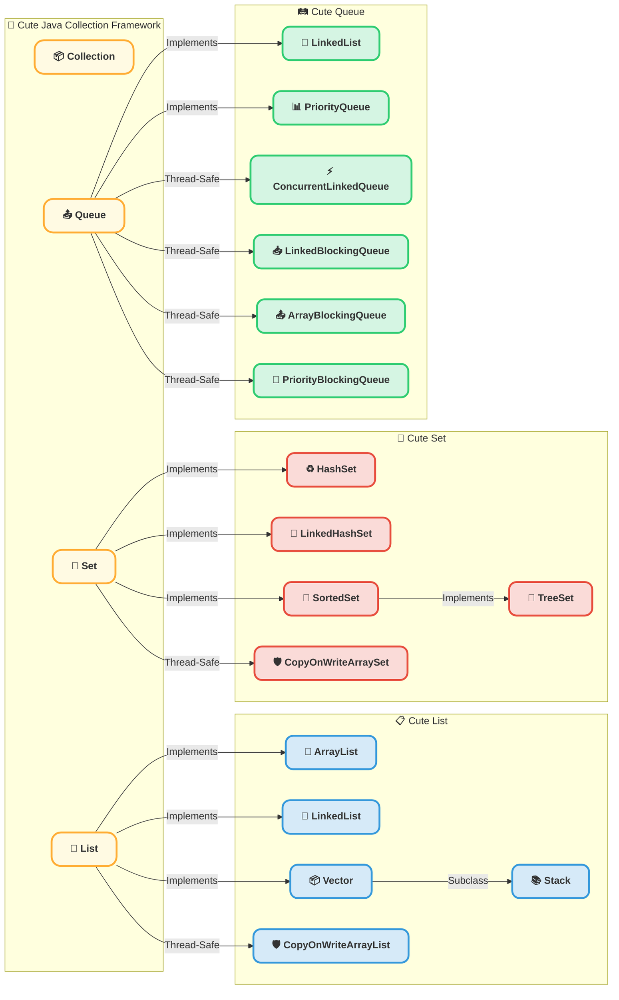
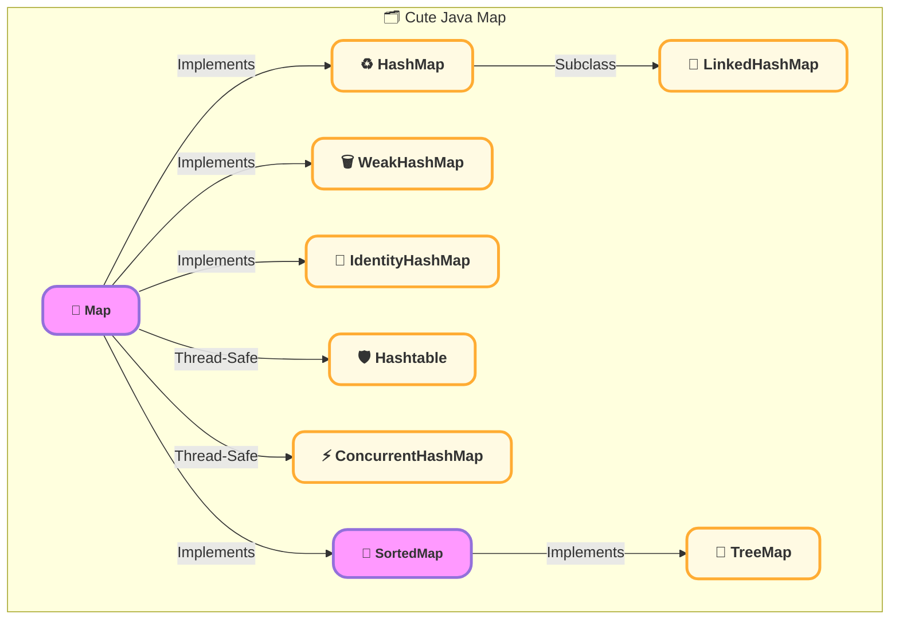

# Java集合分类

```mermaid
graph LR;

    %% 🎀 Cute Collection Framework
    subgraph "🎀 Cute Java Collection Framework"
        C1["📦 <b>Collection</b>"]
        C2["📜 <b>List</b>"]
        C3["🔢 <b>Set</b>"]
        C4["📤 <b>Queue</b>"]
    end

    %% 📋 Cute List Implementations
    subgraph "📋 Cute List"
        C2 -->|Implements| L1["📂 <b>ArrayList</b>"]
        C2 -->|Implements| L2["🔗 <b>LinkedList</b>"]
        C2 -->|Implements| L3["📦 <b>Vector</b>"]
        L3 -->|Subclass| L4["📚 <b>Stack</b>"]
        C2 -->|Thread-Safe| L5["🛡 <b>CopyOnWriteArrayList</b>"]
    end

    %% 📌 Cute Set Implementations
    subgraph "📌 Cute Set"
        C3 -->|Implements| S1["♻️ <b>HashSet</b>"]
        C3 -->|Implements| S2["📜 <b>LinkedHashSet</b>"]
        C3 -->|Implements| S3["🌳 <b>SortedSet</b>"]
        S3 -->|Implements| S4["🌲 <b>TreeSet</b>"]
        C3 -->|Thread-Safe| S5["🛡 <b>CopyOnWriteArraySet</b>"]
    end

    %% 🛤 Cute Queue Implementations
    subgraph "🛤 Cute Queue"
        C4 -->|Implements| Q1["🔗 <b>LinkedList</b>"]
        C4 -->|Implements| Q2["📊 <b>PriorityQueue</b>"]
        C4 -->|Thread-Safe| Q3["⚡ <b>ConcurrentLinkedQueue</b>"]
        C4 -->|Thread-Safe| Q4["📥 <b>LinkedBlockingQueue</b>"]
        C4 -->|Thread-Safe| Q5["📤 <b>ArrayBlockingQueue</b>"]
        C4 -->|Thread-Safe| Q6["🎯 <b>PriorityBlockingQueue</b>"]
    end

    %% 🌈 Cute Q版 Styling (可爱风格)
    classDef cuteStyle fill:#FFFAE3,stroke:#FFAC33,stroke-width:3px,rx:15px,ry:15px,shadow:3px,font-size:16px,font-weight:bold;
    classDef listStyle fill:#D6EAF8,stroke:#3498DB,stroke-width:3px,rx:12px,ry:12px,shadow:5px,font-size:16px,font-weight:bold;
    classDef setStyle fill:#FADBD8,stroke:#E74C3C,stroke-width:3px,rx:12px,ry:12px,shadow:5px,font-size:16px,font-weight:bold;
    classDef queueStyle fill:#D5F5E3,stroke:#2ECC71,stroke-width:3px,rx:12px,ry:12px,shadow:5px,font-size:16px,font-weight:bold;

    %% 🎀 Apply Cute Styles
    class C1,C2,C3,C4 cuteStyle;
    class L1,L2,L3,L4,L5 listStyle;
    class S1,S2,S3,S4,S5 setStyle;
    class Q1,Q2,Q3,Q4,Q5,Q6 queueStyle;
```

```mermaid
graph TD;

    %% 🗂 Cute Java Map
    subgraph "🗂 Cute Java Map"
        M1["📜 <b>Map</b>"]
        M2["🌲 <b>SortedMap</b>"]
        
        M1 -->|Implements| M3["♻️ <b>HashMap</b>"]
        M3 -->|Subclass| M4["📝 <b>LinkedHashMap</b>"]
        M1 -->|Implements| M5["🗑 <b>WeakHashMap</b>"]
        M1 -->|Implements| M6["👥 <b>IdentityHashMap</b>"]
        M1 -->|Thread-Safe| M7["🛡 <b>Hashtable</b>"]
        M1 -->|Thread-Safe| M8["⚡ <b>ConcurrentHashMap</b>"]

        %% 🔥 Fix: SortedMap Implements Map
        M1 -->|Implements| M2
        M2 -->|Implements| M9["🌳 <b>TreeMap</b>"]
    end

    %% 🌈 Cute Styling (Q版可爱风格)
    classDef qStyle fill:#f9f,stroke:#9370DB,stroke-width:3px,rx:15px,ry:15px,shadow:3px,font-size:14px;
    classDef mapStyle fill:#FFFAE3,stroke:#FFAC33,stroke-width:3px,rx:12px,ry:12px,shadow:5px,font-size:16px,font-weight:bold;
    
    %% 🎨 Apply Cute Styles
    class M1,M2 qStyle;
    class M3,M4,M5,M6,M7,M8,M9 mapStyle;
```

