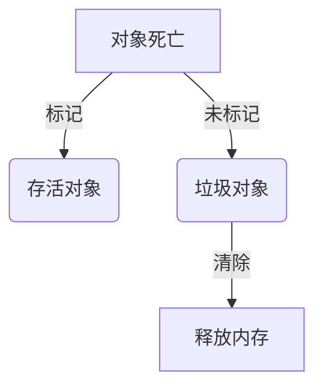
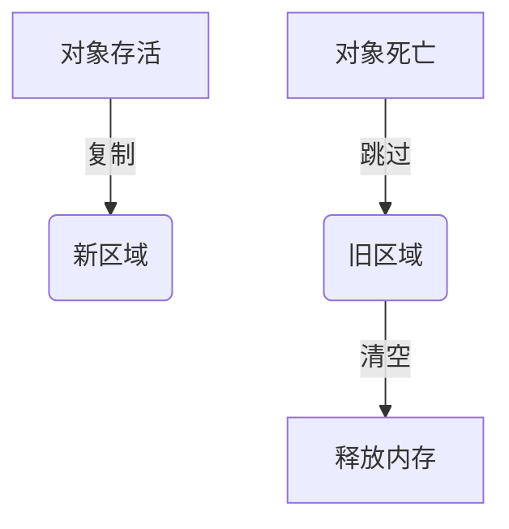
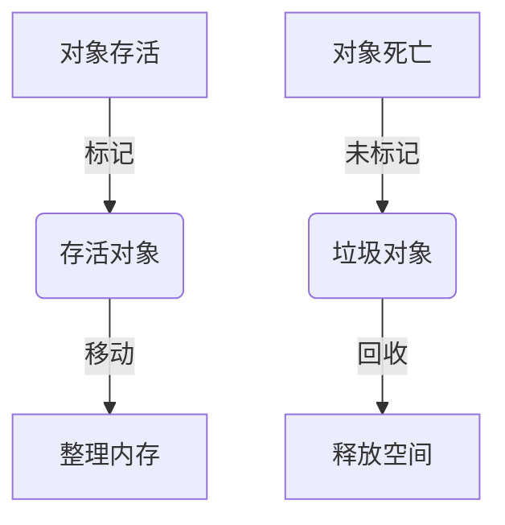
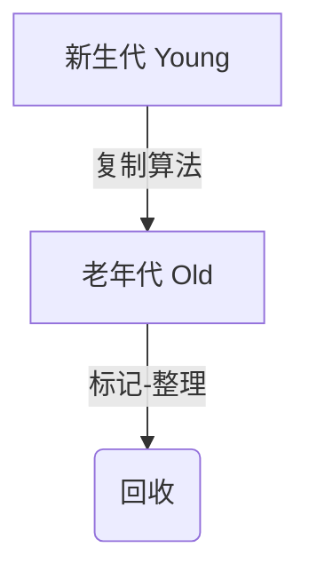
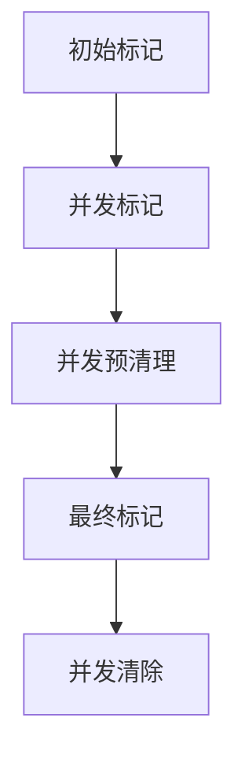
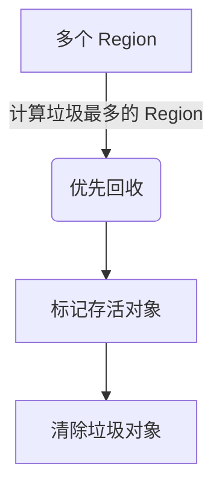
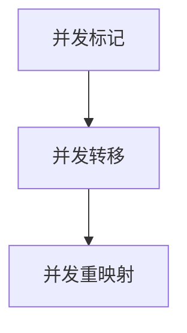

# Java GC（垃圾回收）算法详解

## 1. GC 算法分类

Java GC 主要分为三类：

1\. 基本垃圾回收算法

* 标记-清除（Mark-Sweep）
* 复制（Copying）
* 标记-整理（Mark-Compact）

2\. 分代垃圾回收算法

* 新生代 GC（Minor GC）
* 老年代 GC（Major/Full GC）

3\. 现代 GC 算法

* G1（Garbage First）
* ZGC（Z Garbage Collector）
* Shenandoah GC

## 2. 基本垃圾回收算法

### 2.1 标记-清除（Mark-Sweep）

机制

1\. 标记存活对象（可达性分析法）

2\. 清除不可达对象（垃圾对象）

缺点

* 内存碎片化（对象随机分布，导致大对象分配失败）。
* GC 效率低（每次都要全表扫描）。

✅ 适用于：最早期的 GC，现代 JVM 不会单独使用。

### 2.2 复制算法（Copying）

机制

1. 将内存分为两半（Eden + Survivor）
2. GC 时，把存活对象复制到另一半
3. 清除整个旧区，避免碎片化

缺点

* 浪费 50% 内存（需要两块区域）。
* 适合新生代对象（短生命周期，大量垃圾）。

✅ 适用于：

• 新生代 GC（Minor GC），如 Serial、Parallel GC。

### 2.3 标记-整理（Mark-Compact）

机制

1. 标记存活对象
2. 移动存活对象，整理碎片
3. 回收死亡对象

缺点

* 移动对象成本高（适合老年代）。
* GC 停顿时间长。

✅ 适用于：

* 老年代 GC（如 CMS、G1、ZGC）。

## 3. 分代垃圾回收算法

现代 JVM 采用分代收集（Generational Collection）：

* 新生代（Young Generation）：对象生命周期短，采用 复制算法（Minor GC）。
* 老年代（Old Generation）：对象生命周期长，采用 标记-整理算法（Full GC）。
* 永久代/元空间（Metaspace）：存放 类元数据。

## 4. 现代 GC 算法

### 4.1 CMS（Concurrent Mark-Sweep）

机制

1. 初始标记（STW）：标记 GC Roots 直接可达对象。
2. 并发标记：并发扫描存活对象（不 STW）。
3. 并发预清理：尝试清理垃圾对象。
4. 最终标记（STW）：确保垃圾不会误回收。
5. 并发清除：真正删除垃圾对象（不 STW）。

优点

* 低延迟，适合低延迟应用（如 Web 服务器）。

缺点

* 容易产生碎片化（需要 Full GC 整理）。
* STW（Stop The World）开销大。

### 4.2 G1（Garbage First）

机制

* 分区回收（Region-based）：内存划分为多个 Region，不区分 Eden 和 Old。
* 并发回收：只回收 垃圾最多的 Region，减少 STW 时间。

优点

* 低延迟，避免 Full GC STW。
* 减少碎片化，适合大内存应用（如 4GB+ JVM）。

缺点

* 比 CMS 需要更多 CPU 资源。

### 4.3 ZGC（Z Garbage Collector）

机制

* 超低延迟 GC，可以做到 GC 期间停顿 < 10ms。
* 使用染色指针（Colored Pointers），避免全表扫描。

优点

* 适用于大内存（16GB+）应用。
* GC 停顿时间极低（< 10ms）。

缺点

* 比 G1 需要更多内存。

### 4.4 Shenandoah GC

机制

• 并发整理（Concurrent Compacting），垃圾回收和对象整理 不 STW。

• 可用于 Java 8/11，适合 低延迟应用。

优点

* GC 时间与堆大小无关（适合 100GB+ 内存）。
* 比 G1 低延迟。

缺点

* 高 CPU 开销。

## 5. GC 算法比较

| GC 算法       | 特点                    | 适用场景                |
| ----------- | --------------------- | ------------------- |
| Serial GC   | 单线程，适用于小内存（≤1GB）      | 单核 CPU，低吞吐量应用       |
| Parallel GC | 多线程 GC，提高吞吐量          | 批处理，高吞吐量应用          |
| CMS GC      | 并发回收，低延迟              | Web 服务器，低延迟应用       |
| G1 GC       | 分区回收，减少 STW           | 大内存（4GB+），适合中等低延迟应用 |
| ZGC         | GC 停顿 < 10ms，适合 16GB+ | 高吞吐量、低延迟应用          |
| Shenandoah  | 并发整理，适用于 100GB+       | 高性能企业应用             |

## 6. 总结

✅ Java GC 主要使用 标记-清除、复制、标记-整理 算法。

✅ 现代 GC 采用 分代收集，新生代（复制）+ 老年代（标记整理）。

✅ G1、ZGC、Shenandoah 适用于大内存和低延迟应用。

✅ JVM 默认 GC（JDK 17+）：G1，推荐低延迟应用使用 ZGC 或 Shenandoah 🚀。
