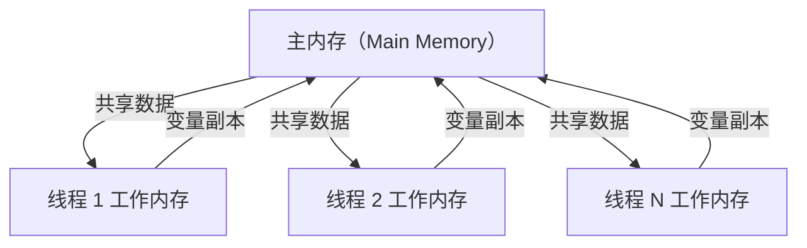
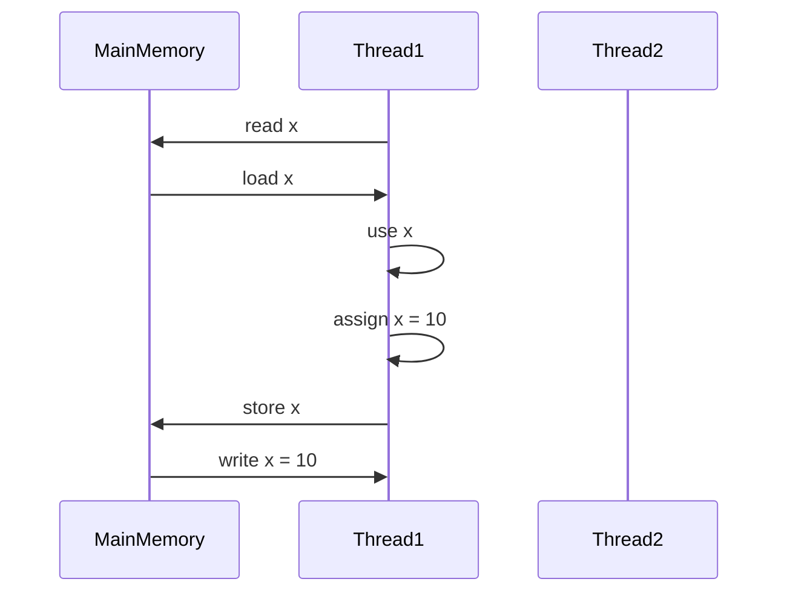

# Java 内存模型

## 1.JMM 内存结构

Java 内存模型将内存划分为：

* 主内存（Main Memory）：所有线程共享的数据，存储 实例对象、类变量（static 变量）。
* 工作内存（Working Memory）：每个线程 独立的本地缓存，存储 线程可见的变量副本。



主内存负责数据持久化，工作内存存储变量副本，线程通过同步机制保证数据一致性。

## 2.JMM 三大特性

Java 内存模型提供 原子性（Atomicity）、可见性（Visibility）、有序性（Ordering） 三大特性。

### 1. 原子性（Atomicity）

保证操作不可被中断，CPU 级别保证一致性

哪些操作是原子操作？

* 基本数据类型的 赋值（int a = 10;）
* volatile 变量的读/写
* synchronized 代码块

非原子操作

```java
i++;  // 这个操作实际由三步组成：
i = i + 1; // 1. 读取 i  2. 计算 i+1  3. 赋值给 i
```

保证原子性的方法

```java
// 方式 1: synchronized
synchronized(lock) { i++; }

// 方式 2: AtomicInteger
AtomicInteger atomicInt = new AtomicInteger(0);
atomicInt.incrementAndGet();
```

### 2. 可见性（Visibility）

保证一个线程修改的变量对其他线程立即可见

问题：普通变量在多线程下可能不可见

* 线程 1 修改变量后，线程 2 可能仍然看到旧值（因为变量缓存在线程工作内存）。

解决方案

* 使用 volatile
* 使用 synchronized
* 使用 Lock（ReentrantLock）

```java
// 方式 1: 使用 volatile
private volatile boolean flag = false;
```

volatile 关键字

✅ 保证可见性（所有线程立即刷新）

❌ 不保证原子性

## 3. 有序性（Ordering）

保证代码按照编写顺序执行

* CPU 可能会进行指令重排序
* volatile 可阻止指令重排序
* synchronized 代码块保证顺序执行

```java
volatile int a = 0, b = 0;

public void method1() {
    a = 1;   // 可能会被 CPU 调整顺序
    b = 2;
}

public void method2() {
    if (b == 2) {
        System.out.println(a); // 可能 a == 0（重排序）
    }
}
```

✅ 使用 volatile 可防止指令重排序

```java
volatile int a = 0, b = 0;
```

## 3.JMM 线程交互规则

Java 线程 如何从主存获取数据、写入数据，JMM 规定了 8 大内存操作：

| 操作     | 作用               |
| ------ | ---------------- |
| lock   | 变量加锁（独占）         |
| unlock | 变量解锁（同步）         |
| read   | 读取主存数据到线程工作内存    |
| load   | 把 read 读入的值放入变量  |
| use    | 线程执行代码时，使用变量值    |
| assign | 线程执行代码时，修改变量值    |
| store  | 把修改后的变量值写入主存     |
| write  | store 写入后，更新主存变量 |




保证变量在主存和工作内存之间的正确交互

## 4.关键字在 JMM 中的作用

### volatile

* 保证可见性
* 防止指令重排序
* 不保证原子性

```java
private volatile boolean flag = false;
```

### synchronized

* 保证可见性（所有线程执行前先刷新主存）
* 保证原子性
* 保证有序性

```java
synchronized(lock) {
    sharedResource++;
}
```

### final

* 对象初始化后，其他线程立即可见
* 防止指令重排序

```java
public final int value = 100;
```

## 5.JMM 总结

| 特性              | 描述             | 解决方案                       |
| --------------- | -------------- | -------------------------- |
| 原子性（Atomicity）  | 确保操作不可分割       | synchronized，AtomicInteger |
| 可见性（Visibility） | 变量修改后对其他线程立即可见 | volatile，synchronized      |
| 有序性（Ordering）   | 保证代码执行顺序       | volatile，synchronized      |

## 6.JMM 重点

1. JMM 规定了主存和线程工作内存的数据交互
2. volatile 只保证可见性，不保证原子性
3. synchronized 既保证可见性，也保证原子性
4. CPU 可能会进行指令重排序，volatile 可阻止
5. JMM 通过 lock/read/write/store 操作同步数据

理解 Java 内存模型，有助于编写高性能并发程序，避免数据不一致和线程安全问题！&#x20;
