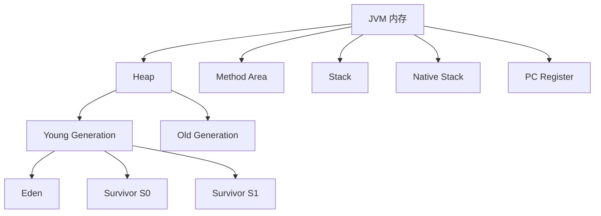
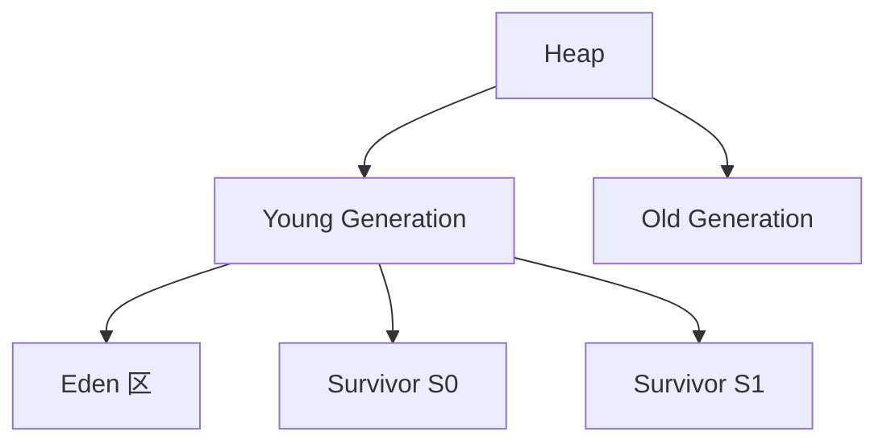
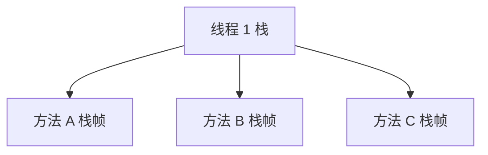

# JVM 内存结构

## 1.JVM 内存结构概览

## 2.JVM 内存结构详细解析

| 区域                  | 作用                     | 管理方式  | 特点                |
| ------------------- | ---------------------- | ----- | ----------------- |
| 堆（Heap）             | 存储对象 和 数组              | GC 管理 | 最大的内存区域，存放实例对象    |
| 方法区（Method Area）    | 存储 类信息、方法元数据、常量池       | GC 管理 | 也称 元空间（Metaspace） |
| JVM 栈（Java Stack）   | 线程私有，存储 局部变量表、操作数栈、帧数据 | 线程管理  | 方法调用时创建，方法结束后销毁   |
| 本地方法栈（Native Stack） | 供 JNI 调用 本地方法          | 线程管理  | 主要用于 调用 C 语言等本地代码 |
| 程序计数器（PC Register）  | 存储 当前线程执行的指令地址         | 线程管理  | 每个线程都有独立的 PC      |

## 3.JVM 堆（Heap）

堆是 JVM 内存最大的一块，用于存储 对象实例，并由 GC（垃圾回收器）自动管理。

* 年轻代（Young Generation）
* Eden（伊甸园区）：新对象分配的主要区域，垃圾回收频繁。
* Survivor（幸存者区 S0/S1）：存放经历过 Minor GC 仍存活的对象。
* 老年代（Old Generation）
* 存放 长期存活的对象，GC 频率低。

* 对象先分配到 Eden（Minor GC 处理）。
* 幸存对象进入 Survivor S0/S1 轮换。
* 经历 N 次 GC 后晋升到老年代（Major GC 处理）。

## 4.方法区（Method Area）

方法区存储：

* 类元数据（Class Metadata）
* 运行时常量池（Runtime Constant Pool）
* JIT 编译后的代码

在 JDK 8 及以上，方法区使用 元空间（Metaspace），并从 堆内存移到本地内存。

## 5.JVM 栈（Java Stack）

线程私有，存储方法执行时的 栈帧（Stack Frame）：

* 局部变量表（Local Variable Table）
* 操作数栈（Operand Stack）
* 帧数据（Frame Data）

栈内存示意

* 方法调用时，入栈
* 方法执行结束，出栈&#x20;

## 6.本地方法栈（Native Stack）

* 供 JNI（Java Native Interface）调用 C 代码。
* JVM 自己的本地方法（如 sun.misc.Unsafe）。

## 7.程序计数器（PC Register）

* 每个线程私有，存储当前执行的 JVM 指令地址。
* 如果线程执行 Native 方法，则 PC 为 null。

## 8. 总结

| 区域                  | 作用            | 特点           | 是否 GC 管理 |
| ------------------- | ------------- | ------------ | -------- |
| 堆（Heap）             | 存储对象实例        | 最大的内存区域      | ✅        |
| 方法区（Method Area）    | 类元数据 & 运行时常量池 | JDK8 以后使用元空间 | ✅        |
| JVM 栈（Java Stack）   | 方法调用的栈帧       | 线程私有，方法执行时创建 | ❌        |
| 本地方法栈（Native Stack） | 调用 JNI 方法     | 供 C 代码运行     | ❌        |
| 程序计数器（PC Register）  | 记录当前执行指令地址    | 线程私有         | ❌        |

