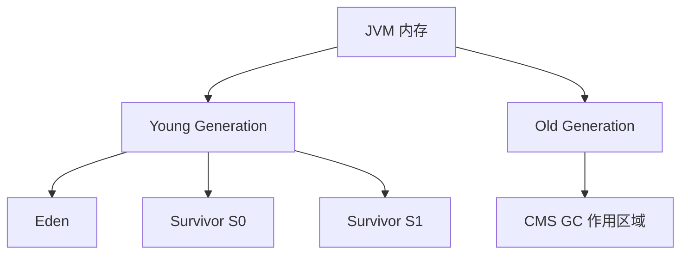
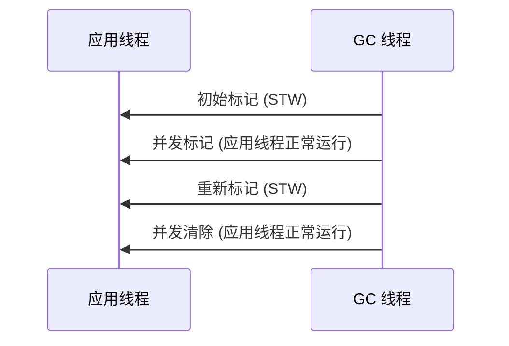
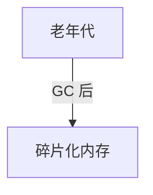

# 垃圾回收器之CMS

CMS（Concurrent Mark-Sweep）GC 是 JDK 1.4 引入的 低延迟垃圾回收器，主要目标是：

1. 减少 Full GC 停顿时间
2. 在应用线程运行的同时进行 GC
3. 适用于低延迟（低 STW）的应用，如 Web 服务器、金融交易系统

CMS 适用于低延迟场景，但由于碎片化问题，已被 G1 GC 和 ZGC 取代。

## 1.CMS GC 关键特点

| 特点                     | 描述                        |
| ---------------------- | ------------------------- |
| 并发执行                   | 绝大部分回收操作 与应用线程并发执行        |
| 低停顿                    | 比 G1 高吞吐，但比 ZGC 停顿时间更长    |
| 使用标记-清除（Mark-Sweep）算法  | 不会进行内存整理，容易产生碎片化          |
| 适用于老年代（Old Generation） | 主要回收 老年代，年轻代仍然使用 Minor GC |

## 2.CMS GC 内存结构

CMS 只作用于老年代（Old Generation），年轻代仍然采用 复制算法（Copying GC） 进行回收。




CMS 只作用于老年代，避免了 Full GC，但由于 不进行内存整理，容易导致碎片化。

## 3.CMS GC 工作流程

CMS 采用 “标记-清除（Mark-Sweep）” 算法，共 四个阶段：




| 阶段                     | 作用                       | 是否 STW   |
| ---------------------- | ------------------------ | -------- |
| 初始标记（Initial Mark）     | 标记 GC Root 可达对象          | 短暂 STW   |
| 并发标记（Concurrent Mark）  | 应用线程正常运行，GC 线程标记对象       | ❌（无 STW） |
| 重新标记（Remark）           | 标记新创建对象，确保 GC Roots 连接正确 | 短暂 STW   |
| 并发清除（Concurrent Sweep） | 并发回收无用对象，释放内存            | ❌（无 STW） |

✅ CMS 主要通过“并发标记”和“并发清除”减少 GC 停顿时间。

## 4.CMS GC 触发条件

| GC 类型            | 触发条件              |
| ---------------- | ----------------- |
| Minor GC（年轻代 GC） | Eden 区满 时触发       |
| CMS GC（老年代 GC）   | 老年代使用超过阈值（默认 92%） |
| Full GC（最终回收）    | CMS GC 失败 或 碎片过多  |

## 5.CMS GC 的问题

### 1. 内存碎片化

CMS 采用 标记-清除（Mark-Sweep），不会整理内存，可能导致碎片化：



❌ 碎片化问题可能导致大对象分配失败，触发 Full GC。

解决方案

* JVM 参数：-XX:+UseCMSCompactAtFullCollection（Full GC 时进行内存整理）
* 手动触发 Full GC：System.gc()

## 2. 重新标记（Remark）阶段仍需 STW

虽然 CMS 主要 并发执行，但 重新标记（Remark）阶段仍然需要 STW，可能影响低延迟应用。

✅ 解决方案

• 降低 STW 影响：-XX:CMSInitiatingOccupancyFraction=70（70% 老年代使用率触发 CMS GC）

## 3. “Concurrent Mode Failure”

如果 CMS 回收速度太慢，老年代空间不足，则触发 Full GC，导致长时间 STW：

```java
[GC (CMS Initial Mark) [1 CMS-initial-mark: 12345K(40960K)]...
[Full GC (Allocation Failure) 12345K->6789K(40960K)]
```

解决方案

* 增加 GC 线程数：-XX:ParallelCMSThreads=N
* 降低触发阈值：-XX:CMSInitiatingOccupancyFraction=60

## 6.CMS GC 关键 JVM 参数

| 参数                                    | 作用                 | 默认值 |
| ------------------------------------- | ------------------ | --- |
| -XX:+UseConcMarkSweepGC               | 启用 CMS GC          | ❌   |
| -XX:+UseParNewGC                      | 年轻代并行 GC（与 CMS 配合） | ✅   |
| -XX:CMSInitiatingOccupancyFraction=70 | 老年代使用 70% 时触发 CMS  | 92% |
| -XX:+UseCMSCompactAtFullCollection    | Full GC 时整理碎片      | ❌   |

## 7.CMS GC 与其他 GC 对比

| GC 类型       | 停顿时间     | 并发执行 | 碎片整理 | 适用场景         |
| ----------- | -------- | ---- | ---- | ------------ |
| Serial GC   | 长        | ❌    | ✅    | 小型应用         |
| Parallel GC | 中等       | ❌    | ✅    | 高吞吐          |
| CMS GC      | 低        | ✅    | ❌    | 低延迟 Web/金融系统 |
| G1 GC       | 更低       | ✅    | ✅    | 大内存 + 低延迟    |
| ZGC         | 超低（≤1ms） | ✅    | ✅    | 超大内存（100GB+） |

✅ CMS 适用于低延迟场景，但因碎片化问题，G1 GC 是更好的选择。

## 8.CMS 适用场景

✅ Web 服务器、金融交易系统

✅ 低延迟（RT < 50ms）的应用

✅ JDK 8 及以下版本（JDK 9 以后推荐 G1 GC）

❌ 不适合

• 吞吐量要求高的应用（可以用 Parallel GC）

• 大内存（32GB+）的应用（可以用 G1 或 ZGC）

• 需要稳定延迟的应用（推荐 G1/ZGC）

## 9.总结

1\. CMS 采用并发回收，减少 GC 停顿

2\. 适用于老年代 GC，年轻代仍然用 Minor GC

3\. 避免了长时间 STW，但可能出现内存碎片

4\. 如果回收不及时，可能触发 Full GC（Concurrent Mode Failure）

5\. CMS 在 JDK 9 以后被 G1 取代

\


🚀 CMS 适用于低延迟应用，但 G1 是更好的选择！ 🎯
