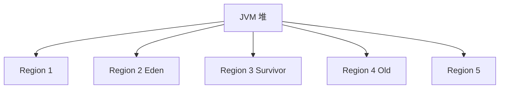
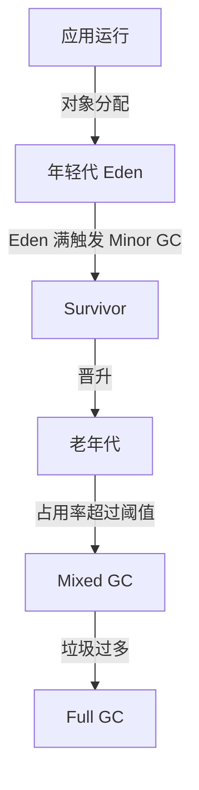

# 垃圾回收器之G1

## 1.G1 GC 的特点

| 特点                  | 描述                                    |
| ------------------- | ------------------------------------- |
| Region 分区           | 不再划分年轻代 & 老年代，而是使用 Region（动态分区）       |
| 优先回收（Garbage First） | 优先回收垃圾最多的 Region，提升效率                 |
| 并发执行                | 减少 STW（Stop The World）停顿时间            |
| 可预测 GC 停顿时间         | 可通过 -XX:MaxGCPauseMillis 控制最大 GC 停顿时间 |
| 混合回收（Mixed GC）      | 在 YGC 之后，老年代 + 年轻代一起回收，避免 Full GC     |

## 2.G1 GC 内存结构

### 传统 GC vs. G1 GC

* 传统 GC（Parallel GC / CMS）：固定划分 年轻代 & 老年代
* G1 GC：把堆划分为多个 Region（动态分区）

### G1 的 Region

| Region 类型     | 作用                       |
| ------------- | ------------------------ |
| Eden（新生代）     | 存放新创建对象，Minor GC 发生      |
| Survivor（新生代） | 存放 Minor GC 后存活的对象       |
| Old（老年代）      | 存放长期存活对象                 |
| Humongous（H）  | 存放 大对象（超过 50% Region 大小） |
| Empty（空闲）     | 等待分配的 Region             |

## 3.G1 GC 工作流程

### 主要 GC 阶段

🔹 详细过程

1\. Minor GC（年轻代回收）

• Eden 满了触发 Minor GC

• 存活对象移到 Survivor，晋升老年代

• STW（短暂停顿）

2\. Concurrent Marking（并发标记）

• 并发执行，程序继续运行

• 标记老年代对象，计算垃圾最多的 Region

3\. Mixed GC（混合 GC）

• 回收 年轻代 + 部分老年代

• 避免 Full GC，控制停顿时间

4\. Full GC（整个堆回收）

• 所有 Region 清理

• STW 时间长（应避免）

## 4.G1 GC 触发条件

### Minor GC

* Eden 区满时触发 Minor GC
* 存活对象晋升到 Survivor 或老年代
* 停顿时间短

### Mixed GC

* 老年代占用超阈值（默认 45%）
* 同时回收年轻代 + 部分老年代
* 可预测停顿时间（-XX:MaxGCPauseMillis）

### Full GC

* Concurrent Marking 失败
* 老年代空间不足
* Humongous 对象太多

## 5.G1 GC 参数调优

关键 JVM 参数

| 参数                                    | 作用                    | 默认值         |
| ------------------------------------- | --------------------- | ----------- |
| -XX:+UseG1GC                          | 启用 G1 GC              | -           |
| -XX:MaxGCPauseMillis=200              | 目标 GC 停顿时间（毫秒）        | 200ms       |
| -XX:InitiatingHeapOccupancyPercent=45 | Mixed GC 触发阈值（老年代使用率） | 45%         |
| -XX:G1HeapRegionSize=32m              | Region 大小（1M \~ 32M）  | 动态分配        |
| -XX:ParallelGCThreads=4               | GC 线程数                | CPU 核心数 / 2 |

## 6.G1 GC 与其他 GC 对比

| GC 类型            | 特点                 | 适用场景          |
| ---------------- | ------------------ | ------------- |
| Serial GC        | 单线程回收，适合小内存        | 小型应用          |
| Parallel GC      | 吞吐量高，适合批处理         | 高吞吐场景         |
| CMS GC           | 低停顿，但容易碎片化         | 低延迟           |
| G1 GC            | 可预测停顿时间，避免 Full GC | 大内存 & 低延迟应用   |
| ZGC / Shenandoah | 超低延迟 GC（1ms 级别）    | 超大内存（> 100GB） |

## 7.G1 GC 适用场景

### &#x20;适合

* 大内存（4GB 以上）
* 低延迟应用（电商、金融交易）
* 希望控制 GC 停顿时间
* 替换 CMS（避免碎片化）

### 不适合

* 小内存 JVM
* 超低延迟要求（可以用 ZGC）

## 8.总结

1. G1 采用 Region（分区管理）内存
2. 先标记垃圾最多的 Region（Garbage First）
3. Minor GC 处理年轻代，Mixed GC 处理老年代
4. 避免 Full GC，优化 STW 时间
5. 可通过 -XX:MaxGCPauseMillis 控制停顿\

🚀 G1 GC 适用于大内存 & 低延迟场景，是 CMS 的替代方案！ 🎯
