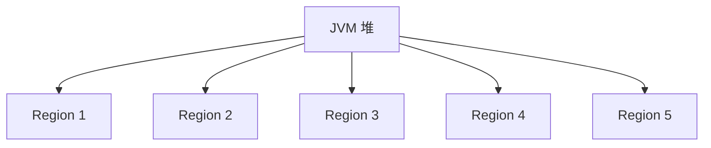
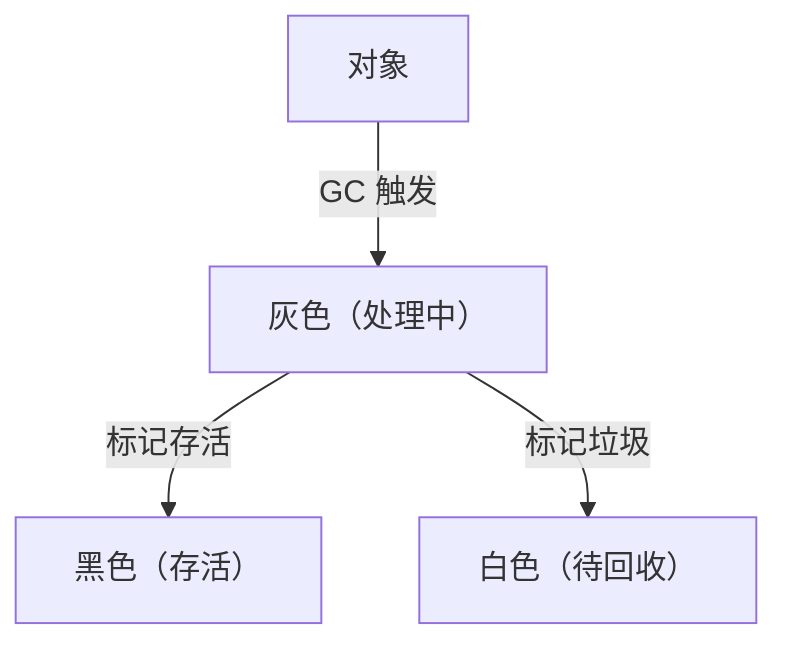

# 垃圾回收器之ZGC

ZGC（Z Garbage Collector）是 JDK 11 引入的 超低延迟垃圾回收器，目标是：

1. 最大支持 16TB 堆内存
2. GC 停顿时间 ≤1ms
3. 全并发回收，避免 STW（Stop-The-World）
4. 使用指针染色（Colored Pointers）+ 读屏障（Load Barrier）优化对象访问
5. 无碎片整理，避免 Full GC\


🚀 ZGC 适用于大内存（>100GB）+ 低延迟（≤1ms）的应用场景，如金融、高频交易、AI 计算。

## 1.ZGC 的核心特点

| 特点            | 描述                                  |
| ------------- | ----------------------------------- |
| 超低停顿时间        | GC 停顿时间 ≤1ms，即使堆大小增加，停顿时间也不变        |
| 支持超大堆内存       | 最大支持 16TB（比 G1 的 32GB 提升 500 倍）     |
| 全并发回收         | 99% 以上的 GC 操作 不影响应用线程               |
| 无 GC 碎片化      | 并发整理内存，无需 Full GC                   |
| 基于 Region（分区） | 不区分年轻代 / 老年代，动态分配 Region            |
| 对象指针重映射       | 使用 指针染色（Colored Pointers） 技术，提升访问效率 |

## 2.ZGC 内存结构

### 传统 GC vs. ZGC

* 传统 GC（G1 / CMS）：固定划分 年轻代 / 老年代
* ZGC：整个堆使用 Region（动态分区），无固定代际概念




### ZGC 的 Region

| Region 类型     | 作用                   |
| ------------- | -------------------- |
| Small Region  | 存放 小对象（≤256KB）       |
| Medium Region | 存放 中等对象（256KB - 4MB） |
| Large Region  | 存放 大对象（≥4MB）         |

✅ 不同大小的对象使用不同的 Region，避免碎片化问题。

## 3.ZGC 核心原理

ZGC 通过 “指针染色（Colored Pointers）” + “读屏障（Load Barrier）”，实现 超低延迟的 GC 机制。

### 指针染色（Colored Pointers）

在 64 位 JVM 中，ZGC 不使用完整的 64 位指针，而是使用其中的一部分作为元数据标记，实现对象重定位，无需 STW。

```java
  ┌────────────────── 64-bit 指针 ───────────────────┐
  │     42-bit（对象地址）      │  4-bit（GC 标记）  │  18-bit（保留位）  │
  └───────────────────────────────────────────────┘
```

| 位数     | 用途                | 作用          |
| ------ | ----------------- | ----------- |
| 42-bit | 存储对象地址（最大支持 16TB） | 直接指向对象      |
| 4-bit  | GC 状态标记           | 记录对象的状态（颜色） |
| 18-bit | 保留位               | 未来扩展        |

✅ 由于 42-bit 指针仍然可以寻址 16TB 地址空间，ZGC 能够支持超大堆。

### GC 颜色标记

ZGC 采用 指针染色（Colored Pointers） 进行垃圾回收标记：

| 颜色         | 作用                 |
| ---------- | ------------------ |
| 白色（White）  | 未标记对象（可能会被回收）      |
| 灰色（Gray）   | 正在被 GC 处理的对象       |
| 黑色（Black）  | 已标记为存活的对象          |
| 黄色（Yellow） | 对象已被转移到新地址，但仍指向旧地址 |




### 读屏障（Load Barrier）

📌 传统 GC 的问题

• 对象移动后，所有引用都要更新，否则指向的地址会错误。

• STW 期间，全局更新所有指针，开销大，影响应用性能。

\


### ZGC 解决方案

* 指针染色（Colored Pointers） 标记对象状态。
* 每次访问对象时，触发“读屏障”检查，决定是否需要重定向。

```java
public class ZGCDemo {
    public static void main(String[] args) {
        Object obj = new Object(); // 假设 obj 地址为 0x1234
        System.out.println(obj.hashCode()); // 访问 obj
    }
}
```

通过读屏障，ZGC 在对象移动后，仍然可以通过旧地址访问新对象，避免长时间 STW。

## 4.ZGC GC 流程


🔹 主要 GC 阶段

| 阶段              | 作用              | 是否 STW |
| --------------- | --------------- | ------ |
| 并发标记（Mark）      | 扫描堆内存，标记存活对象    | 极短 STW |
| 并发重定位（Relocate） | 复制对象到新地址，但保留旧地址 | 无 STW  |
| 更新引用（Remap）     | 访问对象时自动重定向到新地址  | 无 STW  |

## 5.ZGC 关键 JVM 参数

```java
java -XX:+UseZGC -Xmx16g -XX:SoftMaxHeapSize=8g -XX:ZUncommitDelay=300
```

| 参数                     | 作用                 |
| ---------------------- | ------------------ |
| -XX:+UseZGC            | 启用 ZGC             |
| -Xmx16g                | 设置最大堆大小            |
| -XX:SoftMaxHeapSize=8g | 设定软堆大小，超出后可回收      |
| -XX:ZUncommitDelay=300 | 300 秒内未使用的内存会归还 OS |

## 6.总结

1. ZGC 目标：GC 停顿时间 ≤1ms
2. Region 分区管理内存
3. 全并发 GC，99% 的 GC 过程不影响应用线程
4. 指针染色 + 读屏障，避免 STW
5. 最大支持 16TB 内存
6. 适用于大规模、低延迟应用（金融、电商、游戏）\


ZGC 是目前 Java 最先进的 GC，适用于超大内存 & 低延迟应用！&#x20;
