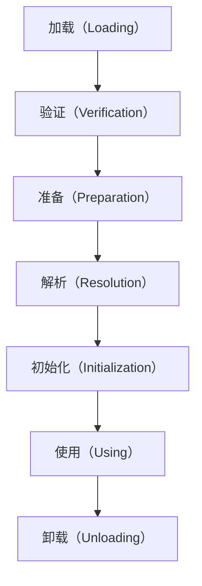
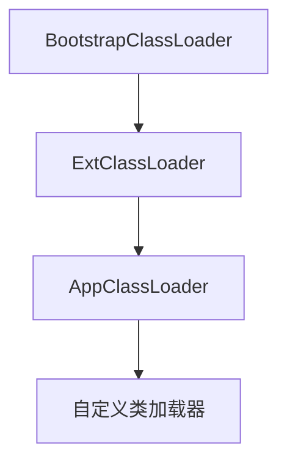

# 类加载机制

## 1.类加载的完整流程

类的生命周期主要包括 7 个阶段：




| 阶段                  | 作用                            |
| ------------------- | ----------------------------- |
| 加载（Loading）         | 将 .class 文件加载到内存，并创建 Class 对象 |
| 验证（Verification）    | 确保 .class 文件格式正确，防止恶意代码       |
| 准备（Preparation）     | 分配类的静态变量内存，并赋默认值（不执行代码）       |
| 解析（Resolution）      | 将符号引用转换为直接引用                  |
| 初始化（Initialization） | 执行 \<clinit> 方法，初始化静态变量       |
| 使用（Using）           | 对象创建、方法调用                     |
| 卸载（Unloading）       | JVM 释放 Class 对象的内存            |

✅ 类的加载是按需进行的，只有在首次使用时才会触发加载。

## 2.类加载的 7 个阶段

### 1. 加载（Loading）

* 从 classpath 读取 .class 文件
* 创建 Class 对象
* 可能从 JAR、网络、动态代理加载

```java
Class<?> clazz = Class.forName("com.example.MyClass"); // 触发类加载
```

```java
1. 读取 `.class` 文件
2. 解析字节码
3. 在堆中创建 `Class` 对象
```

### 2. 验证（Verification）

* 确保 .class 文件符合 JVM 规范
* 防止字节码篡改

```java
1. 是否符合 Class 文件格式？
2. 符号引用是否合法？
3. 访问控制规则是否正确？
```

❌ 如果验证失败，抛出 java.lang.VerifyError

### 3. 准备（Preparation）

* 为类的静态变量分配内存，并赋默认值
* 不执行代码，仅分配内存

```java
public static int a = 10;
public static final int b = 20;
```

```java
a = 0  (默认值)
b = 20 (final 变量直接赋值)
```

final 变量在编译期确定，不在此阶段赋默认值

### 4. 解析（Resolution）

* 将符号引用解析为直接引用
* 符号引用：类似 "Lcom/example/MyClass;"
* 直接引用：指向内存地址

```java
Lcom/example/MyClass; -> 直接指向内存地址
```

```java
System.out.println(MyClass.name); // 解析静态变量
```

❌ 如果找不到类，抛出 ClassNotFoundException

### 5. 初始化（Initialization）

* 执行静态变量的赋值 & 静态代码块（\<clinit> 方法）

类初始化条件：

1. 创建类的实例
2. 调用类的静态方法
3. 访问类的静态变量
4. 反射调用 Class.forName()
5. 子类初始化时，先初始化父类

```java
public class MyClass {
    static {
        System.out.println("MyClass 初始化");
    }
}
```

✅ 只有类的主动引用才会触发初始化，被动引用不会触发

### 6. 使用（Using）

• 类加载完成后，可创建对象、调用方法

• 对象分配在堆内存，方法区存储类信息

```
MyClass obj = new MyClass(); 
obj.method();
```

### 7. 卸载（Unloading）

• JVM 什么时候卸载类？

1. 类的 ClassLoader 被回收
2. Class 没有实例（对象都被 GC）
3. 没有被其他类引用

```sh
[GC] Unloading class com.example.MyClass
```

✅ 类卸载通常发生在 ClassLoader 被回收的场景，如 OSGi、热加载

## 3.类加载器（ClassLoader）

### 1. JVM 内置 3 大类加载器

| 类加载器                 | 作用                               | 父类加载器                |
| -------------------- | -------------------------------- | -------------------- |
| BootstrapClassLoader | 加载 JDK 核心类库（rt.jar、java.lang.\*） | ❌（无父类）               |
| ExtClassLoader       | 加载 ext 目录下的扩展类（如 javax.crypto）   | BootstrapClassLoader |
| AppClassLoader       | 加载应用类（classpath 下的 jar & class）  | ExtClassLoader       |

```java
System.out.println(ClassLoader.getSystemClassLoader());  // AppClassLoader
```

### 2. 双亲委派机制

• 类加载器在加载类时，先交给父加载器加载

• 只有父加载器找不到类，才由子加载器加载




好处

1. 防止类冲突
2. 提高安全性
3. 减少重复加载

### 3. 自定义类加载器

```java
public class MyClassLoader extends ClassLoader {
    @Override
    protected Class<?> findClass(String name) throws ClassNotFoundException {
        byte[] classBytes = loadClassData(name); // 读取 class 字节码
        return defineClass(name, classBytes, 0, classBytes.length);
    }
}
```

✅ 适用于热加载、插件系统

## 4.类的主动引用 vs. 被动引用

主动引用（会触发类加载）

```java
MyClass obj = new MyClass();  // 触发类加载
```

被动引用（不会触发类加载）

```java
System.out.println(MyClass.CONSTANT);  // 不触发
```

final 变量直接编译进 .class 文件，不触发加载

## 5.总结

| 阶段                  | 作用                       |
| ------------------- | ------------------------ |
| 加载（Loading）         | 读取 .class 文件，创建 Class 对象 |
| 验证（Verification）    | 确保 .class 文件合法           |
| 准备（Preparation）     | 为静态变量分配默认值               |
| 解析（Resolution）      | 符号引用 → 直接引用              |
| 初始化（Initialization） | 执行静态代码块，初始化静态变量          |
| 使用（Using）           | 调用类的方法                   |
| 卸载（Unloading）       | JVM 释放 Class 对象          |

🚀 理解 Java 类加载机制，有助于掌握 JVM 原理，优化类加载策略！ 🎯
