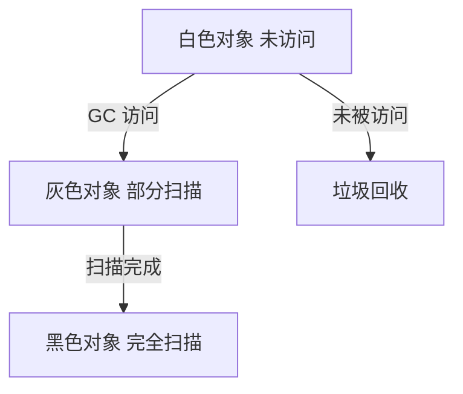
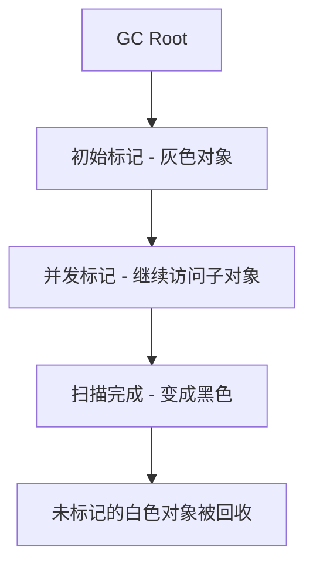
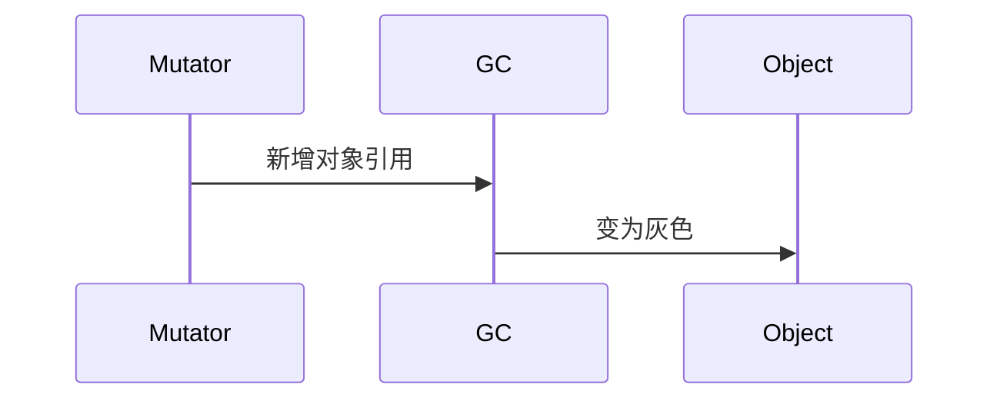
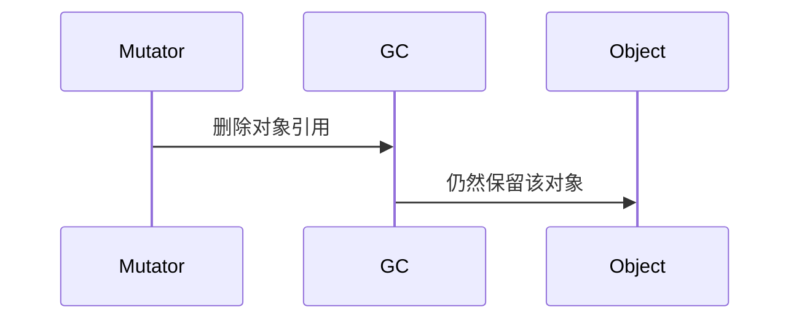

# 三色标记算法（Tri-Color Marking Algorithm）详解

## 1. 什么是三色标记算法？

三色标记算法 是 基于可达性分析（Reachability Analysis） 的一种 增量式并发 GC 算法。

它 将对象分为三类：

* 白色（White）：未被 GC 访问的对象，GC 认为是垃圾，如果最终仍是白色，则会被回收。
* 灰色（Gray）：GC 已经访问，但还未扫描完子对象，表示部分可达，不能立即回收。
* 黑色（Black）：GC 已经访问且子对象都被扫描，表示完全可达，不会被回收。

## 2. 三色标记算法的工作流程

GC 采用三步走策略：

1\. 初始标记（STW）：

* 从 GC Root 出发，标记直接可达对象为 灰色。
* STW（Stop The World）时间短，快速完成。

2\. 并发标记（Concurrent Marking）：

* GC 线程和应用线程（Mutator）并发执行。
* 灰色对象扫描其引用对象，被访问的对象变成灰色。
* 扫描完的对象变成黑色。

3\. 并发清理（Concurrent Cleanup）：

* 未被标记（仍是白色）的对象是垃圾，被回收。

## 3. 并发回收中的 “漂白问题”

在 并发标记阶段，用户线程（Mutator）可能改变对象引用，导致 GC 误回收存活对象。

典型问题：

* 漏标问题（Floating Garbage）：
* Mutator 删除对象引用后，对象变成白色，但 GC 仍未回收，导致 “漂白” 对象存在。
* 误回收问题（Object Resurrection）：
* Mutator 新增对象引用，但对象仍是白色，GC 认为它是垃圾并回收，导致存活对象被误删。

## 4. 解决并发问题：增量更新 vs. 先写屏障

4.1 增量更新（Incremental Update）

* 当 GC 发现对象新建引用时，立刻把目标对象从白色变为灰色，防止误回收。
* 适用于 G1 GC。

✅ 避免存活对象被误回收。

### 4.2 先写屏障（SATB，Snapshot-At-The-Beginning）

* GC 记录 Mutator 在并发标记前的所有引用状态。
* 即使 Mutator 删除了对象引用，GC 仍保留该对象，确保不会误回收。
* 适用于 CMS、Shenandoah GC。

✅ 避免存活对象误删除。

## 5. 现代 GC 使用的三色标记算法

| GC         | 三色标记方式 | 特点                   |
| ---------- | ------ | -------------------- |
| G1 GC      | 增量更新   | 分区化回收，减少 STW         |
| ZGC        | SATB   | 超低延迟，GC 影响小于 10ms    |
| Shenandoah | SATB   | 可回收 100GB+ 堆，适合高吞吐应用 |

## 6. 总结

✅ 三色标记法将对象分为 “白色-灰色-黑色”，决定对象存活与回收。

✅ 并发回收可能导致对象误回收（漂白问题），现代 GC 采用 增量更新 / SATB 解决。

✅ G1 采用增量更新，ZGC/Shenandoah 采用 SATB，减少 Full GC 影响，提升性能。 🚀
