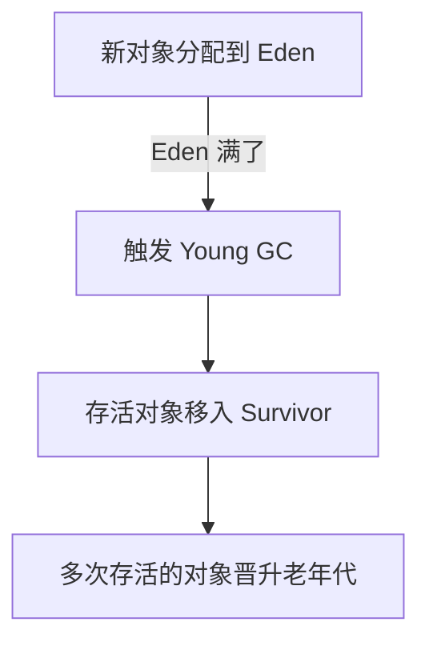
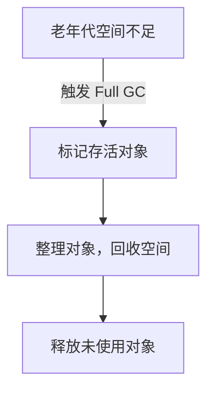

# Young GC（Minor GC）和 Full GC 触发条件详解

## 1. Young GC（Minor GC）触发条件

### 1.1 什么是 Young GC？

Young GC 主要发生在 **新生代（Eden + Survivor）**，用来回收 生命周期短的对象。

**触发条件**

1\. Eden 区满了（主要触发原因）：

* 新生代采用 复制算法，对象先分配在 Eden，Eden 满了触发 GC。

2\. 大对象直接进入老年代：

* 超过 -XX:PretenureSizeThreshold（默认 4MB）的大对象 直接进入老年代，防止 Survivor 频繁复制。

3\. Survivor 区放不下存活对象：

* 长期存活对象（Survivor 存活 MaxTenuringThreshold 次数） 晋升到老年代。
* Survivor 区如果放不下存活对象，部分直接晋升到老年代。

4\. 触发 System.gc()（可能触发）：

* 调用 System.gc() 不会直接触发 Young GC，但 JVM 可能执行 Minor GC。

### 1.2 Young GC 过程




## 2. Full GC 触发条件

### 2.1 什么是 Full GC？

Full GC 主要发生在 老年代（Old Generation），涉及 整个堆（新生代 + 老年代 + 元空间）。

**触发条件**

1\. 老年代空间不足：

* Young GC 时，晋升到老年代的对象过多，老年代空间不足。
* 大对象直接进入老年代，占用大量空间。

2\. 元空间（Metaspace）不足：

* 类加载过多，导致 Metaspace 存不下类元数据。
* -XX:MetaspaceSize 太小，可能频繁触发 Full GC。

3\. 大对象分配失败：

* 老年代没有足够的连续空间 分配大对象，可能触发 Full GC 进行内存整理。

4\. CMS GC 的 promotion failed / concurrent mode failure：

* CMS GC 并发回收失败（Concurrent Mode Failure）。
* 老年代空间不足，无法晋升 Survivor 存活对象（Promotion Failed）。

5\. JVM 调用 System.gc()（手动触发）：

* System.gc() 可能触发 Full GC（但 JVM 不保证 一定执行）。

6\. G1 GC 的 Evacuation Failure：

* G1 GC 无法腾出 Region，导致 Full GC。

### 2.2 Full GC 过程



## 3. Young GC vs. Full GC

| 对比项                 | Young GC（Minor GC）       | Full GC                  |
| ------------------- | ------------------------ | ------------------------ |
| 作用范围                | 新生代（Eden + Survivor）     | 整个堆（新生代 + 老年代 + 元空间）     |
| 触发条件                | Eden 满、Survivor 空间不足、大对象 | 老年代满、Metaspace 满、大对象分配失败 |
| 算法                  | 复制算法（Survivor 回收，晋升老年代）  | 标记-整理（Mark-Compact）      |
| 速度                  | 快（常规 <50ms）              | 慢（可能秒级）                  |
| STW（Stop The World） | 短暂停顿                     | 长暂停，影响性能                 |

✅ Young GC 频繁，但开销低。

⚠️ Full GC 影响应用性能，应尽量避免。

## 4. 避免频繁 Full GC 的优化方案

1\. 优化老年代大小

* 增加 -XX:NewRatio，调整年轻代和老年代比例。
* 大对象直接进入老年代，避免 Survivor 复制浪费空间。

2\. 避免 System.gc()

* 默认情况下 JVM 可自动 GC，不建议手动调用 System.gc()。
* 如果要禁用 System.gc()：

```
-XX:+DisableExplicitGC
```

3\. 调整 Metaspace 大小

* 避免类加载过多导致 Full GC：

```
-XX:MetaspaceSize=256m -XX:MaxMetaspaceSize=512m
```

4\. 使用 G1/ZGC/Shenandoah GC

* G1 GC 可 避免 Full GC 产生长时间 STW：

```
-XX:+UseG1GC
```

## 5. 结论

✅ Young GC（Minor GC） 主要清理 新生代对象，频繁触发，但影响小。

✅ Full GC 主要清理整个堆（新生代+老年代），影响性能，应尽量避免。

✅ 避免 Full GC 的方法：调整堆大小、优化 Metaspace、使用 G1/ZGC GC。 🚀
