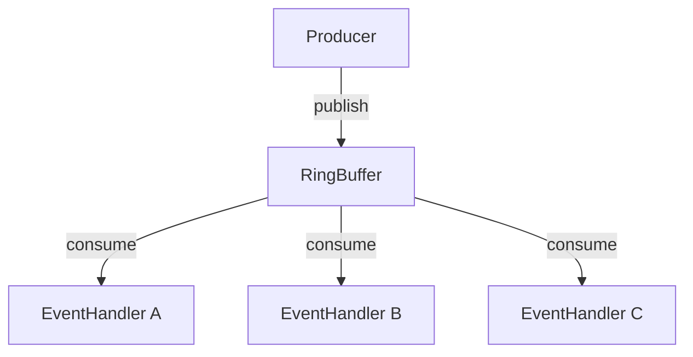
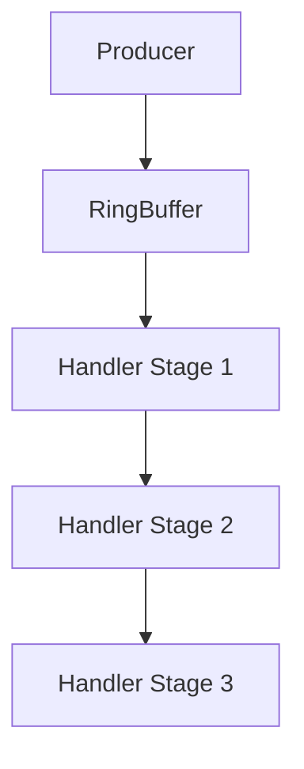
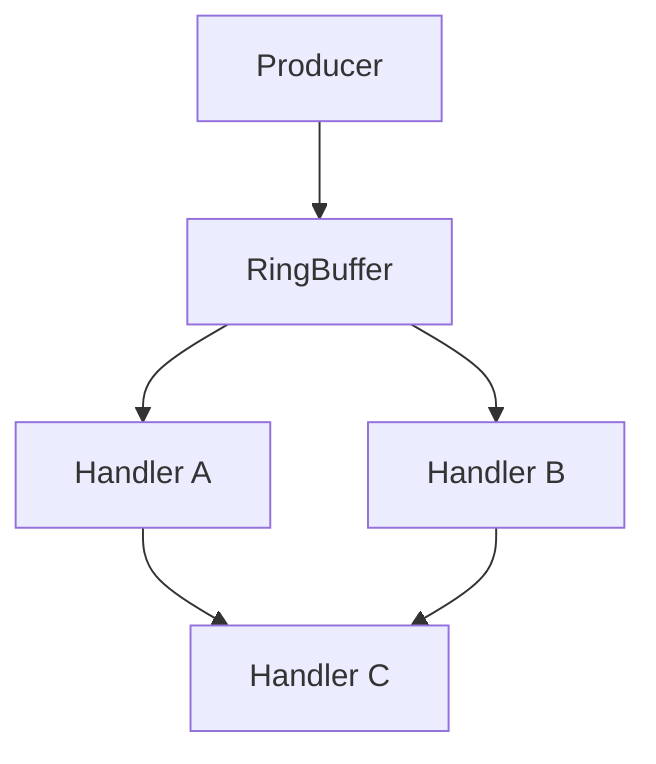
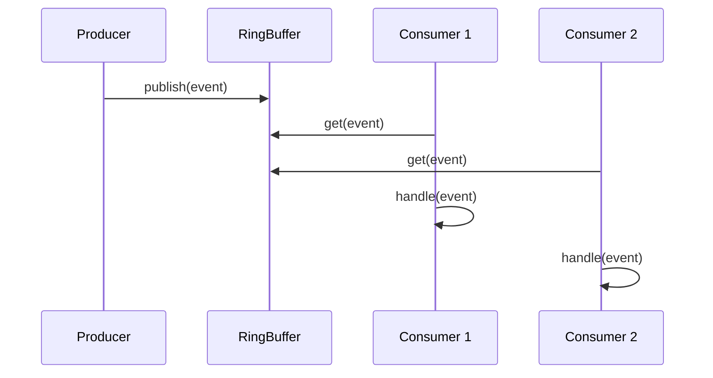

# Disruptor架构

### 1. Disruptor 架构流程图（单生产者，多消费者）

```mermaid
flowchart TD
    Producer[Producer]
    RingBuffer[RingBuffer]
    HandlerA[EventHandler A]
    HandlerB[EventHandler B]
    HandlerC[EventHandler C]

    Producer -->|publish| RingBuffer
    RingBuffer -->|consume| HandlerA
    RingBuffer -->|consume| HandlerB
    RingBuffer -->|consume| HandlerC
```

### 2. Disruptor 流水线模式（多阶段依赖关系）

```mermaid
flowchart TD
    Producer[Producer]
    RingBuffer[RingBuffer]
    Handler1[Handler Stage 1]
    Handler2[Handler Stage 2]
    Handler3[Handler Stage 3]

    Producer --> RingBuffer
    RingBuffer --> Handler1
    Handler1 --> Handler2
    Handler2 --> Handler3
```

### 3. Disruptor 菱形依赖（经典双分支再合并模式）

```mermaid
flowchart TD
    Producer[Producer]
    RingBuffer[RingBuffer]
    HandlerA[Handler A]
    HandlerB[Handler B]
    HandlerC[Handler C]    

    Producer --> RingBuffer
    RingBuffer --> HandlerA
    RingBuffer --> HandlerB
    HandlerA --> HandlerC
    HandlerB --> HandlerC
```

### 4. Disruptor 简易时序图

```mermaid
sequenceDiagram
    participant P as Producer
    participant RB as RingBuffer
    participant C1 as Consumer 1
    participant C2 as Consumer 2

    P->>RB: publish(event)
    C1->>RB: get(event)
    C2->>RB: get(event)
    C1->>C1: handle(event)
    C2->>C2: handle(event)
```
