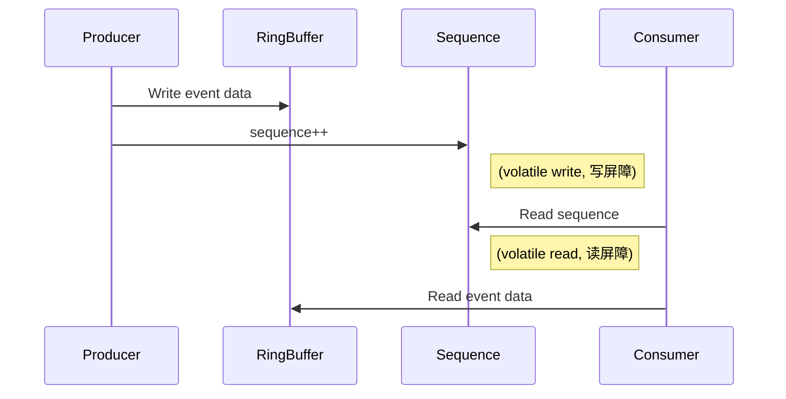

# 内存屏障与顺序保证

Disruptor 在极高并发环境下保证数据可见性和顺序性，核心依赖于 Java 的\*\*内存屏障（Memory Barrier）\*\*机制和 JMM（Java Memory Model）。这是高性能并发库必不可少的“护身符”，也是很多面试官非常喜欢深挖的知识点。

***

### 1. 什么是内存屏障？

* 内存屏障（Memory Barrier / Memory Fence）是一种CPU指令，作用是在多线程并发环境下，控制内存操作的执行顺序和可见性。
* 它确保在屏障前的所有写操作，对其他线程来说在屏障后的读操作之前可见。

***

### 2. Java 内存屏障常见实现

* Java 通过 volatile 关键字、sun.misc.Unsafe、VarHandle 以及 JDK 原子类（如 AtomicLong）底层的 CAS 操作，实现内存屏障语义。
* volatile 修饰的变量，写时插入“写屏障”，读时插入“读屏障”，从而保证对变量的写，对其他线程可见且顺序正确。

***

### 3. Disruptor 如何使用内存屏障？

\

核心点：

* Sequence（序号）变量通常是 volatile，即每次修改 Sequence 时，写屏障让其他线程能立即感知到最新值。
* 生产者发布事件时，先写入 RingBuffer，再更新 Sequence。由于 Sequence 是 volatile，消费者线程马上能看到新数据。
* 消费者读取 Sequence，JMM 保证只要看到新的 Sequence，就一定能看到之前生产者对数据的写入。

***

### 4. 顺序保证的具体过程

1. 生产者写数据：
   * 先把数据写入 RingBuffer 的 slot。
   * 最后一步：将 Sequence 序号递增（volatile write）。
2. 消费者读数据：
   * 首先检查 Sequence 序号（volatile read）。
   * 一旦读到目标序号，才能读取数据，JMM 保证此时一定能看到最新数据。

\

（注意：顺序保证的前提是 RingBuffer 的 slot 对象不可变或只被单线程修改，否则数据可见性可能失效）

***

### 5. 为什么不用锁也能保证安全？

* 依靠 volatile/CAS 的内存屏障，在写入和读取序号时建立“先行发生”关系（happens-before），从而确保数据写入先于序号递增，序号递增先于消费者读数据。
* JVM 和 CPU 会在必要的时候插入屏障，防止指令重排导致并发错误。

***

### 6. 示意图

***

### 7. 一句话总结

\

> Disruptor 靠 Sequence 的 volatile 内存屏障，实现了高性能下的可见性和顺序性，无需锁也能安全并发。

***

