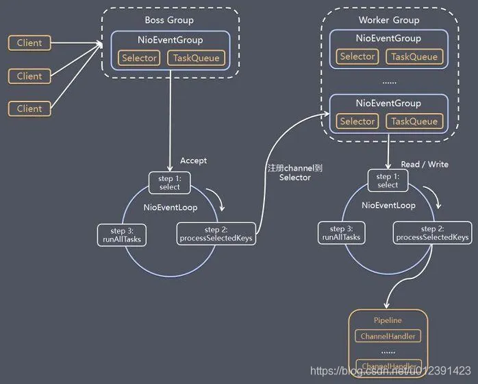

# Netty Reactor模型

<figure><figcaption></figcaption></figure>

1、netty抽象出两个线程池：BossGroup负责监听和建立连接 ；WorkerGroup 负责网络IO的读写

2、BossGroup 和 WorkerGroup 类型都是NioEventLoopGroup , 相当于一个事件循环组，这个组中含有多个事件循环，每一个事件循环都是NioEventLoop

3、NioEventLoop表示一个selector , 用户监听绑定在骑上的socket网络通讯

4、每一个Boos NioEventLoop循环执行3步：

a、轮询accept事件

b、建立连接，生成NioSocketChannel，并注册到workerGroup上

c、处理任务队列中的任务，即RunAllTasks

5、每个Worker NioEventLoop循环执行3步：

a、轮询读写时间

b、处理IO时间，在对应的NioSocketChannel上处理
