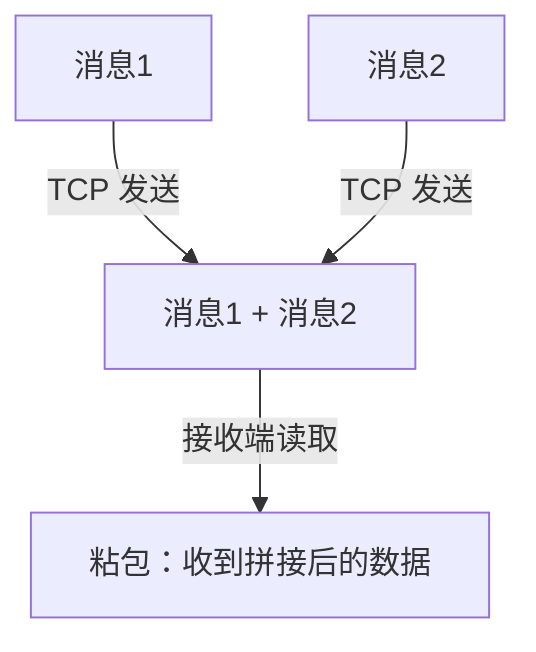
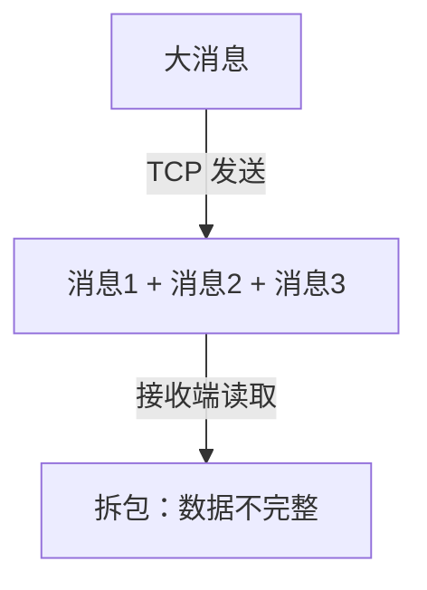

# Netty TCP 粘包/拆包的原因及解决方案

本篇将详细解析：

1. TCP 粘包/拆包的原理
2. Netty 产生粘包/拆包的原因
3. 解决方案（Netty 内置的解码器）
4. 最佳实践

## 1. 什么是 TCP 粘包/拆包？

### TCP 粘包

多个小数据包合并成一个数据包 发送给接收端，导致接收方无法正确解析完整的消息。



示例（客户端连续发送 2 条消息，接收端收到的是合并的数据）：

```java
ctx.writeAndFlush("Hello");
ctx.writeAndFlush("World");
```

可能的接收结果：

```
HelloWorld  ✅（粘包问题）
Hello       ✅
World       ✅
```

### TCP 拆包

一个大数据包被拆成多个小包 发送，导致接收端读取的数据不完整。




示例（发送一个 1024 字节的消息，分成多个 TCP 报文）：

```java
ctx.writeAndFlush(bigData);
```

可能的接收结果：

```
[数据前半部分] ✅（拆包）
[数据后半部分] ✅
```

## 2. Netty 粘包/拆包的原因

### 2.1 TCP 传输机制

* TCP 是基于流的协议，并不会按照应用层的 write() 调用进行拆分，而是尽可能高效地传输数据。
* Nagle 算法 可能导致多个小包合并（粘包）。
* MTU（最大传输单元）限制 可能导致大包拆分。

### 2.2 Netty 的非阻塞 I/O

* Netty 读取 TCP 数据时，并不会保证每次读取到完整的消息，可能会出现：
* 读取多个消息合并（粘包）。
* 读取到部分消息数据（拆包）。

## 3. 解决方案（Netty 提供的解码器）

Netty 提供了一系列 解码器（Decoder） 来处理 TCP 粘包/拆包问题：

| 解码器                          | 原理                     | 适用场景                |
| ---------------------------- | ---------------------- | ------------------- |
| LineBasedFrameDecoder        | 基于换行符 \n 或 \r\n 解析消息   | 文本协议（如 FTP）         |
| DelimiterBasedFrameDecoder   | 自定义分隔符解析（如 #、$）        | 自定义协议               |
| FixedLengthFrameDecoder      | 固定长度解析（如每条消息 10 字节）    | 定长消息协议              |
| LengthFieldBasedFrameDecoder | 在消息头中添加长度字段，先解析长度再解析数据 | 二进制协议（如 Dubbo、MQTT） |

### 3.1 LineBasedFrameDecoder（基于换行符的解码器）

适用于：每条消息以  或 \r 结尾的文本协议（如 FTP）。

📌 代码示例

```java
// 最大帧长度 1024，超出则丢弃
pipeline.addLast(new LineBasedFrameDecoder(1024));
pipeline.addLast(new StringDecoder(CharsetUtil.UTF_8));
```

📌 示例数据

```java
Hello\n
World\n
```

解决方案

* 每条消息以 \n 作为分隔符，避免粘包。

### 3.2 DelimiterBasedFrameDecoder（基于自定义分隔符的解码器）

适用于：使用特定字符（如 #、$）作为消息边界的协议。

📌 代码示例

```java
// 以 "#" 作为消息结束标志
ByteBuf delimiter = Unpooled.copiedBuffer("#".getBytes());
pipeline.addLast(new DelimiterBasedFrameDecoder(1024, delimiter));
pipeline.addLast(new StringDecoder(CharsetUtil.UTF_8));
```

📌 示例数据

```
Hello#
World#
```

解决方案

* 每条消息以 # 作为分隔符，确保数据完整。

### 3.3 FixedLengthFrameDecoder（固定长度解码器）

适用于：定长消息协议（如每条消息固定 10 字节）。

📌 代码示例

```java
// 每条消息固定 10 字节
pipeline.addLast(new FixedLengthFrameDecoder(10));
pipeline.addLast(new StringDecoder(CharsetUtil.UTF_8));
```

📌 示例数据

```java
HelloWorld  ✅（每次读取 10 字节）
1234567890
```

解决方案

* 适用于银行、支付系统等定长数据格式。

### 3.4 LengthFieldBasedFrameDecoder（基于长度字段的解码器）

适用于：二进制协议（如 Dubbo、MQTT、Kafka），数据包格式：

```java
| 长度字段（4 字节） | 消息内容 |
```

📌 代码示例

```java
pipeline.addLast(new LengthFieldBasedFrameDecoder(
    1024, // 最大帧长度
    0,    // 长度字段偏移量（从 0 开始）
    4,    // 长度字段的字节数（4 字节）
    0,    // 长度调整（跳过头部 4 字节）
    4     // 解析后跳过的字节数
));
pipeline.addLast(new StringDecoder(CharsetUtil.UTF_8));
```

📌 示例数据

```java
\x00\x00\x00\x05Hello   ✅（长度 = 5，数据 = Hello）
\x00\x00\x00\x07World!! ✅（长度 = 7，数据 = World!!）
```

解决方案

* 基于消息头的长度字段解析数据，避免拆包/粘包。

## 4. 最佳实践

### 1. 选择合适的解码器

• 文本协议（换行符） → LineBasedFrameDecoder

• 使用 #、$ 等分隔符 → DelimiterBasedFrameDecoder

• 固定长度消息 → FixedLengthFrameDecoder

• 二进制协议（带长度字段） → LengthFieldBasedFrameDecoder

### 2. 业务层手动处理

如果协议复杂，可以在 ByteToMessageDecoder 里手动解析：

```java
public class CustomDecoder extends ByteToMessageDecoder {
    @Override
    protected void decode(ChannelHandlerContext ctx, ByteBuf in, List<Object> out) {
        if (in.readableBytes() < 4) {
            return;
        }
        in.markReaderIndex();
        int length = in.readInt();
        if (in.readableBytes() < length) {
            in.resetReaderIndex();
            return;
        }
        byte[] bytes = new byte[length];
        in.readBytes(bytes);
        out.add(new String(bytes, CharsetUtil.UTF_8));
    }
}
```

✅ 适用于自定义协议，解析头部字段获取消息长度。

## 5. 总结

* TCP 粘包/拆包问题源于 TCP 流式传输，数据可能被合并或拆分。
* Netty 通过 FrameDecoder 解决，如 LineBasedFrameDecoder、LengthFieldBasedFrameDecoder。
* 二进制协议推荐 LengthFieldBasedFrameDecoder，文本协议推荐 DelimiterBasedFrameDecoder。&#x20;
