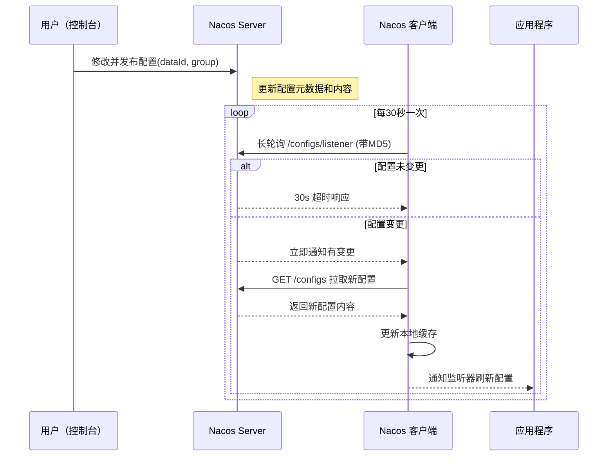

# Nacos 配置更新原理

当然可以！以下是 Nacos 配置更新原理的详细讲解，并使用 Mermaid 绘制关键流程图，涵盖客户端和服务端的行为、缓存机制、长轮询原理，以及与 Spring Boot 的整合刷新机制。

***

### 📦 一、Nacos 配置中心架构角色

| 角色           | 说明                           |
| ------------ | ---------------------------- |
| Nacos Server | 保存配置数据，提供发布和推送功能             |
| Nacos Client | 应用程序中的 SDK，定期监听配置变更          |
| Nacos 控制台    | 提供 Web UI 发布配置               |
| 本地缓存         | 客户端本地 .nacos/config/ 路径下缓存配置 |

***

### 🔄 二、Nacos 配置更新完整流程图（Mermaid）

\


#### ✅ 配置发布与客户端更新时序图



***

### 🧠 三、配置更新机制详解

#### 1️⃣ 配置发布（控制台或 API）

* 操作人通过 UI 或 OpenAPI 修改配置
* Server 更新配置元数据（dataId、group、namespace）和内容
* Server 记录最新 MD5摘要

***

#### 2️⃣ 客户端监听机制：

#### 长轮询

\


客户端会定期发起一个带有当前配置 MD5 的长轮询请求：

```
POST /v1/cs/configs/listener
```

* Server 会挂起该请求最长 30 秒（默认）
* 若 Server 检测到有 MD5 变化，则立即返回变更通知（dataId、group）

***

#### 3️⃣ 客户端拉取配置 + 更新缓存


收到配置变更通知后，客户端主动发起请求：

```
GET /v1/cs/configs?dataId=xxx&group=xxx&namespace=yyy
```

* 拉取新的配置内容
* 更新客户端的内存缓存和 .nacos/config 下的磁盘缓存
* 触发配置监听器回调（如 Spring Cloud @RefreshScope）

***

#### 4️⃣ Spring Boot 自动刷新机制

* 使用 Nacos Spring Starter 时，每个 @Value 或 @ConfigurationProperties 都会注册监听器
* 配合 @RefreshScope，在配置变更时会重新注入字段


**示例代码：**

```
@RefreshScope
@Component
public class MyBean {
    @Value("${my.key}")
    private String key;
}
```

当 my.key 发生变化，Spring Context 会自动重新注入新的值。

***

### 🗂️ 四、本地缓存机制

| 功能         | 说明                                  |
| ---------- | ----------------------------------- |
| 缓存目录       | \~/.nacos/nacos/config/             |
| 缓存内容       | dataId\_group\_namespace.properties |
| 启动优先使用远程配置 | 拉取失败则使用本地缓存                         |
| 本地缓存自动更新   | 配置变更时重新写入磁盘                         |

***

### 🛠️ 五、关键参数说明（默认）

| 配置项                    | 默认值      | 说明           |
| ---------------------- | -------- | ------------ |
| configLongPollTimeout  | 30000 ms | 长轮询最大阻塞时间    |
| maxRetry               | 6        | 配置拉取失败最大重试次数 |
| configRetryTime        | 2 s      | 重试间隔         |
| enableRemoteSyncConfig | true     | 是否启用远程配置     |
| configCacheDir         | .nacos   | 本地缓存目录路径     |

***

### 🧭 六、优缺点总结

| 特性       | 支持情况 | 说明            |
| -------- | ---- | ------------- |
| 实时通知     | ✅    | 长轮询返回差异通知     |
| 客户端热更新   | ✅    | 支持回调刷新字段值     |
| 本地容灾缓存   | ✅    | 本地磁盘 fallback |
| 负载均衡和容错  | ✅    | 支持集群部署与重试     |
| 多租户/命名空间 | ✅    | 支持环境隔离        |

***

### ✅ 七、总结：配置热更新的四步机制

1. 监听变更（长轮询）
2. 拉取配置（GET）
3. 更新缓存（内存 + 本地磁盘）
4. 通知回调（刷新 @Value/@ConfigurationProperties）

***
