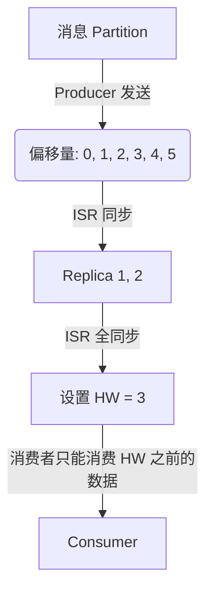
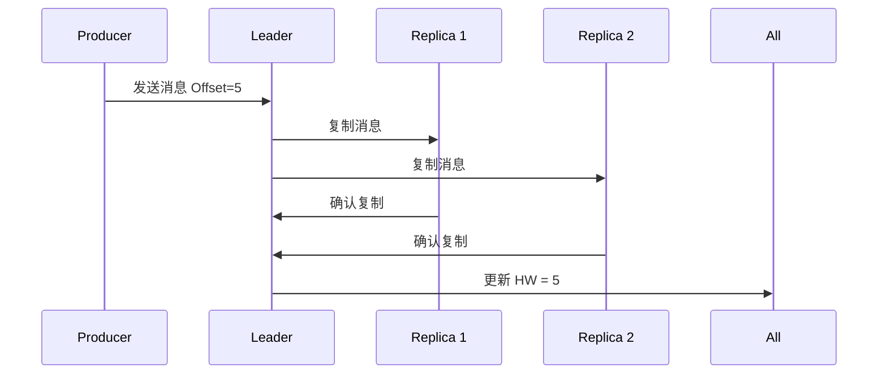
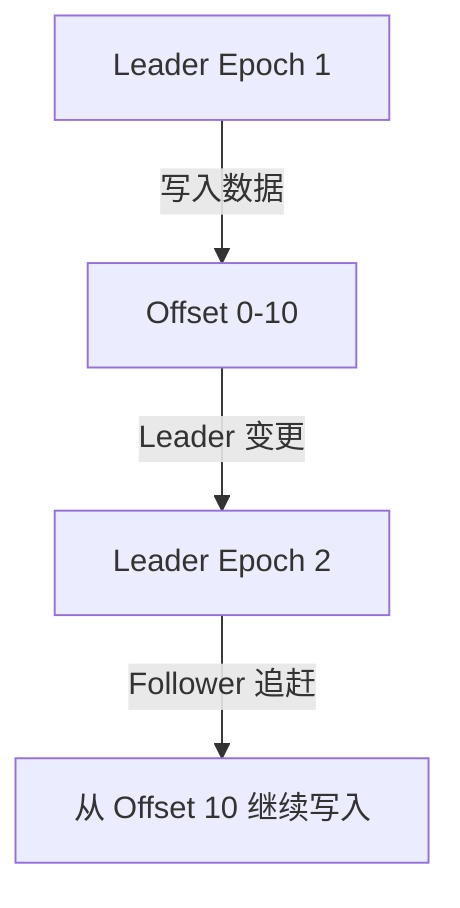
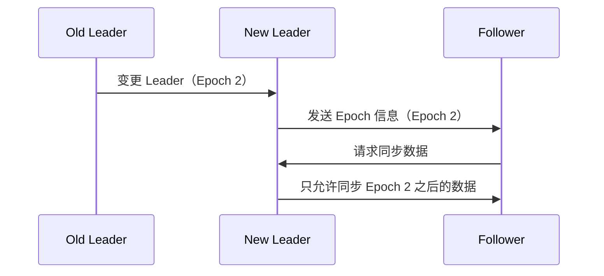

# Kafka 高水位（High Watermark）与 Leader Epoch

## 1. Kafka 高水位（High Watermark，HW）

### 什么是高水位？

高水位（High Watermark, HW）表示 Kafka 消费者能读取的最新消息偏移量。

Kafka 所有副本（Replica）数据同步到 HW 之后，消费者才能消费该消息。

### 高水位的作用

1. 保证消费者读取的消息都是持久化的（防止 Leader 崩溃导致数据丢失）。
2. 确保 ISR（同步副本集）已复制的数据是可消费的。

### 2. Kafka 高水位的更新规则

Kafka 的高水位（HW）由 ISR 副本集（In-Sync Replica Set） 决定：

* ISR 集合的最小偏移量 = HW，消费者只能消费 HW 之前的数据。
* 当 ISR 副本同步数据后，HW 更新。
* 如果 ISR 副本掉线，HW 可能回退。

✅ Kafka 通过 HW 确保所有副本数据一致，防止消费未同步的消息。

## 3. 为什么 Kafka 需要 Leader Epoch？

什么是 Leader Epoch？

Leader Epoch 是 Kafka 维护的分区日志版本号，用于追踪 Leader 副本的日志进度，防止数据丢失或分区回滚。

📌 为什么需要 Leader Epoch？

1\. 防止旧 Leader 覆盖新 Leader 数据

* Kafka 选举新 Leader 后，Follower 可能有更长的日志。
* 旧 Leader 不能写入已提交数据之外的 Offset，防止数据冲突。

2\. 确保 Follower 追赶 Leader

* Kafka 使用 Leader Epoch 确保 Follower 只能从最新 Leader 继续同步。

## 4. Leader Epoch 如何工作？

1\. 每次 Leader 变更，Leader Epoch +1。

2\. 新 Leader 允许 Follower 仅从指定 Epoch 继续同步数据。

3\. 如果 Follower 落后多个 Epoch，会进行日志截断，确保数据一致性。

✅ Leader Epoch 保障 Kafka 在 Leader 变更时不发生数据错乱或回滚。

## 5. 总结

* 高水位（HW）确保消费者只能读取已同步的数据，防止数据丢失。
* Leader Epoch 防止旧 Leader 乱写数据，确保日志一致性。
* Kafka 通过 HW + Leader Epoch 实现副本同步和高可用 。
