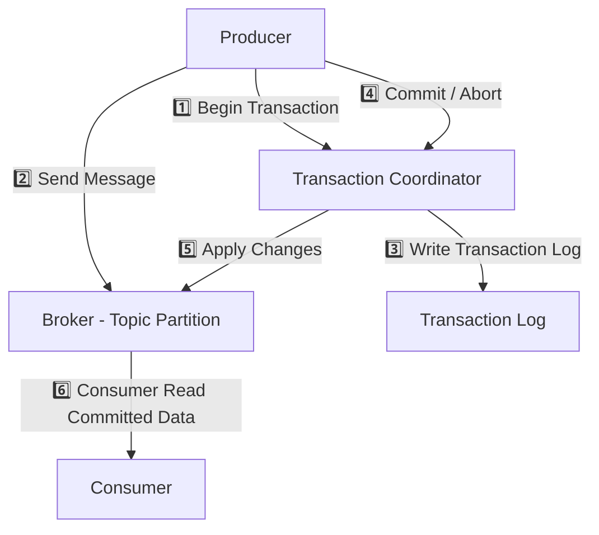
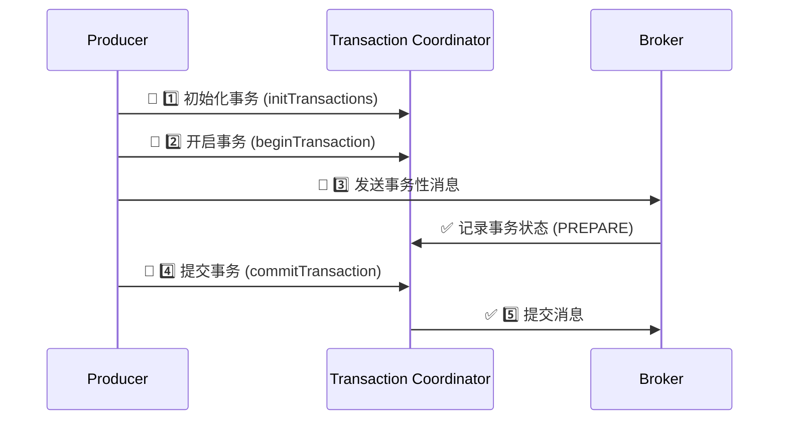
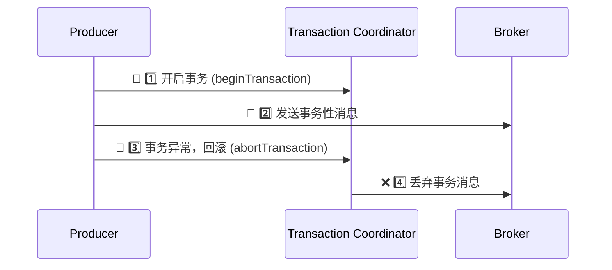

# Kafka 事务消息原理

本文将深入解析 Kafka 事务的核心原理，包括：

* 事务的整体架构
* 事务的实现机制
* 事务 Coordinator（事务协调者）
* 事务日志（Transaction Log）
* 事务提交 & 回滚流程
* 事务消费（Exactly-Once 语义）

## 1. Kafka 事务架构

Kafka 事务机制的核心组件：

1\. Producer（生产者）

* 负责 开启事务，发送消息，提交 / 回滚事务。

2\. Transaction Coordinator（事务协调者）

* 负责 管理事务状态，存储 事务日志（Transaction Log）。

3\. Broker（存储 Kafka 消息）

* 负责 存储事务消息，并 确保事务提交或回滚。

4\. Consumer（消费者）

* 以 read\_committed 隔离级别 读取 已提交的事务消息。



## 2. Kafka 事务的实现机制

Kafka 事务通过 “事务 ID（transactional.id）+ Transaction Coordinator + Transaction Log” 共同实现，保证 消息的原子性和一致性。

### 事务 ID

* 事务 ID（transactional.id） 用于唯一标识一个 Kafka 事务生产者。
* 事务状态由 Transaction Coordinator 维护。

### Transaction Coordinator（事务协调者）

* 管理事务状态（Active, Prepare, Committed, Aborted）。
* 负责事务日志（Transaction Log）管理，确保事务提交或回滚。
* 协调多个 Topic/Partition，确保事务一致性。

## 3. Kafka 事务的 2PC 提交流程

Kafka 采用二阶段提交（Two-Phase Commit，2PC） 来保证事务提交的一致性。



### 详细步骤

| 阶段         | 操作                                                               |
| ---------- | ---------------------------------------------------------------- |
| 1️⃣ 初始化事务  | producer.initTransactions() 初始化事务，创建事务上下文。                       |
| 2️⃣ 开启事务   | producer.beginTransaction() 向事务协调者（Transaction Coordinator）注册事务。 |
| 3️⃣ 发送事务消息 | 生产者向多个 Partition 发送事务消息（消息标记为 未提交 状态）。                           |
| 4️⃣ 事务提交请求 | producer.commitTransaction() 提交事务。                               |
| 5️⃣ 事务日志更新 | Transaction Coordinator 将事务状态更新为 COMMIT。                         |
| 6️⃣ 提交消息   | Broker 将消息状态改为可见，消费者可以消费该消息。                                     |

## 4. Kafka 事务的回滚机制

如果事务执行过程中发生异常，Kafka 支持回滚（Abort Transaction），所有事务性消息将被丢弃。



### 详细步骤

| 阶段              | 操作                          |
| --------------- | --------------------------- |
| 1️⃣ 开启事务        | producer.beginTransaction() |
| 2️⃣ 发送事务消息      | Producer 发送 事务消息            |
| 3️⃣ 事务异常        | 事务执行失败                      |
| 4️⃣ 事务回滚        | producer.abortTransaction() |
| 5️⃣ Broker 丢弃消息 | 事务未提交的消息不会被消费者读取            |

## 5. Kafka 事务日志（Transaction Log）

Kafka 事务日志 记录事务状态，确保事务一致性。

### &#x20;事务日志（Transaction Log）存储内容

| 字段                | 含义                                        |
| ----------------- | ----------------------------------------- |
| transactional.id  | 事务 ID                                     |
| producer.id       | 生产者 ID                                    |
| producer.epoch    | 事务版本                                      |
| transaction.state | 事务状态（Active, Prepare, Committed, Aborted） |

### 事务状态转换

| 状态            | 描述          |
| ------------- | ----------- |
| Active        | 事务进行中       |
| PrepareCommit | 事务进入提交阶段    |
| PrepareAbort  | 事务进入回滚阶段    |
| Committed     | 事务提交成功      |
| Aborted       | 事务回滚，所有消息丢弃 |

✅ 事务日志 + 事务状态机保证 Kafka 事务的 ACID 特性。

## 6. Kafka 事务消费（Exactly-Once 语义）

Kafka 支持 read\_committed 模式，确保消费者只读取已提交事务的消息。

事务消费模式

```java
Properties props = new Properties();
props.put(ConsumerConfig.ISOLATION_LEVEL_CONFIG, "read_committed"); // 只读已提交的消息
KafkaConsumer<String, String> consumer = new KafkaConsumer<>(props);
```

read\_committed 确保消费者不会读取未提交事务的消息。

## 7. Kafka 事务 vs RocketMQ 事务

| 对比项            | Kafka 事务                         | RocketMQ 事务   |
| -------------- | -------------------------------- | ------------- |
| 事务机制           | 二阶段提交（2PC）                       | 半消息 + 事务回查    |
| 事务 Coordinator | ✅ 事务协调者（Transaction Coordinator） | ❌ 无事务协调者，依赖回查 |
| 事务日志           | ✅ 支持（Transaction Log）            | ❌ 无事务日志       |
| 事务回查           | ❌ 不支持事务回查                        | ✅ 支持事务回查      |
| 适用场景           | 流计算、日志处理、Exactly-Once 语义         | 分布式事务、金融、电商支付 |

✅ Kafka 事务适用于大数据处理（Flink、Spark）

✅ RocketMQ 事务适用于分布式事务、金融支付

## 8. Kafka 事务的局限性

🚫 不支持跨 Kafka 集群事务（事务只能在同一集群）。

🚫 事务超时会导致自动回滚（默认 15 分钟）。

🚫 事务管理增加 Transaction Coordinator 负担（影响吞吐量）。

✅ 优化事务超时时间

```
transaction.timeout.ms=600000  # 10分钟
```

## 9. 结论

✅ Kafka 事务基于二阶段提交（2PC）+ Transaction Log，确保事务一致性。

✅ Kafka 事务保证 Exactly-Once 语义，适用于 Flink/Spark Streaming 流计算。

✅ RocketMQ 事务基于半消息 + 事务回查，适用于分布式事务（金融、电商）。 🚀
