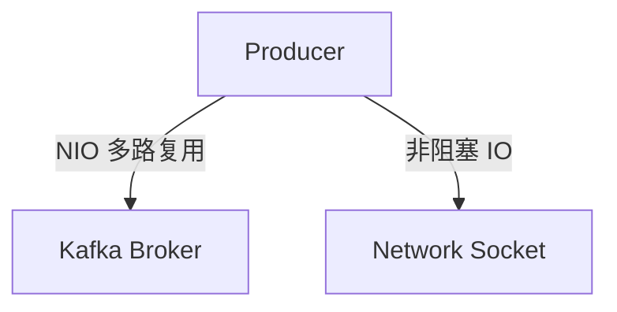

# Kafka 为什么这么快？—— 从消息发送端、存储端、消费者端分析

## 1. 消息发送端（Producer）优化

Kafka Producer 主要通过 减少网络 IO、批量处理、分区并行、NIO、select 轮询、压缩、重试机制 来提升吞吐量。

### Producer 端优化点

| 优化点                    | 优化方式                     | 作用                     |
| ---------------------- | ------------------------ | ---------------------- |
| 批量发送（Batch Processing） | Producer 累积消息，批量发送       | 减少网络 IO，提高吞吐量          |
| 分区并行（Partitioning）     | 并行发送到不同 Partition        | 突破单线程吞吐瓶颈，提高并发能力       |
| NIO（Java NIO）          | 采用 非阻塞 IO（Netty）         | 避免同步 IO 阻塞，提高吞吐量       |
| select 轮询（Selector）    | 采用 Selector 监听多个通道       | 减少线程数，提高并发处理能力         |
| 消息压缩（Compression）      | 采用 GZIP、Snappy、LZ4 压缩消息  | 降低带宽占用，提高传输效率          |
| 重试机制（Retries）          | 生产者失败后自动重试               | 提高可用性，减少消息丢失           |
| ACK 确认级别（acks）         | acks=0 / 1 / all 控制消息可靠性 | acks=all 提高数据一致性，但增加延迟 |

📌 Producer 端优化核心：减少网络 IO，采用 NIO & select 提高并发，优化消息传输，提高吞吐量和可靠性。

📝 额外补充：NIO & select 在 Producer 端的作用

### NIO（Java NIO）

Kafka Producer 采用 Netty + Java NIO（非阻塞 IO），通过 单线程管理多个连接，避免了传统 阻塞式 BIO（Blocking IO） 带来的性能瓶颈。

* 传统阻塞 IO（BIO）：每个连接需要一个独立线程，导致高并发时线程数过多，占用大量资源。
* 非阻塞 IO（NIO）：一个线程可以管理多个 TCP 连接，提高 Producer 发送效率。



优势

* 提高 Producer 发送效率，减少线程上下文切换的开销。
* 降低 CPU & 内存消耗，一个线程可以管理多个连接。
* 提升 Kafka 在高并发场景下的吞吐量。

### select 轮询（Selector 机制）

Kafka Producer 使用 Selector 监听多个 TCP 连接，当有新数据可写时才处理，避免 CPU 空轮询。

```java
Selector selector = Selector.open();
channel.register(selector, SelectionKey.OP_READ);
while (true) {
    selector.select(); // 只在有事件时才继续
    Set<SelectionKey> keys = selector.selectedKeys();
    for (SelectionKey key : keys) {
        // 处理可写事件
    }
}
```

优势

* 减少 Producer 线程数，一个线程管理多个网络连接。
* 避免空轮询，提高 CPU 利用率。
* 提高高并发场景下的 Producer 吞吐量。

## 2. 存储端（Broker）优化

Kafka Broker 作为核心存储层，主要通过 顺序写入、零拷贝、PageCache、分区存储、副本同步 提高吞吐量。

Broker 端优化点

| 优化点                     | 优化方式                          | 作用              |
| ----------------------- | ----------------------------- | --------------- |
| 顺序写入（Append-Only）       | Kafka 采用日志存储，顺序写入磁盘           | 避免随机写，提高磁盘吞吐    |
| PageCache 读写优化          | 先写入 PageCache，异步刷盘            | 降低磁盘 IO，提高存储性能  |
| 零拷贝（Zero Copy）          | sendfile() 直接从 PageCache 读取数据 | 减少 CPU 拷贝，提高吞吐量 |
| 高效副本同步（Leader-Follower） | Leader 负责写入，Follower 异步同步数据   | 提高数据可靠性         |
| 日志分段存储（Log Segments）    | 分段存储 & 自动清理，避免日志过大            | 提高磁盘管理效率        |
| ACK 机制（acks=all）        | Broker 端控制数据复制，确保数据一致性        | 提高可靠性，防止数据丢失    |

📌 Broker 端优化核心：顺序写入、PageCache 读写加速、副本同步、零拷贝，提高存储和读取性能。

## 3. 消费端（Consumer）优化

Kafka Consumer 采用 Pull 模式、批量消费、PageCache 读取、分区并行消费 提高吞吐量和实时性。

Consumer 端优化点

| 优化点                    | 优化方式                        | 作用                    |
| ---------------------- | --------------------------- | --------------------- |
| 拉模式（Pull-based）        | Consumer 按需拉取数据             | 避免 Push 方式消息堆积，减少网络拥塞 |
| 批量消费（Batch Fetch）      | 一次性拉取多条消息                   | 减少网络交互，提高吞吐量          |
| PageCache 读取           | Consumer 直接从 PageCache 读取   | 避免频繁磁盘 IO，提高读取性能      |
| 分区并行消费（Consumer Group） | 多 Consumer 组成员 共同消费一个 Topic | 提高消费吞吐能力              |
| Offset 机制              | 自动提交 / 手动提交 Offset，支持回溯     | 实现断点续传，提高数据可靠性        |

📌 Consumer 端优化核心： 批量拉取、PageCache 读取、分区并行消费，提高吞吐量和实时性。

