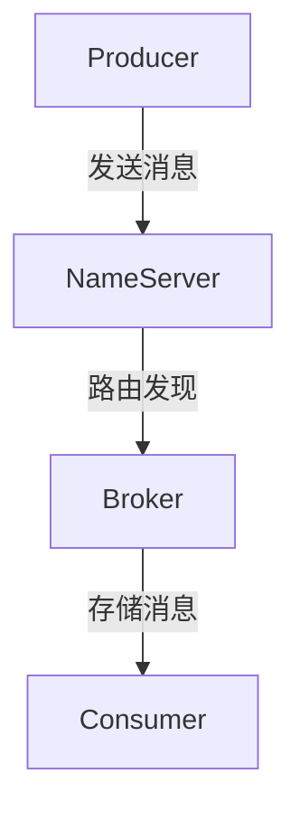
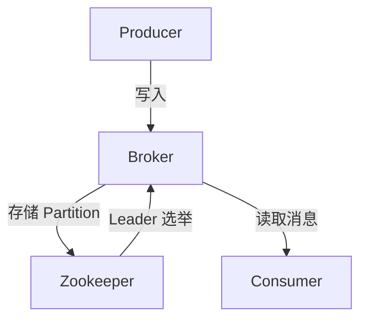
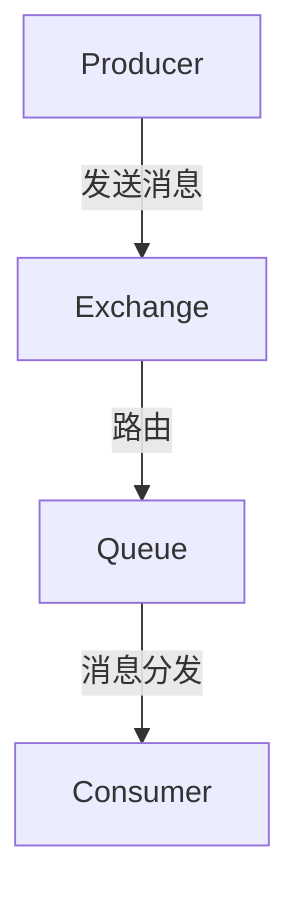

# RocketMQ vs Kafka vs RabbitMQ 对比

## 1. 基本对比

| 对比项   | RocketMQ             | Kafka               | RabbitMQ    |
| ----- | -------------------- | ------------------- | ----------- |
| 开发语言  | Java                 | Scala/Java          | Erlang      |
| 消息模型  | 主题订阅（Topic）          | 主题订阅（Topic）         | 队列模型（Queue） |
| 存储方式  | 磁盘 + MappedFile（零拷贝） | 磁盘 + PageCache（零拷贝） | 内存 + 磁盘（可选） |
| 支持事务  | ✅ 支持                 | ❌ 不支持               | ✅ 支持        |
| 消息顺序  | ✅ 支持（顺序队列）           | ❌ 不支持               | ✅ 支持        |
| 吞吐量   | 百万级 TPS              | 百万级 TPS             | 万级 TPS      |
| 消息持久化 | 存磁盘，异步刷盘             | 存磁盘，PageCache 缓存    | 内存/磁盘       |
| 延迟消息  | ✅ 支持（定时消息）           | ❌ 不支持               | ✅ 支持        |
| 集群模式  | 多主多从                 | 分区（Partition）+副本    | 主从（镜像队列）    |
| 典型场景  | 分布式事务、大规模消息          | 日志收集、实时流处理          | 低延迟、高可靠     |

## 2. 架构对比

### 2.1 RocketMQ

* 核心组件
* Producer（生产者）：发送消息到 Broker。
* Broker（消息中间件）：存储和分发消息。
* Consumer（消费者）：从 Broker 拉取消息。
* NameServer（注册中心）：管理 Broker 路由信息。

✅ 支持事务消息、顺序消息，适合分布式事务和金融场景。

### 2.2 Kafka

* 核心组件
* Producer：生产消息到 Topic。
* Broker：存储 Partition（分区）。
* Consumer：从 Topic 拉取消息。
* Zookeeper：管理 Broker 和 Partition Leader。

✅ 适合日志收集、流式计算（大数据、实时计算）。

### 2.3 RabbitMQ

* 核心组件
* Producer：生产消息。
* Exchange（交换机）：决定消息路由规则。
* Queue（队列）：存储消息。
* Consumer：消费消息。

✅ 支持 Fanout、Direct、Topic 路由模式，适用于低延迟、高可靠应用（银行、订单系统）。

## 3. 消息存储对比

| 对比项  | RocketMQ                   | Kafka                  | RabbitMQ         |
| ---- | -------------------------- | ---------------------- | ---------------- |
| 存储方式 | CommitLog（顺序写）+ MappedFile | Segment 文件（PageCache）  | 内存+磁盘（可选）        |
| 刷盘机制 | 同步 / 异步刷盘                  | PageCache 刷盘           | RabbitMQ 使用持久化队列 |
| 日志清理 | 基于时间或大小清理                  | Log Retention（基于时间/大小） | 可持久化但占用磁盘        |

✅ Kafka 适合大吞吐量，RocketMQ 适合事务消息，RabbitMQ 适合可靠消息传递。

## 4. 消息可靠性

| 对比项    | RocketMQ          | Kafka                 | RabbitMQ   |
| ------ | ----------------- | --------------------- | ---------- |
| ACK 机制 | 支持（消息可回溯）         | 支持（Consumer Commit）   | 支持（消费确认机制） |
| 事务支持   | ✅ 支持事务消息          | ❌ 不支持                 | ✅ 支持事务     |
| 消息丢失   | Broker 异常可能丢失部分消息 | Partition 副本机制保证数据可靠性 | 默认持久化，防止丢失 |

✅ 金融交易、订单场景：推荐 RocketMQ（支持事务消息）。

✅ 日志收集、数据流处理：推荐 Kafka（Partition + 副本保证数据一致性）。

✅ 高可靠性（支付、银行）：推荐 RabbitMQ（事务+持久化队列）。

## 5. 性能对比（TPS）

| 指标     | RocketMQ          | Kafka      | RabbitMQ    |
| ------ | ----------------- | ---------- | ----------- |
| 吞吐量    | 100万+ TPS         | 100万+ TPS  | 万级 TPS      |
| 单条消息延迟 | 1-5ms             | 1-5ms      | <1ms        |
| 并发消费者  | 高（支持 Pull + Push） | 高（Pull 模型） | 中等（Push 模型） |

✅ Kafka & RocketMQ 适合高吞吐应用（日志、流计算）。

✅ RabbitMQ 适合低延迟高可靠应用（支付、订单）。

## 6. 适用场景

| 场景           | 推荐 MQ               | 原因                        |
| ------------ | ------------------- | ------------------------- |
| 高吞吐量（日志、大数据） | Kafka               | Partition 并行消费，吞吐量高       |
| 金融支付、订单系统    | RocketMQ / RabbitMQ | 支持事务、低延迟                  |
| 延迟消息（定时任务）   | RocketMQ / RabbitMQ | 支持延迟队列                    |
| 微服务通信        | RabbitMQ / Kafka    | RabbitMQ 可靠，Kafka 适合事件驱动  |
| 消息队列（普通业务）   | RabbitMQ / RocketMQ | RabbitMQ 低延迟，RocketMQ 高吞吐 |

## 7. 总结

✅ RocketMQ 适合 金融、电商、分布式事务、定时消息（低延迟 + 事务支持）。

✅ Kafka 适合 日志收集、流计算、大数据分析（高吞吐 + 分布式支持）。

✅ RabbitMQ 适合 银行、订单、微服务通信（低延迟 + 持久化 + 事务支持）。

🚀 如果是高吞吐量数据流处理，选 Kafka。

⚡ 如果是分布式事务、低延迟系统，选 RocketMQ。

🔒 如果是金融、订单、微服务通信，选 RabbitMQ。
