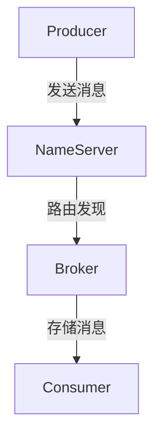
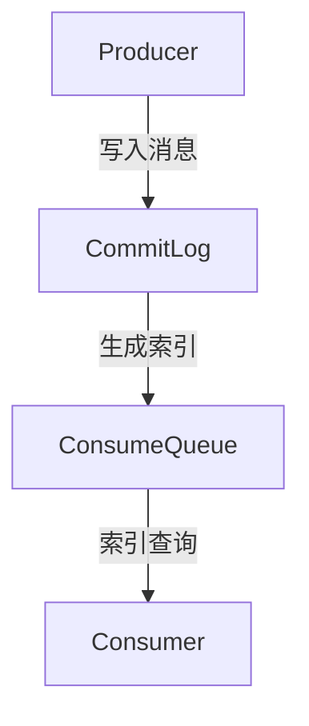

# RocketMq

## 1. RocketMQ 的架构是什么？核心组件有哪些？

RocketMQ 采用 分布式、高可用架构，主要由 4 个核心组件 组成：

1. Producer（生产者）：负责发送消息到 Broker。
2. Broker（消息服务器）：存储消息，并将消息投递给消费者。
3. Consumer（消费者）：从 Broker 订阅消息并处理业务逻辑。
4. NameServer（注册中心）：管理 Broker 路由信息，支持 动态扩展。




特点

* Broker 集群（主从架构） 支持 高可用。
* NameServer 负责路由管理，支持 动态扩展。
* Producer/Consumer 都支持 Push 和 Pull 模式。

## 2. RocketMQ 消息存储机制是什么？

RocketMQ 使用 CommitLog 存储消息，采用 顺序写 + MappedFile 提高性能。

### 消息存储结构

| 组件           | 作用                         |
| ------------ | -------------------------- |
| CommitLog    | 消息存储核心文件，所有消息先写入 CommitLog |
| ConsumeQueue | 索引文件，加速 Consumer 查找消息      |
| IndexFile    | Hash 索引，支持消息按 Key 查询       |

&#x20;存储优化

• 零拷贝（Zero-Copy）+ MappedFile，提升 IO 性能。

• 消息异步刷盘（默认 ASYNC\_FLUSH），提高吞吐量。

• 消息存储采用 MMAP，避免 PageCache 回收影响 GC。




## 3. RocketMQ 如何保证消息的可靠性？


RocketMQ 通过 三大机制 保证消息可靠性：

### 1. 生产端（Producer）

* 重试机制：失败后 自动重试（默认 2 次）。
* 同步刷盘模式（SYNC\_FLUSH）：确保消息写入磁盘。
* 事务消息：保证 分布式事务一致性。


### 2. 存储端（Broker）

* 主从同步（ASYNC\_MASTER / SYNC\_MASTER），防止 Broker 宕机丢数据。
* CommitLog + Checkpoint，防止数据丢失。

### 3. 消费端（Consumer）

* ACK 确认机制，消费失败后支持 重试消费。
* 死信队列（DLQ），处理无法消费的消息。

✅ 如果业务对可靠性要求高，推荐

```
sendMessageInTransaction() # 开启事务消息
```

✅ 如果需要强一致性，建议

```
brokerRole=SYNC_MASTER # 启用同步刷盘
```

## 4. RocketMQ 如何保证消息的顺序性？

RocketMQ 提供 两种方式 保证消息顺序：

### 1. 全局顺序（单队列模型）

* 所有消息都发送到同一个 Queue，保证顺序性。
* 缺点：吞吐量低，单点瓶颈。

### 2. 分区顺序（基于 MessageQueue）

* 同一个业务 Key（如订单 ID）总是发往同一队列。
* 消费者按照 FIFO 方式拉取消息。

### 示例

```java
SendResult sendResult = producer.send(
    new Message("Topic", "Tag", "OrderID_123", "Order Created".getBytes()),
    (mqs, msg, arg) -> mqs.get(Math.abs(arg.hashCode()) % mqs.size()),
    "OrderID_123"
);
```

✅ 适用于订单支付、库存更新等业务场景。

## 5. RocketMQ 如何实现延迟消息？

RocketMQ 通过延迟级别 实现 定时消息：

* 消息投递到特殊的 DelayQueue。
* 达到时间后，投递到实际队列。

### &#x20;延迟级别

| 级别 | 延迟时间 |
| -- | ---- |
| 1  | 1s   |
| 2  | 5s   |
| 3  | 10s  |
| 4  | 30s  |
| 5  | 1m   |

### 代码示例

```java
Message message = new Message("Topic", "Delayed message".getBytes());
message.setDelayTimeLevel(3); // 延迟 10 秒
producer.send(message);
```

✅ 适用于 订单支付超时、定时任务等场景。

## 6. RocketMQ 如何实现分布式事务？

RocketMQ 支持事务消息（Transactional Message），分 三步执行：

1. 发送半消息（Prepare 状态）。
2. 执行本地事务（如数据库操作）。
3. 回调 checkTransactionState() 确认事务状态：

• 成功：提交消息。

• 失败：回滚消息。

```java
TransactionMQProducer producer = new TransactionMQProducer("tx_producer");
producer.setTransactionListener(new TransactionListener() {
    @Override
    public LocalTransactionState executeLocalTransaction(Message msg, Object arg) {
        return LocalTransactionState.COMMIT_MESSAGE;
    }

    @Override
    public LocalTransactionState checkLocalTransaction(MessageExt msg) {
        return LocalTransactionState.COMMIT_MESSAGE;
    }
});
```

✅ 适用于金融支付、订单系统，保证分布式事务一致性。

7\. RocketMQ 如何避免消息堆积？

1\. 扩展 MessageQueue 数量

* 增加 Partition，提升并发能力：

```java
queueNums=8

```

2\. 使用 PullConsumer 代替 PushConsumer

* 手动拉取消息，提高消费能力：

```java
consumer.setConsumeFromWhere(ConsumeFromWhere.CONSUME_FROM_LAST_OFFSET);
```

3\. 消费者多线程并发消费

• 调整 consumeMessageBatchMaxSize 提高批量消费能力：

```java
consumer.setConsumeThreadMax(30);
```

✅ 适用于高并发消息消费场景（电商、日志处理）。

## 8. RocketMQ 和 Kafka、RabbitMQ 的对比

| 对比项  | RocketMQ    | Kafka    | RabbitMQ  |
| ---- | ----------- | -------- | --------- |
| 吞吐量  | 百万级 TPS     | 百万级 TPS  | 万级 TPS    |
| 顺序消息 | ✅ 支持        | ❌ 不支持    | ✅ 支持      |
| 事务消息 | ✅ 支持        | ❌ 不支持    | ✅ 支持      |
| 延迟消息 | ✅ 支持        | ❌ 不支持    | ✅ 支持      |
| 适用场景 | 分布式事务、金融、电商 | 日志收集、流计算 | 微服务、低延迟消息 |

✅ RocketMQ 适用于分布式事务、顺序消息、金融支付等高可靠场景 🚀。

## 9. 结论

🔹 RocketMQ 提供高吞吐、低延迟、支持事务 & 延迟消息。

🔹 适用于电商、金融支付、订单、定时任务等高可靠场景。

🔹 面试重点：事务消息、顺序消息、消息堆积优化、GC 优化。 🚀
