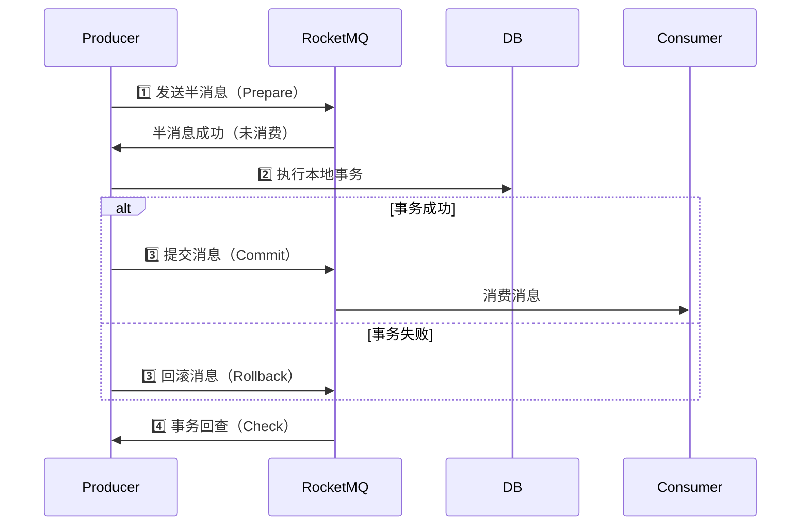
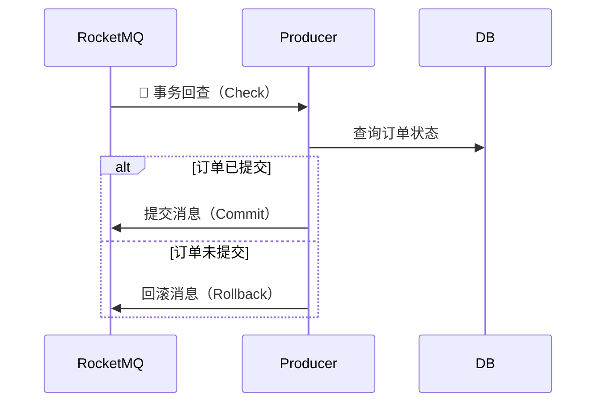

# RocketMQ 事务消息原理

## 1. RocketMQ 事务消息的核心概念

### 什么是事务消息？

RocketMQ 支持分布式事务消息，允许 消息发送与数据库事务操作绑定，确保数据一致性。

### 适用场景

* 订单支付、库存扣减（订单创建成功 → 扣库存）。
* 银行转账（A 账户扣款 → B 账户到账）。
* 电商系统的支付 & 发货流程（支付成功 → 触发物流发货）。

## 2. RocketMQ 事务消息的三阶段流程

RocketMQ 事务消息基于 二阶段提交（Two-Phase Commit）+ 事务回查机制 实现。




### 事务消息的 3 个阶段

| 阶段               | 描述                               |
| ---------------- | -------------------------------- |
| 第一阶段（Prepare 消息） | 生产者发送 “半消息” 到 RocketMQ，消息暂不可消费   |
| 第二阶段（本地事务执行）     | 生产者执行本地事务（如数据库操作）                |
| 第三阶段（确认提交 / 回滚）  | 根据事务结果，提交（Commit）或回滚（Rollback）消息 |

如果 Producer 宕机，RocketMQ 会主动进行事务回查，防止数据不一致。

## 3. 事务消息的代码示例

### 1. 配置事务消息生产者

```
TransactionMQProducer producer = new TransactionMQProducer("tx_producer_group");
producer.setNamesrvAddr("127.0.0.1:9876");
producer.setTransactionListener(new MyTransactionListener()); // 绑定事务监听器
producer.start();
```

### 2.发送事务消息

```
Message message = new Message("TransactionTopic", "Order", "order-123", "Create Order".getBytes());

TransactionSendResult result = producer.sendMessageInTransaction(
    message, "订单事务参数"
);

System.out.println("事务消息状态：" + result.getLocalTransactionState());
```

### 3.实现事务监听器

```
public class MyTransactionListener implements TransactionListener {
    // 执行本地事务逻辑（数据库操作）
    @Override
    public LocalTransactionState executeLocalTransaction(Message msg, Object arg) {
        try {
            System.out.println("执行本地事务：" + new String(msg.getBody()));

            // 这里模拟订单业务逻辑
            boolean success = processOrder(arg);

            return success ? LocalTransactionState.COMMIT_MESSAGE
                           : LocalTransactionState.ROLLBACK_MESSAGE;
        } catch (Exception e) {
            return LocalTransactionState.UNKNOW; // 事务未知，RocketMQ 需要回查
        }
    }

    // 事务回查逻辑
    @Override
    public LocalTransactionState checkLocalTransaction(MessageExt msg) {
        System.out.println("RocketMQ 事务回查：" + new String(msg.getBody()));

        // 这里可以查询数据库，看事务是否真的提交
        boolean success = checkOrderStatus(msg.getKeys());

        return success ? LocalTransactionState.COMMIT_MESSAGE
                       : LocalTransactionState.ROLLBACK_MESSAGE;
    }
}
```

关键点

* executeLocalTransaction()：执行数据库事务逻辑。
* checkLocalTransaction()：RocketMQ 回查事务状态，防止生产者宕机导致不一致。

## 4. RocketMQ 事务回查机制

为什么需要事务回查？

如果 Producer 在本地事务执行后 宕机，无法通知 RocketMQ 提交消息，可能导致：

1\. 事务已提交，但 RocketMQ 仍认为消息是未确认状态。

2\. RocketMQ 需要主动询问 Producer 事务状态，避免数据不一致。

RocketMQ 事务回查流程



✅ RocketMQ 事务回查可以保证事务不丢失，防止消息未提交但业务已完成。

## 5. RocketMQ 事务消息 vs. 其他 MQ

| 对比项  | RocketMQ   | Kafka    | RabbitMQ   |
| ---- | ---------- | -------- | ---------- |
| 事务支持 | ✅ 支持       | ❌ 不支持    | ✅ 支持       |
| 事务回查 | ✅ 支持事务回查   | ❌ 不支持    | ❌ 不支持      |
| 可靠性  | ✅ 保证事务一致性  | ❌ 可能丢失消息 | ✅ 支持事务 ACK |
| 适用场景 | 金融、电商、订单事务 | 日志收集、流计算 | 微服务、分布式系统  |

✅ RocketMQ 适用于分布式事务，保证数据一致性 🚀。

6\. RocketMQ 事务消息的优势\


✅ 支持分布式事务，保证消息与数据库事务的一致性。

✅ 事务回查机制，防止 Producer 宕机导致消息丢失。

✅ 高吞吐量，相比 RabbitMQ 性能更优（百万级 TPS）。

✅ 支持事务消息的批量处理，提高吞吐量。

## 7. 事务消息的限制

🚫 不支持广播消息（只能用于 Cluster 模式）。

🚫 不支持 Pull 模式消费（只支持 Push）。

🚫 事务回查可能增加网络开销，影响系统性能。

## 8. 总结

🔹 RocketMQ 事务消息采用二阶段提交 + 事务回查，保证分布式事务一致性。

🔹 提供 Commit / Rollback / Unknow 三种事务状态，防止数据丢失。

🔹 适用于金融、电商、支付系统等高可靠场景 🚀。
