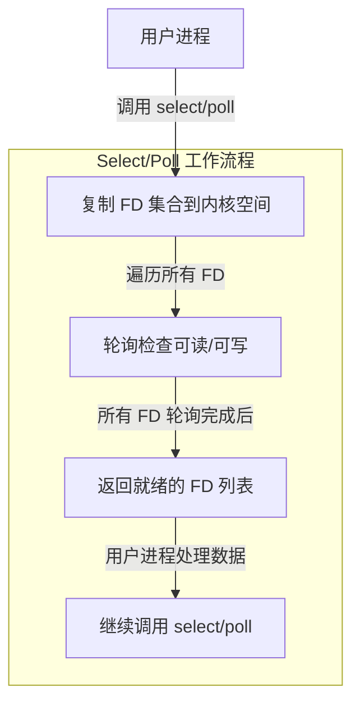
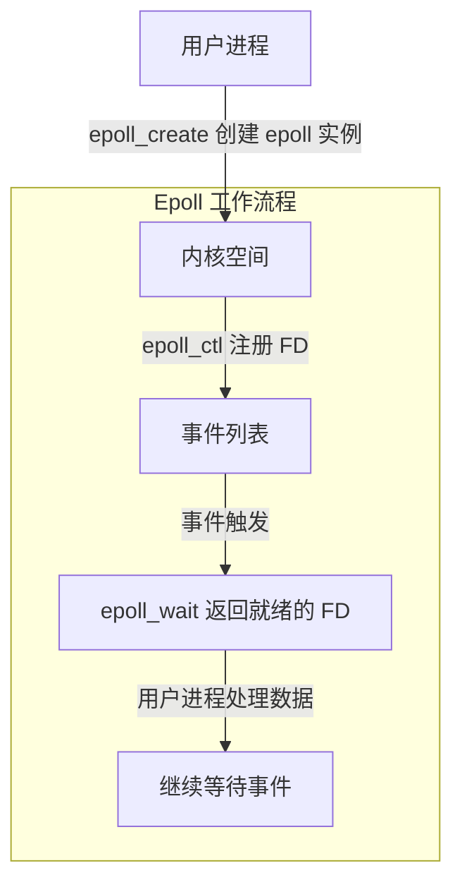

# IO 多路复用：Select、Poll、Epoll 区别

## 1. 什么是 IO 多路复用？

IO 多路复用（I/O Multiplexing）是一种 高效处理多个 I/O 连接 的技术，适用于高并发网络编程。

在 Linux 下，常见的 IO 复用方案包括：

• select

• poll

• epoll

它们的主要区别在于：

1\. 文件描述符（FD）存储方式

2\. 事件通知机制

3\. 性能优化

## 2. Select、Poll、Epoll 对比

| 方式     | 存储方式       | 时间复杂度 | 文件描述符上限        | 通知方式     | 适用场景  |
| ------ | ---------- | ----- | -------------- | -------- | ----- |
| select | 数组存储 FD    | O(n)  | 1024（Linux 旧版） | 轮询遍历     | 小规模并发 |
| poll   | 链表存储 FD    | O(n)  | 无上限            | 轮询遍历     | 中等并发  |
| epoll  | 红黑树 + 事件回调 | O(1)  | 无上限            | 事件驱动（回调） | 大规模并发 |

## 3. 详细对比分析

### 3.1select

• 文件描述符存储：使用 fd\_set 位图（数组）。

• 每次调用都要遍历整个 fd 集合（O(n) 复杂度）。

• 最大文件描述符数量：1024（FD\_SETSIZE 限制）。

• 使用场景：适用于 小规模连接（如 1000 以内）。

### 示例代码

```c
fd_set fds;
FD_ZERO(&fds);
FD_SET(socket_fd, &fds);
select(socket_fd + 1, &fds, NULL, NULL, NULL);
```

⚠️ 问题：

1\. 轮询方式低效：即使没有事件，也要遍历所有 fd。

2\. 文件描述符数量有限，不适用于大规模连接。




### 3.2poll

• 存储结构：链表 形式的 pollfd 结构体数组。

• 轮询所有 FD，但支持 更大规模的连接（无上限）。

• 性能依然是 O(n)，但比 select 扩展性更好。

示例代码

```c
struct pollfd fds[2];
fds[0].fd = socket_fd;
fds[0].events = POLLIN;
poll(fds, 2, -1);
```

⚠️ 问题：

1\. 仍然是轮询方式，性能依然受限。

2\. 每次调用 poll，都需要遍历所有文件描述符。

### 3.3 epoll（最优）

• 存储方式：红黑树管理 FD，事件触发回调机制（Event-Driven）。

• 性能 O(1)，只处理有事件的 FD，不遍历整个列表。

• 可支持百万级别的连接，适用于高并发服务器。

示例代码

```c
int epfd = epoll_create(1);
struct epoll_event ev;
ev.events = EPOLLIN;
ev.data.fd = socket_fd;
epoll_ctl(epfd, EPOLL_CTL_ADD, socket_fd, &ev);
epoll_wait(epfd, &events, 10, -1);
```

优点：

1\. 基于事件驱动（回调触发），不轮询，提高效率。

2\. 支持大规模 FD，适用于高并发系统（如 Nginx、Kafka）。




## 4. 适用场景

| 使用场景                     | 适合的 IO 多路复用方案 |
| ------------------------ | ------------- |
| 小规模并发（< 1000 连接）         | select        |
| 中等规模并发（1000 \~ 10000 连接） | poll          |
| 大规模并发（10 万以上连接）          | epoll         |
